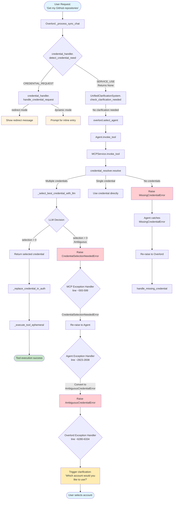

# Credential Handling Flow Documentation

## Overview
This document describes the complete flow of credential handling in the MUXI Runtime system, particularly for cases where users have multiple credentials for the same service.

## Key Components

### 1. Credential Detection (Overlord)
- **Location**: `src/muxi/formation/overlord/overlord.py`
- **Function**: `_process_sync_chat()` (line ~5678)
- Detects if a message needs credentials before clarification

### 2. MCP Service
- **Location**: `src/muxi/services/mcp/service.py`
- **Function**: `invoke_tool()` (line ~500)
- Handles credential resolution and selection

### 3. Agent
- **Location**: `src/muxi/formation/agents/agent.py`
- **Function**: `invoke_tool()` (line ~2773)
- Catches and converts credential exceptions

### 4. Credential Handler
- **Location**: `src/muxi/formation/credentials/handler.py`
- Provides credential detection and handling logic

## Complete Flow Diagram



## Exception Flow

### 1. CredentialSelectionNeededError
**Raised by**: `MCPService._select_best_credential_with_llm()` (line ~1837)
```python
class CredentialSelectionNeededError(Exception):
    def __init__(self, service: str, user_id: str, 
                 available_credentials: list, ordered_credentials: list = None)
```
- Raised when LLM determines credential selection is ambiguous (selection = 0)
- Contains list of available credential names

### 2. AmbiguousCredentialError  
**Created by**: `Agent.invoke_tool()` (line ~2833)
```python
class AmbiguousCredentialError(Exception):
    def __init__(self, service: str, user_id: str,
                 available_credentials: list, ordered_credentials: list = None)
```
- Converted from CredentialSelectionNeededError
- Caught by Overlord to trigger clarification

### 3. MissingCredentialError
**Raised by**: `MCPService.invoke_tool()` (line ~553)
```python
class MissingCredentialError(Exception):
    def __init__(self, service: str, user_id: str)
```
- Raised when no credentials found for the service
- Triggers credential addition flow

## Critical Code Sections

### MCPService Credential Resolution (lines 550-585)
```python
# Resolve credentials from database
credentials = await credential_resolver.resolve(user_id, service_name)

if credentials is None:
    raise MissingCredentialError(service_name, user_id)

# If multiple credentials, use LLM to select
if isinstance(credentials, list):
    try:
        credentials = await self._select_best_credential_with_llm(...)
    except CredentialSelectionNeededError as e:
        e.user_id = user_id
        raise  # Re-raise to agent
    
# Only format if we have a valid single credential
if credentials and not isinstance(credentials, list):
    resolved_auth = self._replace_credential_in_auth(stored_creds, credentials)
```

### Agent Exception Conversion (lines 2823-2838)
```python
if isinstance(e, CredentialSelectionNeededError):
    # Convert to AmbiguousCredentialError and raise to overlord
    raise AmbiguousCredentialError(
        service=e.service,
        user_id=e.user_id,
        available_credentials=e.available_credentials,
        ordered_credentials=e.ordered_credentials,
    ) from e
```

### Overlord Clarification Trigger (lines 6280-6334)
```python
except AmbiguousCredentialError as e:
    # Prepare clarification request
    clarification_request = {
        "type": "credential_selection",
        "service": e.service,
        "available_credentials": e.available_credentials,
        ...
    }
    # Store pending clarification and return to user
```

## Key Behaviors

### Single Credential
- Credential used directly
- No LLM selection needed
- No clarification triggered

### Multiple Credentials  
1. LLM attempts to select based on context
2. If ambiguous (selection = 0), raises CredentialSelectionNeededError
3. Exception propagates: MCP → Agent → Overlord
4. Overlord triggers clarification asking user to choose

### No Credentials
1. MissingCredentialError raised immediately
2. Triggers credential addition flow based on mode (redirect/dynamic)

## Configuration

### Formation YAML
```yaml
user_credentials:
  mode: redirect  # or dynamic
  redirect_message: "Please configure your API credentials..."
  
mcp_servers:
  - id: github-mcp
    uses_user_credentials: true
    credentials:
      service: github
      auth_type: bearer
      accept_inline: true
```

## Testing

### Test Users
- **user1**: Has 2 GitHub credentials (ranaroussi, lilyautomaze) - triggers selection
- **user2**: Has 1 GitHub credential - uses directly
- **user3**: Has 0 credentials - triggers addition flow

### Expected Responses
- Multiple credentials: "You have two options: 'ranaroussi' or 'lilyautomaze.' Could you please let me know which one you'd like to use?"
- No credentials (redirect mode): "Please configure your API credentials in the external credential manager."
- No credentials (dynamic mode with accept_inline): Prompts for credential entry

## Common Issues and Solutions

### Issue: "string indices must be integers"
**Cause**: Exception raised when credentials list passed to wrong place
**Solution**: Ensure credential names (strings) passed to exceptions, not full dict objects

### Issue: Exception not reaching Overlord
**Cause**: Code continues after raising exception due to incorrect indentation
**Solution**: Ensure code after exception raising is properly indented/structured

### Issue: Credential not decrypted
**Cause**: JSON string not parsed before decryption
**Solution**: Parse JSON strings in EncryptedCredentialResolver.resolve()

## Recent Changes (August 2025)
1. Fixed credential decryption for JSON string storage
2. Fixed exception flow with proper indentation in MCP service
3. Updated CredentialSelectionNeededError to handle both string and dict lists
4. Added proper LLM initialization using default formation configuration
5. Removed hardcoded account names, using dynamic detection