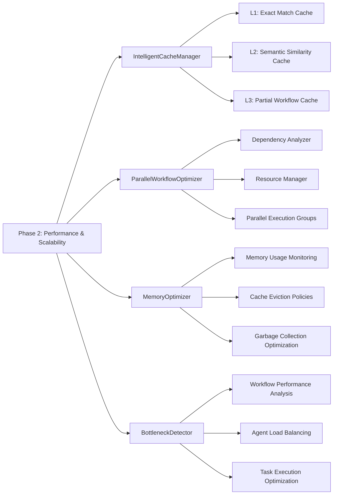
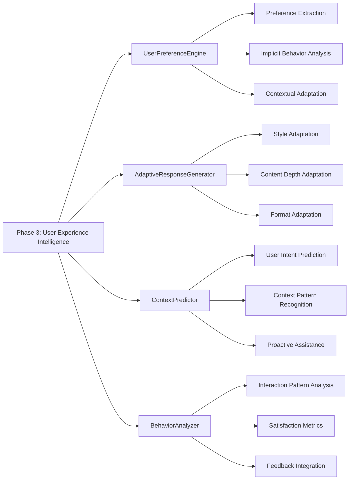
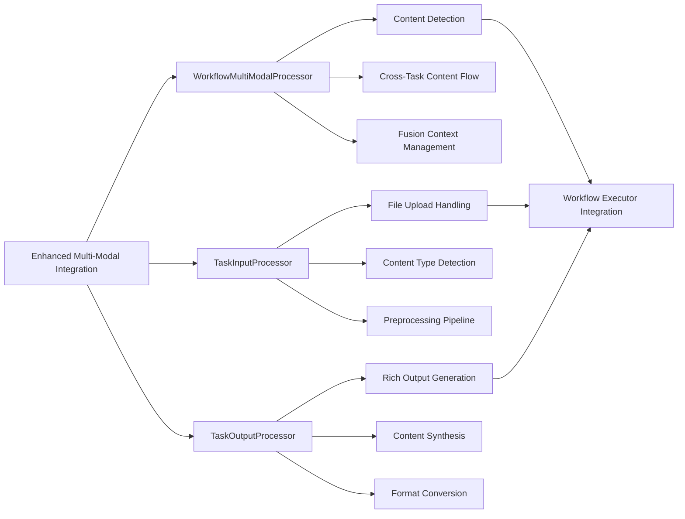
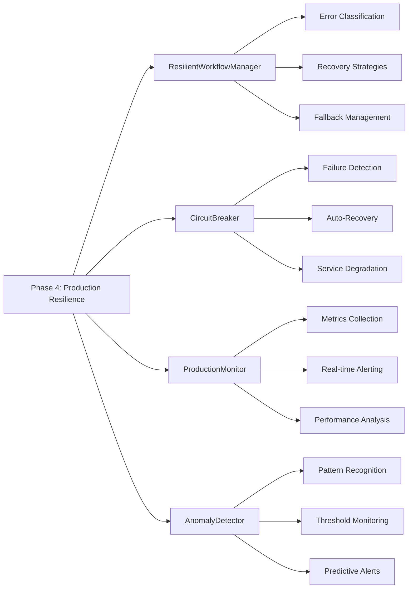
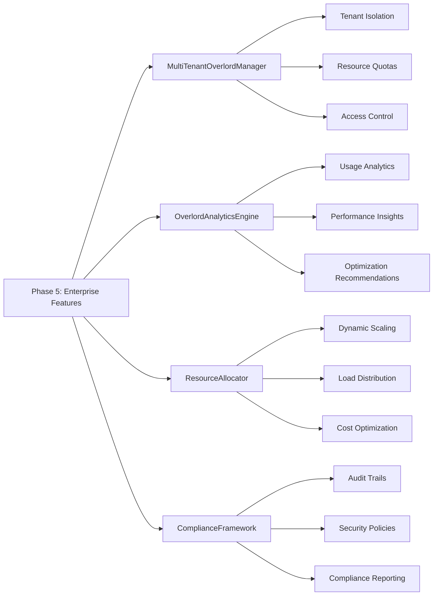

### Part A: Widgets (Deferred)

**Status:** 📋 **DEFERRED** - Moved to separate PRD

**See:** [`contexts/prds/widgets.md`](../contexts/prds/widgets.md) for detailed planning

**Rationale:** Widgets require tight SDK integration for optimal UX. Implementation deferred until core runtime foundation is stable and SDK integration strategy is finalized.

**Planned Scope:**
- Workflow approval buttons ("Approve Plan" / "Modify Plan")
- Enhanced clarification options (multiple choice buttons)
- Secure credential collection forms
- Link previews and source references
- Artifact positioning enhancements

### Phase 2: Performance & Scalability Optimization (High Priority)

### Phase 3: User Experience Intelligence (Medium Priority)

### Part B: Enhanced Multi-Modal Integration

### Phase 4: Production Resilience & Monitoring (Medium Priority)

### Phase 5: Enterprise Features (Lower Priority)

