# MUXI Runtime Request Lifecycle

## Overview

This document describes the complete lifecycle of a user request in the MUXI Runtime system - a sophisticated AI orchestration platform that transforms simple requests into intelligent, context-aware responses through multiple processing layers.

### Key Capabilities

The MUXI Runtime is not just a request-response system; it's an intelligent processing pipeline that:

- **Adapts to complexity**: Automatically routes simple queries to single agents or decomposes complex requests into multi-agent workflows
- **Maintains context**: Three-tier memory system (working, buffer, long-term) ensures conversations are coherent and personalized
- **Clarifies ambiguity**: Multi-turn clarification system resolves unclear requests before processing
- **Orchestrates intelligence**: Coordinates multiple AI agents with specialized capabilities through MCP tools and A2A communication
- **Optimizes execution**: Dynamically chooses between sync/async processing based on estimated execution time
- **Ensures consistency**: Applies configurable personas to maintain uniform communication style across all agents
- **Handles complexity**: Supports SOPs (Standard Operating Procedures) for repeatable complex workflows

### Request Journey Highlights

A request passing through MUXI undergoes:

1. **Session & Memory Initialization**: Context loading from three memory tiers with vector similarity search
2. **Intelligent Routing**: Clarification detection, SOP matching, complexity analysis, and agent selection
3. **Execution Planning**: Time estimation and sync/async mode selection with immediate user notification for long tasks
4. **Agent Processing**: Tool execution via MCP, agent-to-agent delegation, parallel task execution
5. **Response Generation**: Batch, streaming, or webhook delivery based on execution mode and user preferences
6. **Persona Application**: Style and tone consistency regardless of which agents were involved
7. **Memory Updates**: Learning from interactions for future personalization

The system seamlessly handles everything from simple queries ("What's the weather?") to complex orchestrations ("Analyze my codebase, generate security audit, create Linear issues, and notify my team") through the same intelligent pipeline.

## Request Flow Diagram

```mermaid
flowchart TD
    Start([User Sends Request])

    %% Input Methods
    Start -->|API/MCP/SDK/CLI/Embedded| InitReq[Initialize Request]

    %% Session Check
    InitReq --> CheckSession{Check Session}
    CheckSession -->|New Session| CreateSession[Create Session ID]
    CheckSession -->|Existing| UseSession[Use Existing Session]

    CreateSession --> ReqTracking[Request Tracking<br/>- Generate Request ID<br/>- Start Timer<br/>- Log Event]
    UseSession --> ReqTracking

    %% File Upload Check
    ReqTracking --> HasFiles{Has File<br/>Uploads?}
    HasFiles -->|Yes| ProcessFiles[Process Files<br/>- Store in temp<br/>- Extract metadata<br/>- Update context]
    HasFiles -->|No| InitMemory[Initialize Memory<br/>Systems]
    ProcessFiles --> InitMemory

    %% Memory Systems
    InitMemory --> SmartBuffer[Smart Buffer Memory<br/>- Load last N messages<br/>- Vector similarity search<br/>- Auto-summarization<br/>- FIFO with multiplier]

    SmartBuffer --> LongTermCheck{Long-term<br/>Enabled?}
    LongTermCheck -->|Yes| LongTermMem[Long-term Memory<br/>- PostgreSQL/SQLite<br/>- User preferences<br/>- Historical context<br/>- Semantic search]
    LongTermCheck -->|No| BuildContext

    LongTermMem --> BuildContext[Build User Context<br/>- Merge preferences<br/>- Apply personalization<br/>- Load user history<br/>- Extract patterns]

    BuildContext --> WorkingMem[Working Memory<br/>- Current task state<br/>- Active file refs<br/>- Tool outputs - Session data]

    WorkingMem --> FormatMsg[Format Message with Full Context<br/>- User context<br/>- Recent history<br/>- Current state]

    %% Clarification Check
    FormatMsg --> PendingClarification{Has pending<br/>Clarification?}
    PendingClarification -->|Yes| ProcessClarification[Process Clarification<br/>Response]
    PendingClarification -->|No| NeedClarification{Need<br/>Clarification?}

    ProcessClarification --> NeedClarification
    NeedClarification -->|Yes| InitClarification[Initialize Clarification<br/>- Analyze gaps<br/>- Generate questions<br/>- Store context]
    NeedClarification -->|No| IsActionable{Is actionable?}

    InitClarification --> WriteQuestion[Write Clarification<br/>Question]
    WriteQuestion --> ApplyPersona1[[Apply Overlord Persona]]

    %% Main Processing Path
    IsActionable -->|Yes| AgentSpecified{Agent<br/>Specified?}
    IsActionable -->|No| ApplyPersona1

    AgentSpecified -->|Yes| RequestAgent[Request Specific<br/>Agent]
    AgentSpecified -->|No| WorkflowAnalysis[Workflow Analysis<br/>- Check complexity<br/>- Check SOPs]

    RequestAgent --> AgentProcessing

    %% SOP and Workflow Path
    WorkflowAnalysis --> SOPMatch{SOP<br/>Matched?}
    SOPMatch -->|Yes| ExecuteSOP[Execute SOP<br/>- Load template<br/>- Decompose tasks<br/>- Execute workflow]
    SOPMatch -->|No| ComplexCheck{Complex<br/>Request?}

    ExecuteSOP --> AgentProcessing

    ComplexCheck -->|﹥=Threshold| WorkflowDecomp[Workflow<br/>Decomposition<br/>- Create task graph<br/>- Assign agents<br/>- Execute parallel]
    ComplexCheck -->|﹤Threshold| AutoRoute[Auto-Route to<br/>Best Agent]

    WorkflowDecomp --> AgentProcessing
    AutoRoute --> AgentProcessing

    %% Plan Confirmation
    ComplexCheck2{Requires plan<br/>confirmation?}
    WorkflowDecomp --> ComplexCheck2
    ComplexCheck2 -->|Yes| AskConfirmation[Ask user for<br/>confirmation]
    ComplexCheck2 -->|No| EstimateTime

    AskConfirmation -->|Approved| EstimateTime
    AskConfirmation -->|Declined| WorkflowDecomp

    %% Time Estimation
    EstimateTime[Estimate Execution Time<br/>- Analyze task complexity<br/>- Check tool requirements<br/>- Review historical data]

    EstimateTime --> TimeThreshold{Estimated<br/>Time?}
    TimeThreshold -->|﹥=Threshold| NotifyUser[Notify User of Estimated Time<br/>- Return task ID<br/>- Provide time estimate<br/>- Setup webhook]
    TimeThreshold -->|﹤Threshold| ProcessAgent[Process with Agent<br/>- Load agent config<br/>- Apply system prompt<br/>- Initialize context]

    NotifyUser --> ProcessAgent

    %% Agent Processing
    ProcessAgent --> AgentProcessing[Agent Processing]

    AgentProcessing --> NeedTools{Need Tools?}
    NeedTools -->|Yes| MCPTools[MCP Tool Calls<br/>- Connect to server<br/>- Execute tools<br/>- Handle responses]
    NeedTools -->|No| NeedHelp{Need Help<br/>from another<br/>Agents?}

    MCPTools --> ProcessToolResults[Process Tool Results<br/>- Parse outputs<br/>- Update context<br/>- Check errors]

    ProcessToolResults --> NeedHelp

    %% Agent Communication
    NeedHelp -->|Yes| A2A[A2A Communication<br/>- Format request<br/>- Call internal/external agent<br/>- Await response]
    NeedHelp -->|No| MoreProcessing{Need more<br/>Processing?}

    A2A --> HandoffType{Handoff<br/>Type?}
    HandoffType -->|Delegation| DelegateAgent[Delegate to Agent<br/>- Transfer context<br/>- Wait for completion<br/>- Aggregate results]
    HandoffType -->|Consultation| ConsultAgent[Consult Agent<br/>- Request specific info<br/>- Continue processing<br/>- Integrate insights]
    HandoffType -->|Parallel| ParallelAgents[Parallel Agents<br/>- Split tasks<br/>- Execute concurrently<br/>- Merge results]

    DelegateAgent --> AgentResponse[Agent Response<br/>- Collect outputs<br/>- Update memory<br/>- Format results]
    ConsultAgent --> AgentResponse
    ParallelAgents --> AgentResponse

    AgentResponse --> MoreProcessing
    MoreProcessing -->|Yes| AgentProcessing
    MoreProcessing -->|No| GenerateResponse[Generate Response<br/>- Format output<br/>- Add explanations<br/>- Include artifacts]

    %% Final Response Path
    GenerateResponse --> ApplyPersona2[Apply Overlord Persona<br/>- Maintain tone consistency<br/>- Apply style preferences<br/>- Format for user<br/>- Add personality touches]

    ApplyPersona1 --> ApplyPersona2

    ApplyPersona2 --> ResponseMode{Response<br/>Mode?}

    ResponseMode -->|Async| WebhookDelivery[Webhook Delivery<br/>- Format payload<br/>- Call webhook URL<br/>- Retry on failure]
    ResponseMode -->|Sync| UserPref{User<br/>Preference?}

    UserPref -->|Batch| BatchResponse[Batch Response<br/>- Complete processing<br/>- Return full response<br/>- Single payload]
    UserPref -->|Stream| StreamResponse[Stream Response<br/>- Chunk generation<br/>- Progressive delivery<br/>- Real-time updates]

    WebhookDelivery --> UpdateMemory[Update Memory<br/>- Buffer: conversation<br/>- Working: context<br/>- Long-term: persist]
    BatchResponse --> UpdateMemory
    StreamResponse --> UpdateMemory

    UpdateMemory --> HasArtifacts{Has<br/>Artifacts?}
    HasArtifacts -->|Yes| AttachArtifacts[Attach Artifacts<br/>- PDFs<br/>- Files<br/>- Data URLs]
    HasArtifacts -->|No| FinalizeResponse[Finalize Response<br/>- Add metadata<br/>- Log completion<br/>- Update metrics]

    AttachArtifacts --> FinalizeResponse

    FinalizeResponse --> End([Return to User])

    class Start,End startEnd
    class CheckSession,HasFiles,LongTermCheck,PendingClarification,NeedClarification,IsActionable,AgentSpecified,SOPMatch,ComplexCheck,ComplexCheck2,TimeThreshold,NeedTools,NeedHelp,HandoffType,MoreProcessing,ResponseMode,UserPref,HasArtifacts decision
    class UseSession,CreateSession warning
    class RESTAPI,MCP,SDK,CLI,Embedded input
```



## Component Details

### 1. Entry Points

**REST API:**
- Primary HTTP interface for web applications
- Supports JSON payloads and multipart file uploads
- RESTful endpoints for all operations

**MCP (Model Context Protocol):**
- Native protocol for AI-to-AI communication
- Efficient binary protocol with lower overhead
- Built-in tool discovery and schema validation

**SDK:**
- Language-specific client libraries (Python, TypeScript, Go)
- High-level abstractions over REST API
- Built-in retry logic and error handling

**CLI:**
- Command-line interface for terminal operations
- Interactive and non-interactive modes
- Scriptable for automation

**Embedded:**
- Direct library integration for in-process usage
- Zero network overhead
- Shared memory context

### 2. Session Management

**Session ID Generation:**
- New users receive a unique session ID (nano ID)
- Sessions persist across multiple requests
- Session data includes:
  - User preferences
  - Conversation history
  - Pending clarifications
  - Active workflows

**User ID:**
- Can be provided by client or auto-generated
- Links to long-term memory storage
- Enables personalization and context retention

### 3. Request Initialization

**Request Tracking:**
```python
request_id = f"req_{generate_id()}"
request_data = {
    "id": request_id,
    "user_id": user_id,
    "session_id": session_id,
    "timestamp": time.time(),
    "status": "processing",
    "formation_id": formation_id
}
```

**Observability Events:**
- `request.received` - Initial request logging
- `request.processing` - Processing stages
- `request.completed` - Final response delivered

### 4. File Upload Processing

**File Handling Flow:**
1. Files uploaded as multipart form data or base64
2. Stored in temporary directory: `/tmp/muxi_uploads/{session_id}/`
3. Metadata extracted:
   - File type and size
   - MIME type detection
   - Content preview generation
4. Context updated with file references
5. Files available to agents via MCP tools

**Supported File Types:**
- Documents: PDF, DOCX, TXT, MD
- Images: PNG, JPG, GIF
- Data: CSV, JSON, YAML
- Code: Various programming languages

### 5. Memory System Integration

**Three-Tier Memory Architecture:**

#### Smart Buffer Memory
- **Intelligent Message Management:**
  - Stores last N messages (configurable, default: 50)
  - Multiplier system for expanded context (N × multiplier)
  - FIFO eviction with importance weighting
  - Preserves critical messages longer

- **Vector Similarity Search:**
  ```python
  # Find similar past interactions
  similar_messages = await buffer_memory.search_similar(
      query=current_message,
      threshold=0.8,
      limit=5
  )
  ```

- **Automatic Summarization:**
  - Triggers when buffer approaches capacity
  - Summarizes older conversations
  - Preserves key information while reducing tokens
  - Maintains conversation continuity

- **Context Window Optimization:**
  ```python
  buffer_config = {
      "size": 50,
      "multiplier": 10,  # Effective size: 500 messages
      "summarize_after": 40,
      "vector_search": True,
      "embedding_model": "text-embedding-3-small"
  }
  ```

#### Long-term Memory (Optional)
- **Storage Backends:**
  - PostgreSQL with pgvector extension
  - SQLite for single-user deployments
  - Redis for distributed systems

- **User Profile Management:**
  ```python
  user_profile = {
      "user_id": "usr_nanoid123",
      "preferences": {
          "communication_style": "technical",
          "expertise_level": "advanced",
          "response_format": "detailed"
      },
      "interaction_history": [...],
      "learned_patterns": [...],
      "custom_instructions": [...]
  }
  ```

- **Semantic Search Capabilities:**
  ```python
  # Search historical interactions
  results = await long_term_memory.semantic_search(
      query="previous discussions about API design",
      user_id=user_id,
      time_range="30d",
      relevance_threshold=0.7
  )
  ```

- **Context Building:**
  ```python
  # Build rich user context from long-term memory
  user_context = await long_term_memory.build_context(
      user_id=user_id,
      include=[
          "preferences",
          "recent_topics",
          "domain_knowledge",
          "interaction_patterns"
      ]
  )
  ```

#### Working Memory
- **Session State Management:**
  - Current task context and progress
  - Active file references and metadata
  - Tool call results and intermediate outputs
  - Temporary data with TTL

- **Dynamic Context Updates:**
  ```python
  working_memory = {
      "session_id": "ses_nanoid456",
      "current_task": {
          "type": "research",
          "stage": "data_collection",
          "progress": 0.6
      },
      "active_files": [
          {"path": "/tmp/report.pdf", "type": "output"},
          {"path": "/tmp/data.csv", "type": "input"}
      ],
      "tool_outputs": {
          "web_search": [...],
          "sys_info": {...}
      },
      "agent_states": {
          "researcher": "active",
          "writer": "pending"
      }
  }
  ```

**Memory Loading Sequence:**
```python
async def load_memory_context(user_id, session_id):
    # 1. Initialize smart buffer memory
    buffer = await buffer_memory.initialize(session_id)
    recent_messages = await buffer.get_recent(
        limit=10,
        include_summaries=True
    )

    # 2. Load long-term memory if enabled
    user_context = {}
    if long_term_memory.is_enabled():
        user_context = await long_term_memory.get_user_context(
            user_id=user_id,
            include_preferences=True,
            include_history=True
        )

        # Apply learned patterns
        patterns = await long_term_memory.get_patterns(user_id)
        user_context["learned_patterns"] = patterns

    # 3. Initialize working memory
    working_memory.initialize({
        "session_id": session_id,
        "user_id": user_id,
        "timestamp": time.time(),
        "request_count": 0
    })

    # 4. Merge all context sources
    full_context = {
        "user": user_context,
        "recent_history": recent_messages,
        "session_state": working_memory.get_state(),
        "buffer_summary": buffer.get_summary()
    }

    return full_context
```

**Memory Update After Response:**
```python
async def update_memory_systems(request, response, context):
    # 1. Update buffer memory
    await buffer_memory.append({
        "role": "user",
        "content": request,
        "timestamp": context["request_time"]
    })
    await buffer_memory.append({
        "role": "assistant",
        "content": response,
        "timestamp": time.time()
    })

    # 2. Update working memory
    working_memory.update({
        "last_interaction": time.time(),
        "request_count": working_memory.get("request_count", 0) + 1,
        "last_response_type": response.type
    })

    # 3. Update long-term memory
    if long_term_memory.is_enabled():
        # Extract learnings
        learnings = await extract_learnings(request, response)
        if learnings:
            await long_term_memory.store_learnings(
                user_id=context["user_id"],
                learnings=learnings
            )

        # Update interaction history
        await long_term_memory.add_interaction({
            "request": request,
            "response": response.content,
            "metadata": {
                "duration": response.duration,
                "agents_used": response.agents,
                "tools_called": response.tools
            }
        })
```

### 6. Unified Clarification System

**Clarification Detection Flow:**

```python
# Single unified clarification check
result = await unified_clarification.needs_clarification(
    message=message,
    request_id=request_id,
    session_id=session_id,
    context=context
)

# Returns ClarificationResult with action: "clarify" or "execute"
# Uses request_id for state management, session_id for stats only
```

**Actionable vs Non-Actionable Requests:**

The system distinguishes between actionable requests (requiring agent processing) and non-actionable statements (informational or greetings):

```python
async def is_actionable(message):
    # Non-actionable examples:
    # - "Thank you"
    # - "I'm working on an e-commerce platform"
    # - "The system uses React and Node.js"
    # - Simple acknowledgments

    # Actionable examples:
    # - "Create a report"
    # - "What database should I use?"
    # - "Debug this error"

    # Uses LLM to determine intent
    return await llm.analyze_actionability(message)
```

**Non-Actionable Handling:**
- Acknowledged by overlord directly
- No agent delegation
- Persona response applied
- Memory updated for context

**Unified Clarification Process:**
1. **Single Entry Point**: All clarification through `UnifiedClarificationSystem`
2. **LLM-Based Analysis**: No pattern matching, all decisions via LLM
3. **Buffer Memory State**: Uses request_id as primary key with TTL cleanup
4. **Context Switch Detection**: Automatically detects when users change topics
5. **Five Clarification Modes**: direct, brainstorm, planning, credential, execution

**Clarification Styles:**
- `conversational` - Natural, friendly tone
- `formal` - Professional, structured
- `brief` - Minimal, direct questions

### 7. SOP (Standard Operating Procedure) System

**SOP Detection:**
1. Semantic search against indexed SOPs
2. Keyword and tag matching
3. Similarity threshold checking (default: 0.7)

**SOP Execution:**
```yaml
# Example SOP Structure
name: system-report-override
tags: [linear, system, usage]
triggers:
  keywords: [cpu, memory, system info]
template: |
  1. Gather system information
  2. Calculate performance metrics
  3. Generate PDF report
  4. Create Linear issue
```

**SOP Processing:**
- Templates passed directly to task decomposer
- Automatic workflow generation
- Agent assignment based on capabilities
- Artifact generation support

### 8. Workflow System

**Complexity Analysis:**
```python
complexity_score = analyze_request_complexity(message)
# Factors:
# - Number of distinct tasks
# - Required tool calls
# - Data dependencies
# - Parallel execution opportunities
```

**Workflow Decomposition (Score >= Threshold):**
1. Break request into atomic tasks
2. Identify dependencies
3. Create execution graph
4. Assign agents based on capabilities
5. Execute in parallel where possible
6. Aggregate results

**Plan Confirmation Flow:**

When a complex workflow requires user approval (configured via `requires_approval`):

```python
async def handle_workflow_approval(workflow_plan):
    if workflow.requires_approval:
        # Generate human-readable plan
        plan_preview = format_workflow_plan(workflow_plan)

        # Ask user for confirmation
        confirmation_request = {
            "type": "workflow_approval",
            "plan": plan_preview,
            "estimated_time": workflow.estimated_time,
            "task_count": len(workflow.tasks),
            "message": "This request requires multiple steps. Would you like to proceed?"
        }

        user_response = await get_user_confirmation(confirmation_request)

        if user_response.approved:
            # Proceed with workflow execution
            return "execute"
        else:
            # Fall back to simpler processing or cancel
            return "fallback"

    # No approval needed, execute directly
    return "execute"
```

**Approval Configuration:**
```yaml
workflow:
  requires_approval: true  # Ask for confirmation
  approval_threshold: 10    # Only for complexity >= 10
  bypass_approval: false    # Override for testing
  auto_approve_timeout: 30  # Auto-approve after 30s
```

**Task Structure:**
```python
task = {
    "id": "task_123",
    "description": "## Task: Gather system metrics",
    "agent": "it-support",
    "dependencies": [],
    "tools": ["sys_info"],
    "timeout": 30
}
```

### 9. Agent Routing

**Auto-routing Logic:**
1. Extract intent from message
2. Match against agent capabilities
3. Consider agent availability
4. Apply load balancing
5. Route to best match

**Direct Agent Specification:**
- User can specify: `agent_name="researcher"`
- Bypasses auto-routing
- Still subject to clarification if needed

### 10. Agent Processing & Communication

**Agent Processing Flow:**

Once a request reaches an agent, the following internal processing occurs:

#### MCP Tool Execution

**Tool Discovery & Connection:**
```python
# Agent loads its configured MCP servers
mcp_servers = agent.config.get("mcp_servers", [])
for server in mcp_servers:
    client = await mcp_service.connect(server)
    tools = await client.list_tools()
    agent.register_tools(tools)
```

**Tool Call Process:**
1. **Intent Analysis**: Agent analyzes which tools are needed
2. **Parameter Extraction**: Extract required parameters from context
3. **Connection Management**:
   ```python
   # Reconnect if needed (connections are ephemeral)
   if not client.is_connected():
       await client.connect()
   ```
4. **Tool Execution**:
   ```python
   result = await client.call_tool(
       name="sys_info",
       arguments={"metrics": ["cpu", "memory", "disk"]}
   )
   ```
5. **Error Handling**: Retry logic, fallbacks, timeout management
6. **Result Processing**: Parse and integrate tool outputs

**MCP Server Types:**
- **Filesystem**: File operations (read, write, search)
- **System Info**: System metrics and diagnostics
- **Web Scraper**: Data extraction from websites
- **Web Search**: Internet search capabilities
- **Custom**: Domain-specific tools

#### A2A (Agent-to-Agent) Communication

**Communication Patterns:**

1. **Delegation Pattern:**
   ```python
   # Primary agent delegates entire task
   response = await a2a_client.call(
       agent_id="researcher",
       message="Research the latest trends in AI",
       context=current_context,
       mode="delegation"
   )
   ```

2. **Consultation Pattern:**
   ```python
   # Agent consults another for specific expertise
   insights = await a2a_client.call(
       agent_id="legal-expert",
       message="Review this contract clause",
       context={"clause": contract_text},
       mode="consultation"
   )
   # Continue processing with insights
   ```

3. **Parallel Execution:**
   ```python
   # Execute tasks across multiple agents
   tasks = [
       a2a_client.call("researcher", research_task),
       a2a_client.call("writer", writing_task),
       a2a_client.call("reviewer", review_task)
   ]
   results = await asyncio.gather(*tasks)
   ```

**A2A Transport Mechanisms:**

1. **Internal Transport** (Same Formation):
   - Direct function calls
   - Shared memory context
   - Zero network overhead
   - Synchronous or async

2. **External Transport** (Cross-Formation):
   - HTTP/REST endpoints
   - gRPC for performance
   - WebSocket for streaming
   - Message queue integration

**Agent Handoff Process:**

```python
# Handoff with context transfer
handoff_context = {
    "original_request": user_message,
    "processed_data": intermediate_results,
    "working_memory": working_memory.snapshot(),
    "session_id": session_id,
    "parent_agent": agent_id
}

response = await target_agent.process(
    message=refined_request,
    context=handoff_context,
    inherit_memory=True
)
```

**Multi-Agent Coordination:**

1. **Orchestrated Flow:**
   - Overlord manages agent sequence
   - Context passed between agents
   - Results aggregated centrally

2. **Autonomous Collaboration:**
   - Agents discover and call each other
   - Self-organizing based on capabilities
   - Emergent problem-solving

3. **Hybrid Approach:**
   - Overlord sets high-level plan
   - Agents handle detailed coordination
   - Dynamic adaptation based on results

#### Agent Decision Making

**Tool vs A2A Decision Tree:**

```python
async def decide_action(agent, task):
    # Check if task can be handled with available tools
    if agent.has_required_tools(task):
        return "use_tools"

    # Check if another agent is better suited
    best_agent = await find_best_agent(task)
    if best_agent and best_agent != agent.id:
        return f"delegate_to:{best_agent}"

    # Check if consultation would help
    if task.requires_expertise_not_available():
        experts = await find_expert_agents(task.domain)
        return f"consult:{experts}"

    # Default to best effort with available resources
    return "process_with_available_resources"
```

**Context Preservation:**

During agent handoffs and tool calls, context is preserved through:

1. **Working Memory Snapshot**: Current task state
2. **Conversation History**: Relevant prior interactions
3. **Tool Call History**: Previous tool results
4. **User Preferences**: Maintained across agents
5. **Session State**: Persistent session data

#### Agent Implementation Details

**Agent Lifecycle:**

1. **Initialization**:
   ```python
   agent = Agent(
       id="researcher",
       name="Research Specialist",
       system_prompt="You are an expert researcher...",
       llm_config={"model": "gpt-4", "temperature": 0.7},
       mcp_servers=["web-search", "web-scraper"],
       capabilities=["research", "analysis", "summarization"]
   )
   ```

2. **Request Processing**:
   ```python
   async def process_request(self, message, context):
       # 1. Understand intent
       intent = await self.analyze_intent(message)

       # 2. Plan approach
       plan = await self.create_plan(intent, context)

       # 3. Execute plan (tools, A2A, or direct response)
       for step in plan.steps:
           if step.type == "tool":
               result = await self.execute_tool(step.tool, step.params)
           elif step.type == "delegate":
               result = await self.delegate_to_agent(step.agent, step.task)
           elif step.type == "generate":
               result = await self.generate_response(step.prompt)

           context.update(result)

       # 4. Synthesize final response
       return await self.synthesize_response(context)
   ```

**Agent Capabilities Registry:**

```yaml
agents:
  researcher:
    capabilities:
      - web_search
      - document_analysis
      - fact_checking
      - summarization
    preferred_tasks:
      - "research [topic]"
      - "find information about"
      - "analyze trends"

  writer:
    capabilities:
      - content_creation
      - editing
      - formatting
      - tone_adjustment
    preferred_tasks:
      - "write article"
      - "create documentation"
      - "draft email"

  it-support:
    capabilities:
      - system_diagnostics
      - file_operations
      - troubleshooting
      - report_generation
    preferred_tasks:
      - "check system status"
      - "diagnose issue"
      - "generate report"
```

**Agent Selection Algorithm:**

```python
def select_best_agent(request, available_agents):
    scores = {}

    for agent in available_agents:
        score = 0

        # Capability matching
        required_capabilities = extract_capabilities(request)
        capability_match = len(
            set(required_capabilities) & set(agent.capabilities)
        )
        score += capability_match * 10

        # Keyword matching
        for keyword in agent.preferred_tasks:
            if keyword in request.lower():
                score += 5

        # Load balancing
        current_load = get_agent_load(agent.id)
        score -= current_load * 2

        # Historical performance
        success_rate = get_agent_success_rate(agent.id, request_type)
        score += success_rate * 3

        scores[agent.id] = score

    return max(scores, key=scores.get)
```

### 11. Overlord Persona Application

**Persona System:**

The Overlord applies a consistent communication style and personality to all responses before returning them to the user. This ensures a cohesive user experience regardless of which agents or tools were involved in processing.

**Persona Configuration:**
```yaml
overlord:
  persona:
    name: "Assistant"
    style: "professional"  # professional, casual, technical, friendly
    tone: "helpful"
    traits:
      - knowledgeable
      - efficient
      - precise
    communication_preferences:
      use_examples: true
      explain_reasoning: false
      include_confidence: false
      max_verbosity: "balanced"
```

**Persona Application Process:**

```python
async def apply_persona(raw_response, persona_config, user_context):
    # 1. Analyze user's communication style preference
    user_style = user_context.get("communication_style", "default")

    # 2. Adjust tone based on conversation history
    tone_adjustment = analyze_conversation_tone(
        recent_history=user_context["recent_history"]
    )

    # 3. Apply style transformations
    styled_response = await transform_response(
        content=raw_response,
        style_rules={
            "formality": persona_config["style"],
            "tone": tone_adjustment,
            "verbosity": persona_config["communication_preferences"]["max_verbosity"]
        }
    )

    # 4. Add personality touches
    if persona_config["traits"]:
        styled_response = add_personality_markers(
            response=styled_response,
            traits=persona_config["traits"]
        )

    # 5. Ensure consistency with previous responses
    styled_response = ensure_consistency(
        current=styled_response,
        previous=user_context["recent_responses"],
        maintain=["terminology", "formatting", "voice"]
    )

    return styled_response
```

**Style Transformation Examples:**

1. **Technical to Friendly:**
   - Raw: "The API endpoint returned HTTP 404 status code indicating resource not found."
   - Styled: "It looks like the API couldn't find what you're looking for (404 error). Let me help you fix that!"

2. **Verbose to Concise:**
   - Raw: "After analyzing the system performance metrics, I have determined that the CPU utilization is at 85%, memory usage is at 72%, and disk I/O is within normal parameters."
   - Styled: "System load: CPU 85%, Memory 72%, Disk I/O normal."

3. **Adding Personality:**
   - Raw: "Task completed successfully."
   - Styled: "Great news! I've successfully completed that task for you."

**Consistency Maintenance:**

```python
class PersonaConsistency:
    def __init__(self):
        self.vocabulary = {}  # Track term usage
        self.formatting_style = {}  # Track formatting preferences
        self.response_patterns = []  # Track response structures

    def learn_from_interaction(self, request, response):
        # Learn user's preferred terminology
        self.vocabulary.update(extract_key_terms(request))

        # Learn formatting preferences
        self.formatting_style.update(analyze_format_preferences(response))

        # Learn successful response patterns
        if was_successful(response):
            self.response_patterns.append(extract_pattern(response))

    def apply_consistency(self, new_response):
        # Use consistent terminology
        for term, preferred in self.vocabulary.items():
            new_response = new_response.replace(term, preferred)

        # Apply consistent formatting
        new_response = apply_formatting(new_response, self.formatting_style)

        # Structure response using successful patterns
        pattern = select_best_pattern(self.response_patterns, new_response)
        if pattern:
            new_response = restructure_response(new_response, pattern)

        return new_response
```

**Adaptive Persona:**

The persona system adapts based on:

1. **User Feedback**: Positive/negative reactions adjust style
2. **Context Changes**: Technical discussions vs casual queries
3. **Time of Day**: More formal during business hours
4. **User Expertise**: Detected from conversation complexity
5. **Cultural Preferences**: Region-specific communication styles

### 12. Execution Time Estimation & Response Mode

**Execution Time Estimation:**

Before processing begins, the system estimates execution time to determine whether to process synchronously or asynchronously:

```python
async def estimate_execution_time(request, workflow_type):
    # Base estimates by workflow type
    base_times = {
        "simple_query": 5,
        "single_agent": 10,
        "workflow": 30,
        "sop": 45,
        "complex_workflow": 60
    }

    # Adjust based on factors
    time_estimate = base_times.get(workflow_type, 15)

    # Factor in MCP tool calls
    if requires_mcp_tools(request):
        tool_count = estimate_tool_calls(request)
        time_estimate += tool_count * 5  # 5s per tool call average

    # Factor in A2A communication
    if requires_multi_agent(request):
        agent_count = estimate_agent_calls(request)
        time_estimate += agent_count * 10  # 10s per agent delegation

    # Check historical data
    similar_requests = await get_similar_request_times(request)
    if similar_requests:
        historical_avg = sum(similar_requests) / len(similar_requests)
        time_estimate = (time_estimate + historical_avg) / 2

    return time_estimate
```

**Execution Mode Decision:**

```python
async def determine_execution_mode(estimated_time, user_preferences):
    # Check user preference override
    if user_preferences.get("force_async"):
        return "async"
    if user_preferences.get("force_sync"):
        return "sync"

    # Default threshold: 30 seconds
    async_threshold = config.get("async_threshold", 30)

    if estimated_time >= async_threshold:
        return "async"
    else:
        return "sync"
```

**Async Notification Flow:**

When a request is estimated to take longer than the threshold, the user is immediately notified:

```python
async def notify_user_of_async_processing(request_id, estimated_time):
    # Generate task ID
    task_id = f"task_{generate_nano_id()}"

    # Immediately return to user
    notification = {
        "task_id": task_id,
        "request_id": request_id,
        "status": "processing",
        "estimated_time_seconds": estimated_time,
        "estimated_completion": time.time() + estimated_time,
        "message": f"Your request is being processed. Estimated time: {estimated_time}s",
        "webhook_url": user_preferences.get("webhook_url")
    }

    # Send notification to user immediately
    await send_response(notification)

    # Continue processing in background
    asyncio.create_task(
        process_async_request(task_id, request_id, request_data)
    )

    return task_id
```

The key difference is that for async requests:
1. User receives immediate feedback with task ID and time estimate
2. Processing continues in the background
3. Results are delivered via webhook when complete
4. User can check status using the task ID at any time

### 13. Response Generation

#### Synchronous Batch Response
```python
# Complete processing before returning
response = await agent.process(message, context)
return MuxiResponse(
    content=response.content,
    artifacts=response.artifacts,
    metadata={
        "request_id": request_id,
        "duration_ms": elapsed_time,
        "tokens_used": token_count,
        "mode": "sync_batch"
    }
)
```

#### Synchronous Streaming Response
```python
# Stream chunks as they're generated
async def stream_response():
    async for chunk in agent.stream(message, context):
        # Send chunk immediately
        yield chunk
        # Update memory with partial response
        await buffer_memory.append_stream_chunk(chunk)
        # Allow client to process progressively
        await asyncio.sleep(0)  # Yield control
```

#### Asynchronous Response with Webhook
```python
# Return immediately with task ID
task_id = f"task_{generate_nano_id()}"
await queue_manager.enqueue({
    "task_id": task_id,
    "request": message,
    "context": context,
    "webhook_url": webhook_url,
    "retry_config": {
        "max_attempts": 3,
        "backoff_factor": 2
    }
})

# Return task reference to client
return {
    "task_id": task_id,
    "status": "queued",
    "estimated_completion": estimated_time,
    "webhook_url": webhook_url
}

# Later, when processing completes
async def deliver_via_webhook(task_id, result, webhook_url):
    payload = {
        "task_id": task_id,
        "status": "completed",
        "result": result,
        "timestamp": time.time()
    }

    # Attempt delivery with retries
    for attempt in range(3):
        try:
            response = await http_client.post(
                webhook_url,
                json=payload,
                timeout=30
            )
            if response.status_code == 200:
                break
        except Exception as e:
            if attempt == 2:
                # Final attempt failed, store for manual retrieval
                await store_failed_delivery(task_id, payload)
            await asyncio.sleep(2 ** attempt)  # Exponential backoff
```

**User Preference Configuration:**

```yaml
response:
  default_mode: sync  # sync or async
  sync_preference: batch  # batch or stream
  async_threshold: 30  # seconds
  webhook:
    url: "https://api.example.com/webhook"
    retry_attempts: 3
    timeout: 30
  streaming:
    chunk_size: 1024
    flush_interval: 100  # ms
```

### 14. Artifact Handling

**Artifact Types:**
- PDF reports
- Generated files
- Data exports
- Images/charts

**Artifact Storage:**
```python
artifact = MuxiArtifact(
    filename="report.pdf",
    type="application/pdf",
    content=pdf_bytes,  # For small files
    data_url=f"data:application/pdf;base64,{encoded}",  # For display
    storage_path="/tmp/muxi_artifacts/report.pdf"  # For large files
)
```

### 15. Memory Updates

**Post-Response Memory Updates:**

1. **Buffer Memory:**
   - Add user message and response
   - Maintain conversation flow
   - Trigger summarization if needed

2. **Working Memory:**
   - Clear task-specific data
   - Retain relevant context
   - Update user preferences

3. **Long-term Memory:**
   - Persist important information
   - Update user profile
   - Store successful patterns

## Error Handling

**Error Recovery Strategies:**

1. **Clarification Errors:**
   - Fall back to direct processing
   - Log error and continue
   - Use default assumptions

2. **Agent Failures:**
   - Retry with exponential backoff
   - Route to fallback agent
   - Return graceful error message

3. **Workflow Failures:**
   - Skip non-critical tasks
   - Aggregate partial results
   - Report completion status

4. **Memory Failures:**
   - Continue without historical context
   - Use in-memory fallback
   - Log for debugging

## Performance Optimizations

### Parallel Processing
- Concurrent workflow task execution
- Parallel MCP tool calls
- Asynchronous memory operations

### Caching
- LLM response caching (TTL: 3600s)
- SOP index caching
- Tool schema caching

### Resource Management
- Connection pooling for MCP servers
- Token budget management
- Memory size limits

## Metrics and Observability

**Key Metrics:**
- Request latency (p50, p95, p99)
- Token usage per request
- Clarification rate
- Workflow trigger rate
- SOP match rate
- Agent utilization
- Error rates by component

**Logging Levels:**
- `DEBUG`: Detailed execution flow
- `INFO`: Request lifecycle events
- `WARNING`: Degraded functionality
- `ERROR`: Component failures

## Configuration

**Key Configuration Parameters:**

```yaml
overlord:
  auto_decomposition: true
  complexity_threshold: 7.0

clarification:
  enabled: true
  style: conversational
  max_rounds: 3

memory:
  buffer_size: 50
  working_memory_ttl: 3600
  long_term_enabled: false

workflow:
  max_parallel_tasks: 10
  task_timeout: 300
  retry_attempts: 3

response:
  default_mode: sync
  stream_chunk_size: 1024
  async_callback_timeout: 3600
```

## Security Considerations

1. **File Upload Security:**
   - Size limits enforced
   - MIME type validation
   - Virus scanning (optional)
   - Sandboxed storage

2. **Memory Isolation:**
   - User data segregation
   - Session isolation
   - Encrypted storage (optional)

3. **Token Redaction:**
   - Automatic API key detection
   - Credential masking in logs
   - Secure credential storage

## Conclusion

The MUXI Runtime request lifecycle is designed to be flexible, resilient, and intelligent. It handles various request types, manages complex workflows, maintains context through sophisticated memory systems, and ensures optimal routing through clarification and analysis systems. The architecture supports horizontal scaling, graceful degradation, and comprehensive observability for production deployments.
