# MUXI Runtime Request Lifecycle

## Overview

This document describes the complete lifecycle of a user request in the MUXI Runtime system - a sophisticated AI orchestration platform that transforms simple requests into intelligent, context-aware responses through multiple processing layers.

### Key Capabilities

The MUXI Runtime is not just a request-response system; it's an intelligent processing pipeline that:

- **Adapts to complexity**: Automatically routes simple queries to single agents or decomposes complex requests into multi-agent workflows
- **Maintains context**: Three-tier memory system (working, buffer, long-term) ensures conversations are coherent and personalized
- **Clarifies ambiguity**: Multi-turn clarification system resolves unclear requests before processing
- **Orchestrates intelligence**: Coordinates multiple AI agents with specialized capabilities through MCP tools and A2A communication
- **Optimizes execution**: Dynamically chooses between sync/async processing based on estimated execution time
- **Ensures consistency**: Applies configurable personas to maintain uniform communication style across all agents
- **Handles complexity**: Supports SOPs (Standard Operating Procedures) for repeatable complex workflows

### Request Journey Highlights

A request passing through MUXI undergoes:

 1. **Session & Memory Initialization**: Context loading from three memory tiers with vector similarity search
 2. **Credential Detection**: Intercepts credential-related requests (SERVICE_USE or CREDENTIAL_REQUEST) **before clarification analysis**, handling them based on configured mode (redirect/dynamic). This happens at line 6118 of `overlord._process_sync_chat()`. When credentials are missing, the system either redirects users to external credential management or prompts for credentials dynamically. Credential responses bypass security checks and retry the original request with stored credentials. See [User Credentials Flow](./user-credentials-flow.md) for details
 3. **Clarification & Actionability**: Multi-turn clarification system resolves unclear requests; non-actionable statements get direct responses
 4. **Intelligent Routing**: Priority-based routing with agent specification check, then SOP matching, then complexity analysis
 5. **SOP-First Processing**: Standard Operating Procedures override all other routing when matched, ensuring consistent execution of predefined workflows
 6. **Workflow Analysis**: Complex requests (above threshold) trigger multi-agent orchestration when no SOP exists
 7. **Agent Processing**: Tool execution via MCP, agent-to-agent delegation, parallel task execution
 8. **Response Generation**: Batch, streaming, or webhook delivery based on execution mode and user preferences
 9. **Persona Application**: Style and tone consistency regardless of which agents were involved
10. **Memory Updates**: Learning from interactions for future personalization

The system seamlessly handles everything from simple queries ("What's the weather?") to complex orchestrations ("Analyze my codebase, generate security audit, create Linear issues, and notify my team") through the same intelligent pipeline.

## Request Flow Diagram

```mermaid
flowchart TD
    Start([User Sends Request])

    %% Input Methods
    Start -->|API/MCP/SDK/CLI/Embedded| InitReq[Initialize Request]

    %% Session Check
    InitReq --> CheckSession{Check Session}
    CheckSession -->|New Session| CreateSession[Create Session ID]
    CheckSession -->|Existing| UseSession[Use Existing Session]

    CreateSession --> ReqTracking[Request Tracking<br/>- Generate Request ID<br/>- Start Timer<br/>- Log Event]
    UseSession --> ReqTracking

    %% File Upload Check
    ReqTracking --> HasFiles{Has File<br/>Uploads?}
    HasFiles -->|Yes| ProcessFiles[Process Files<br/>- Store in temp<br/>- Extract metadata<br/>- Update context]
    HasFiles -->|No| InitMemory[Initialize Memory<br/>Systems]
    ProcessFiles --> InitMemory

    %% Memory Systems
    InitMemory --> SmartBuffer[Smart Buffer Memory<br/>- Load last N messages<br/>- Vector similarity search<br/>- Auto-summarization<br/>- FIFO with multiplier]

    SmartBuffer --> LongTermCheck{Long-term<br/>Enabled?}
    LongTermCheck -->|Yes| LongTermMem[Long-term Memory<br/>- PostgreSQL/SQLite<br/>- User preferences<br/>- Historical context<br/>- Semantic search]
    LongTermCheck -->|No| BuildContext

    LongTermMem --> BuildContext[Build User Context<br/>- Merge preferences<br/>- Apply personalization<br/>- Load user history<br/>- Extract patterns]

    BuildContext --> WorkingMem[Working Memory<br/>- Current task state<br/>- Active file refs<br/>- Tool outputs - Session data]

    WorkingMem --> FormatMsg[Format Message with Full Context<br/>- User context<br/>- Recent history<br/>- Current state]

    %% Credential Check (Issue #53)
    FormatMsg --> CredentialCheck{Need<br/>Credentials?}
    CredentialCheck -->|SERVICE_USE| HandleCredentials[Handle Credentials<br/>- Check MCP registry<br/>- Verify user has creds<br/>- Redirect or prompt]
    CredentialCheck -->|CREDENTIAL_REQUEST| HandleCredentials
    CredentialCheck -->|NONE| PendingClarification

    HandleCredentials -->|Handled| End([Return Response])
    HandleCredentials -->|Has Credentials| PendingClarification

    %% Clarification Check
    PendingClarification{Has pending<br/>Clarification?}
    PendingClarification -->|Yes| ProcessClarification[Process Clarification<br/>Response]
    PendingClarification -->|No| NeedClarification{Need<br/>Clarification?}

    ProcessClarification --> NeedClarification
    NeedClarification -->|Yes| InitClarification[Initialize Clarification<br/>- Analyze gaps<br/>- Generate questions<br/>- Store context]
    NeedClarification -->|No| IsActionable{Is actionable?}

    InitClarification --> WriteQuestion[Write Clarification<br/>Question]
    WriteQuestion --> ApplyPersona1[[Apply Overlord Persona]]

    %% Main Processing Path
    IsActionable -->|Yes| AgentSpecified{Agent<br/>Specified?}
    IsActionable -->|No| ApplyPersona1

    AgentSpecified -->|Yes| RequestAgent[Request Specific<br/>Agent]
    AgentSpecified -->|No| SOPMatch{SOP<br/>Matched?}
    RequestAgent --> AgentProcessing

    %% SOP and Workflow Path
    SOPMatch -->|Yes| ExecuteSOP[Execute SOP<br/>- Load template<br/>- Decompose tasks<br/>- Execute workflow]
    SOPMatch -->|No| ComplexCheck{Complex<br/>Request?}

    ExecuteSOP --> AgentProcessing
    ComplexCheck -->|﹥=Threshold| WorkflowDecomp[Workflow<br/>Decomposition<br/>- Create task graph<br/>- Assign agents<br/>- Execute parallel]
    ComplexCheck -->|﹤Threshold| AutoRoute[Auto-Route to<br/>Best Agent]

    WorkflowDecomp --> AgentProcessing
    AutoRoute --> AgentProcessing

    %% Plan Confirmation
    ComplexCheck2{Requires plan<br/>confirmation?}
    WorkflowDecomp --> ComplexCheck2
    ComplexCheck2 -->|Yes| AskConfirmation[Ask user for<br/>confirmation]
    ComplexCheck2 -->|No| EstimateTime

    AskConfirmation -->|Approved| EstimateTime
    AskConfirmation -->|Declined| WorkflowDecomp

    %% Time Estimation
    EstimateTime[Estimate Execution Time<br/>- Analyze task complexity<br/>- Check tool requirements<br/>- Review historical data]

    EstimateTime --> TimeThreshold{Estimated<br/>Time?}
    TimeThreshold -->|﹥=Threshold| NotifyUser[Notify User of Estimated Time<br/>- Return task ID<br/>- Provide time estimate<br/>- Setup webhook]
    TimeThreshold -->|﹤Threshold| ProcessAgent[Process with Agent<br/>- Load agent config<br/>- Apply system prompt<br/>- Initialize context]

    NotifyUser --> ProcessAgent

    %% Agent Processing
    ProcessAgent --> AgentProcessing[Agent Processing]

    AgentProcessing --> NeedTools{Need Tools?}
    NeedTools -->|Yes| MCPTools[MCP Tool Calls<br/>- Connect to server<br/>- Execute tools<br/>- Handle responses]
    NeedTools -->|No| NeedHelp{Need Help<br/>from another<br/>Agents?}

    MCPTools --> ProcessToolResults[Process Tool Results<br/>- Parse outputs<br/>- Update context<br/>- Check errors]

    ProcessToolResults --> NeedHelp

    %% Agent Communication
    NeedHelp -->|Yes| A2A[A2A Communication<br/>- Format request<br/>- Call internal/external agent<br/>- Await response]
    NeedHelp -->|No| MoreProcessing{Need more<br/>Processing?}

    A2A --> HandoffType{Handoff<br/>Type?}
    HandoffType -->|Delegation| DelegateAgent[Delegate to Agent<br/>- Transfer context<br/>- Wait for completion<br/>- Aggregate results]
    HandoffType -->|Consultation| ConsultAgent[Consult Agent<br/>- Request specific info<br/>- Continue processing<br/>- Integrate insights]
    HandoffType -->|Parallel| ParallelAgents[Parallel Agents<br/>- Split tasks<br/>- Execute concurrently<br/>- Merge results]

    DelegateAgent --> AgentResponse[Agent Response<br/>- Collect outputs<br/>- Update memory<br/>- Format results]
    ConsultAgent --> AgentResponse
    ParallelAgents --> AgentResponse

    AgentResponse --> MoreProcessing
    MoreProcessing -->|Yes| AgentProcessing
    MoreProcessing -->|No| GenerateResponse[Generate Response<br/>- Format output<br/>- Add explanations<br/>- Include artifacts]

    %% Final Response Path
    GenerateResponse --> ApplyPersona2[Apply Overlord Persona<br/>- Maintain tone consistency<br/>- Apply style preferences<br/>- Format for user<br/>- Add personality touches]

    ApplyPersona1 --> ApplyPersona2

    ApplyPersona2 --> ResponseMode{Response<br/>Mode?}

    ResponseMode -->|Async| WebhookDelivery[Webhook Delivery<br/>- Format payload<br/>- Call webhook URL<br/>- Retry on failure]
    ResponseMode -->|Sync| UserPref{User<br/>Preference?}

    UserPref -->|Batch| BatchResponse[Batch Response<br/>- Complete processing<br/>- Return full response<br/>- Single payload]
    UserPref -->|Stream| StreamResponse[Stream Response<br/>- Chunk generation<br/>- Progressive delivery<br/>- Real-time updates]

    WebhookDelivery --> UpdateMemory[Update Memory<br/>- Buffer: conversation<br/>- Working: context<br/>- Long-term: persist]
    BatchResponse --> UpdateMemory
    StreamResponse --> UpdateMemory

    UpdateMemory --> HasArtifacts{Has<br/>Artifacts?}
    HasArtifacts -->|Yes| AttachArtifacts[Attach Artifacts<br/>- PDFs<br/>- Files<br/>- Data URLs]
    HasArtifacts -->|No| FinalizeResponse[Finalize Response<br/>- Add metadata<br/>- Log completion<br/>- Update metrics]

    AttachArtifacts --> FinalizeResponse

    FinalizeResponse --> End([Return to User])

    class Start,End startEnd
    class CheckSession,HasFiles,LongTermCheck,PendingClarification,NeedClarification,IsActionable,AgentSpecified,SOPMatch,ComplexCheck,ComplexCheck2,TimeThreshold,NeedTools,NeedHelp,HandoffType,MoreProcessing,ResponseMode,UserPref,HasArtifacts decision
    class UseSession,CreateSession warning
    class RESTAPI,MCP,SDK,CLI,Embedded input
```



## Component Details

### 1\. Entry Points

**REST API:**

- Primary HTTP interface for web applications
- Supports JSON payloads and multipart file uploads
- RESTful endpoints for all operations

**MCP (Model Context Protocol):**

- Native protocol for AI-to-AI communication
- Efficient binary protocol with lower overhead
- Built-in tool discovery and schema validation

**SDK:**

- Language-specific client libraries (Python, TypeScript, Go)
- High-level abstractions over REST API
- Built-in retry logic and error handling

**CLI:**

- Command-line interface for terminal operations
- Interactive and non-interactive modes
- Scriptable for automation

**Embedded:**

- Direct library integration for in-process usage
- Zero network overhead
- Shared memory context

### 2\. Session Management

**Session ID Generation:**

- New users receive a unique session ID (nano ID)
- Sessions persist across multiple requests
- Session data includes:
  - User preferences
  - Conversation history
  - Pending clarifications
  - Active workflows

**User ID:**

- Can be provided by client or auto-generated
- Links to long-term memory storage
- Enables personalization and context retention

### 3\. Request Initialization

**Request Tracking:**

```python
request_id = f"req_{generate_id()}"
request_data = {
    "id": request_id,
    "user_id": user_id,
    "session_id": session_id,
    "timestamp": time.time(),
    "status": "processing",
    "formation_id": formation_id
}
```

**Observability Events:**

- `request.received` - Initial request logging
- `request.processing` - Processing stages
- `request.completed` - Final response delivered

**Request ID Lifecycle Management:**

For multi-turn clarification, the system intelligently reuses request IDs to maintain traceability:

```python
# Request ID determination logic (chat_orchestrator.py line 214-234)
if request_id:
    # Use provided request_id (e.g., from triggers or external callers)
    pass
elif pending_clarification:
    # Reuse the existing request_id for multi-turn clarification
    stored_request_id = pending_clarification.get("request_id")
    if stored_request_id:
        request_id = stored_request_id
        # Emits: ConversationEvents.REQUEST_VALIDATED (request_id reuse)
else:
    # Generate new request ID for new conversations
    request_id = f"req_{generate_nanoid()}"
```

**Why This Matters:**
- All clarification turns share the same `request_id` for complete trace
- Enables observability to track full conversation flow
- Simplifies debugging multi-turn clarifications
- Supports workflow approval and credential collection flows

### 4\. File Upload Processing

**File Handling Flow:**

1. Files uploaded as multipart form data or base64
2. Stored in temporary directory: `/tmp/muxi_uploads/{session_id}/`
3. Metadata extracted:
   - File type and size
   - MIME type detection
   - Content preview generation
4. Context updated with file references
5. Files available to agents via MCP tools

**Supported File Types:**

- Documents: PDF, DOCX, TXT, MD
- Images: PNG, JPG, GIF
- Data: CSV, JSON, YAML
- Code: Various programming languages

### 5\. Memory System Integration

**Three-Tier Memory Architecture:**

#### Smart Buffer Memory

- **Intelligent Message Management:**

  - Stores last N messages (configurable, default: 50)
  - Multiplier system for expanded context (N × multiplier)
  - FIFO eviction with importance weighting
  - Preserves critical messages longer

- **Vector Similarity Search:**

  ```python
  # Find similar past interactions
  similar_messages = await buffer_memory.search_similar(
      query=current_message,
      threshold=0.8,
      limit=5
  )
  ```

- **Automatic Summarization:**

  - Triggers when buffer approaches capacity
  - Summarizes older conversations
  - Preserves key information while reducing tokens
  - Maintains conversation continuity

- **Context Window Optimization:**

  ```python
  buffer_config = {
      "size": 50,
      "multiplier": 10,  # Effective size: 500 messages
      "summarize_after": 40,
      "vector_search": True,
      "embedding_model": "text-embedding-3-small"
  }
  ```

#### Long-term Memory (Optional)

- **Storage Backends:**

  - PostgreSQL with pgvector extension
  - SQLite for single-user deployments
  - Redis for distributed systems

- **User Profile Management:**

  ```python
  user_profile = {
      "user_id": "usr_nanoid123",
      "preferences": {
          "communication_style": "technical",
          "expertise_level": "advanced",
          "response_format": "detailed"
      },
      "interaction_history": [...],
      "learned_patterns": [...],
      "custom_instructions": [...]
  }
  ```

- **Semantic Search Capabilities:**

  ```python
  # Search historical interactions
  results = await long_term_memory.semantic_search(
      query="previous discussions about API design",
      user_id=user_id,
      time_range="30d",
      relevance_threshold=0.7
  )
  ```

- **Context Building:**

  ```python
  # Build rich user context from long-term memory
  user_context = await long_term_memory.build_context(
      user_id=user_id,
      include=[
          "preferences",
          "recent_topics",
          "domain_knowledge",
          "interaction_patterns"
      ]
  )
  ```

#### Working Memory

- **Session State Management:**

  - Current task context and progress
  - Active file references and metadata
  - Tool call results and intermediate outputs
  - Temporary data with TTL

- **Dynamic Context Updates:**

  ```python
  working_memory = {
      "session_id": "ses_nanoid456",
      "current_task": {
          "type": "research",
          "stage": "data_collection",
          "progress": 0.6
      },
      "active_files": [
          {"path": "/tmp/report.pdf", "type": "output"},
          {"path": "/tmp/data.csv", "type": "input"}
      ],
      "tool_outputs": {
          "web_search": [...],
          "sys_info": {...}
      },
      "agent_states": {
          "researcher": "active",
          "writer": "pending"
      }
  }
  ```

**Memory Loading Sequence:**

```python
async def load_memory_context(user_id, session_id):
    # 1. Initialize smart buffer memory
    buffer = await buffer_memory.initialize(session_id)
    recent_messages = await buffer.get_recent(
        limit=10,
        include_summaries=True
    )

    # 2. Load long-term memory if enabled
    user_context = {}
    if long_term_memory.is_enabled():
        user_context = await long_term_memory.get_user_context(
            user_id=user_id,
            include_preferences=True,
            include_history=True
        )

        # Apply learned patterns
        patterns = await long_term_memory.get_patterns(user_id)
        user_context["learned_patterns"] = patterns

    # 3. Initialize working memory
    working_memory.initialize({
        "session_id": session_id,
        "user_id": user_id,
        "timestamp": time.time(),
        "request_count": 0
    })

    # 4. Merge all context sources
    full_context = {
        "user": user_context,
        "recent_history": recent_messages,
        "session_state": working_memory.get_state(),
        "buffer_summary": buffer.get_summary()
    }

    return full_context
```

**Message Enhancement with Context Priority:**

After loading memory systems, the system enhances the user's message with context in a specific priority order:

```
=== USER SYNOPSIS ===
[Cached user profile from Memobase - only in multi-user mode]

=== LONG-TERM MEMORIES ===
[Top 3 relevant memories from vector search across collections:
 activities, preferences, user_identity, relationships, work_projects]

=== RECENT CONVERSATION ===
[Last N messages from buffer memory:
 - Vector search (semantic relevance) if enabled
 - Chronological order if vector search disabled]

=== CURRENT REQUEST ===
User: [actual message from user]
```

**Why Priority Matters:**
- **User Synopsis First**: Provides agent with user identity/preferences context
- **Long-term Memories Second**: Adds relevant historical facts and patterns
- **Recent Conversation Third**: Provides immediate conversational context
- **Current Request Last**: What the user actually wants now (highest priority for processing)

This ordering ensures the most relevant information is available while respecting token budgets. Agents see this enhanced message, not just the raw user input.

**Memory Update After Response:**

```python
async def update_memory_systems(request, response, context):
    # 1. Update buffer memory
    await buffer_memory.append({
        "role": "user",
        "content": request,
        "timestamp": context["request_time"]
    })
    await buffer_memory.append({
        "role": "assistant",
        "content": response,
        "timestamp": time.time()
    })

    # 2. Update working memory
    working_memory.update({
        "last_interaction": time.time(),
        "request_count": working_memory.get("request_count", 0) + 1,
        "last_response_type": response.type
    })

    # 3. Update long-term memory
    if long_term_memory.is_enabled():
        # Extract learnings
        learnings = await extract_learnings(request, response)
        if learnings:
            await long_term_memory.store_learnings(
                user_id=context["user_id"],
                learnings=learnings
            )

        # Update interaction history
        await long_term_memory.add_interaction({
            "request": request,
            "response": response.content,
            "metadata": {
                "duration": response.duration,
                "agents_used": response.agents,
                "tools_called": response.tools
            }
        })
```

### 6\. Credential Detection & Handling

**Critical Timing**: Credential detection happens **BEFORE** clarification analysis (line 6118 in `overlord._process_sync_chat()`).

**Detection Flow:**

```python
# 1. Check for pending credential response FIRST
if self.credential_handler and session_id in self.credential_handler._pending:
    response = await self.credential_handler.handle_credential_response(
        message=message,
        session_id=session_id,
        user_id=user_id
    )
    # Returns: credential stored → retry original request

# 2. Detect credential need via credential_handler
credential_detection = await self.credential_handler.detect_credential_need(
    message, user_id
)

# 3. Handle detection results
if credential_detection:
    if credential_detection["type"] == "CREDENTIAL_REQUEST":
        # User explicitly asking for credential help
        # Handle based on mode: redirect or dynamic
        pass
    # SERVICE_USE now returns None - already handled earlier
```

**Credential Response Handling:**

When user provides credentials, the system:

1. **Stores Credential**: Saves to user's credential store
2. **Updates MCP Cache**: Makes credential available to MCP servers immediately
3. **Retries Original Request**: Calls `_process_sync_chat()` again with:
   - Original message (stored in clarification state)
   - `skip_clarification=True` (prevents infinite loop)
   - Stored credentials now available

**Ambiguous Credential Selection:**

When multiple credentials exist for a service:

1. **Present Options**: Show numbered list of available credentials
2. **Store Selection State**: Track available credentials in clarification state
3. **Parse Response**: Extract selection by number or name
4. **Cache Selected**: Update MCP service cache with chosen credential
5. **Retry Request**: Process original request with selected credential

**Security Check Bypass:**

Credential responses bypass security checks to prevent false positives:

```python
skip_security_check = False
if session_id:
    pending_clarification = await self._get_pending_clarification(session_id)
    if pending_clarification:
        clarification_type = pending_clarification.get("type")
        if clarification_type in ["credential", "ambiguous_credential"]:
            skip_security_check = True  # Allow credential tokens
```

**Credential Modes:**

- **Redirect Mode** (default): Directs users to external credential management
  - Returns redirect message immediately
  - No credential collection in chat
  - Secure for enterprise environments

- **Dynamic Mode**: Prompts for credentials in chat
  - Collects credentials interactively
  - Stores securely in user's credential store
  - Suitable for personal/development use

**Events Emitted:**

- Initial detection triggers streaming event: "I need user credentials..."
- Credential storage success (no explicit event currently)
- Credential error: `ErrorEvents.INTERNAL_ERROR`

### 7\. Unified Clarification System

**Clarification Detection Flow:**

```python
# Single unified clarification check
result = await unified_clarification.needs_clarification(
    message=message,
    request_id=request_id,
    session_id=session_id,
    context=context
)

# Returns ClarificationResult with action: "clarify" or "execute"
# Uses request_id for state management, session_id for stats only
```

**Actionable vs Non-Actionable Requests:**

The system distinguishes between actionable requests (requiring agent processing) and non-actionable statements (informational or greetings):

```python
async def is_actionable(message):
    # Non-actionable examples:
    # - "Thank you"
    # - "I'm working on an e-commerce platform"
    # - "The system uses React and Node.js"
    # - Simple acknowledgments

    # Actionable examples:
    # - "Create a report"
    # - "What database should I use?"
    # - "Debug this error"

    # Uses LLM to determine intent
    return await llm.analyze_actionability(message)
```

**Non-Actionable Handling:**

- Acknowledged by overlord directly
- No agent delegation
- Persona response applied
- Memory updated for context

**Unified Clarification Process:**

1. **Single Entry Point**: All clarification through `UnifiedClarificationSystem`
2. **LLM-Based Analysis**: No pattern matching, all decisions via LLM
3. **Buffer Memory State**: Uses request_id as primary key with TTL cleanup
4. **Context Switch Detection**: Automatically detects when users change topics
5. **Five Clarification Modes**: direct, brainstorm, planning, credential, execution

**Clarification Styles:**

- `conversational` - Natural, friendly tone
- `formal` - Professional, structured
- `brief` - Minimal, direct questions

### 7\. SOP (Standard Operating Procedure) System

**SOP-First Priority Routing:**

SOPs have first-class priority in the MUXI Runtime request routing system:

```
Request → Agent Specified? → (No) → SOP Detection (PRIORITY) → Execute SOP
                          ↓ (Yes)              ↓ (No SOP Found)
                      Direct Agent          Workflow Analysis
```

**Key SOP Behaviors:**

- **Checked FIRST**: SOPs are detected before workflow protection logic
- **Override Everything**: SOPs bypass complexity thresholds (including ≤ 2.0)
- **Guaranteed Execution**: Matched SOPs always execute, regardless of other configuration
- **Agent Bypass**: Direct agent requests skip SOP detection (respects explicit intent)

**SOP Detection Process:**

1. Semantic search against indexed SOPs (FAISS)
2. Keyword and tag matching with relevance scoring
3. Similarity threshold filtering (≥ 0.7 semantic, ≥ 3 tag-based)
4. Immediate execution when matched

**SOP Execution:**

```yaml
# Example SOP Structure
name: system-report-override
tags: [linear, system, usage]
triggers:
  keywords: [cpu, memory, system info]
template: |
  1. Gather system information
  2. Calculate performance metrics
  3. Generate PDF report
  4. Create Linear issue
```

**SOP Processing:**

- Templates passed directly to task decomposer
- Automatic workflow generation with mode-specific instructions
- Agent assignment based on capabilities
- Artifact generation support
- Bypasses approval requirements by default

### 8\. Workflow System

**Complexity Analysis:**

```python
complexity_score = analyze_request_complexity(message)
# Factors:
# - Number of distinct tasks
# - Required tool calls
# - Data dependencies
# - Parallel execution opportunities
```

**Workflow Decomposition (Score &gt;= Threshold):**

1. Break request into atomic tasks
2. Identify dependencies
3. Create execution graph
4. Assign agents based on capabilities
5. Execute in parallel where possible
6. Aggregate results

**Workflow Protection Logic:**

To prevent workflow overhead for simple messages that happen to score high complexity, the system applies protection logic:

```python
# Priority 1: SOP found - bypass ALL protection
if relevant_sop:
    return await self._process_with_workflow(...)  # Force workflow

# Priority 2: No SOP - apply protection
is_non_actionable = await self._is_non_actionable_for_workflow(message)
if is_non_actionable:
    pass  # Fall through to normal agent selection

# Priority 3: Check if simple question
is_simple_question = await self._is_simple_question(message)
if threshold <= 2.0 or is_simple_question:
    pass  # Fall through to normal agent selection
else:
    return await self._process_with_workflow(...)  # Trigger workflow
```

**Protection Scenarios:**

- **Simple Greetings**: "Hello", "Thank you" - non-actionable, skip workflow
- **Simple Questions**: "What time is it?", "Who are you?" - simple question, skip workflow
- **Low Threshold**: If `complexity_threshold <= 2.0` - skip workflow (likely misconfigured)
- **SOP Override**: If SOP matched - always workflow, bypasses ALL protection

**Why Protection Matters:**

Prevents performance overhead and over-engineering for:
- Casual conversation ("Thanks!", "Got it")
- Simple informational queries ("What's your name?")
- Basic requests that don't need multi-agent coordination

**Plan Confirmation Flow:**

Workflow approval is triggered in two scenarios:
1. **Explicit approval requests**: User asks to see the plan in any language (detected via `is_explicit_approval_request`)
2. **High complexity**: Request complexity exceeds the configured threshold

```python
async def handle_workflow_approval(workflow_plan, analysis):
    # Approval needed if explicitly requested OR complexity exceeds threshold
    if analysis.is_explicit_approval_request or analysis.complexity_score >= approval_threshold:
        # Generate human-readable plan
        plan_preview = format_workflow_plan(workflow_plan)

        # Ask user for confirmation
        confirmation_request = {
            "type": "workflow_approval",
            "plan": plan_preview,
            "estimated_time": workflow.estimated_time,
            "task_count": len(workflow.tasks),
            "message": "This request requires multiple steps. Would you like to proceed?"
        }

        user_response = await get_user_confirmation(confirmation_request)

        if user_response.approved:
            # Proceed with workflow execution
            return "execute"
        else:
            # Fall back to simpler processing or cancel
            return "fallback"

    # No approval needed, execute directly
    return "execute"
```

**Approval Configuration:**

```yaml
workflow:
  requires_approval: true  # Ask for confirmation
  approval_threshold: 10    # Only for complexity >= 10
  bypass_approval: false    # Override for testing
  auto_approve_timeout: 30  # Auto-approve after 30s
```

**Task Structure:**

```python
task = {
    "id": "task_123",
    "description": "## Task: Gather system metrics",
    "agent": "it-support",
    "dependencies": [],
    "tools": ["sys_info"],
    "timeout": 30
}
```

### 9\. Agent Routing

**Priority-Based Routing Logic:**

The MUXI Runtime uses a priority-based routing system:

```
1. Agent Specified? → (Yes) Direct Agent Processing (bypasses everything)
                   ↓ (No)
2. SOP Detected? → (Yes) Execute SOP Workflow
                ↓ (No)
3. Complex Request? → (Yes) Multi-Agent Workflow
                   ↓ (No)
4. Auto-Route to Best Agent
```

**Direct Agent Specification:**

- User can specify: `agent_name="researcher"`
- **Highest Priority**: Bypasses SOP detection and workflow analysis
- **Respects Explicit Intent**: User gets exactly what they requested
- Still subject to clarification if the request is unclear

**Auto-routing Logic** (when no agent specified and no SOP found):

1. Extract intent from message
2. Match against agent capabilities
3. Consider agent availability and load balancing
4. Route to best-suited agent

**SOP Override Behavior:**

- SOPs take precedence over auto-routing
- Ensures consistent execution of standardized procedures
- User cannot accidentally bypass SOPs with complex requests

### 10\. Agent Processing & Communication

**Agent Processing Flow:**

Once a request reaches an agent, the following internal processing occurs:

#### MCP Tool Execution

**Tool Discovery & Connection:**

```python
# Agent loads its configured MCP servers
mcp_servers = agent.config.get("mcp_servers", [])
for server in mcp_servers:
    client = await mcp_service.connect(server)
    tools = await client.list_tools()
    agent.register_tools(tools)
```

**Tool Call Process:**

1. **Intent Analysis**: Agent analyzes which tools are needed
2. **Parameter Extraction**: Extract required parameters from context
3. **Connection Management**:

   ```python
   # Reconnect if needed (connections are ephemeral)
   if not client.is_connected():
       await client.connect()
   ```
4. **Tool Execution**:

   ```python
   result = await client.call_tool(
       name="sys_info",
       arguments={"metrics": ["cpu", "memory", "disk"]}
   )
   ```
5. **Error Handling**: Retry logic, fallbacks, timeout management
6. **Result Processing**: Parse and integrate tool outputs

**MCP Server Types:**

- **Filesystem**: File operations (read, write, search)
- **System Info**: System metrics and diagnostics
- **Web Scraper**: Data extraction from websites
- **Web Search**: Internet search capabilities
- **Custom**: Domain-specific tools

#### A2A (Agent-to-Agent) Communication

**Communication Patterns:**

1. **Delegation Pattern:**

   ```python
   # Primary agent delegates entire task
   response = await a2a_client.call(
       agent_id="researcher",
       message="Research the latest trends in AI",
       context=current_context,
       mode="delegation"
   )
   ```

2. **Consultation Pattern:**

   ```python
   # Agent consults another for specific expertise
   insights = await a2a_client.call(
       agent_id="legal-expert",
       message="Review this contract clause",
       context={"clause": contract_text},
       mode="consultation"
   )
   # Continue processing with insights
   ```

3. **Parallel Execution:**

   ```python
   # Execute tasks across multiple agents
   tasks = [
       a2a_client.call("researcher", research_task),
       a2a_client.call("writer", writing_task),
       a2a_client.call("reviewer", review_task)
   ]
   results = await asyncio.gather(*tasks)
   ```

**A2A Transport Mechanisms:**

1. **Internal Transport** (Same Formation):

   - Direct function calls
   - Shared memory context
   - Zero network overhead
   - Synchronous or async

2. **External Transport** (Cross-Formation):

   - HTTP/REST endpoints
   - gRPC for performance
   - WebSocket for streaming
   - Message queue integration

**Agent Handoff Process:**

```python
# Handoff with context transfer
handoff_context = {
    "original_request": user_message,
    "processed_data": intermediate_results,
    "working_memory": working_memory.snapshot(),
    "session_id": session_id,
    "parent_agent": agent_id
}

response = await target_agent.process(
    message=refined_request,
    context=handoff_context,
    inherit_memory=True
)
```

**Multi-Agent Coordination:**

1. **Orchestrated Flow:**

   - Overlord manages agent sequence
   - Context passed between agents
   - Results aggregated centrally

2. **Autonomous Collaboration:**

   - Agents discover and call each other
   - Self-organizing based on capabilities
   - Emergent problem-solving

3. **Hybrid Approach:**

   - Overlord sets high-level plan
   - Agents handle detailed coordination
   - Dynamic adaptation based on results

#### Agent Decision Making

**Tool vs A2A Decision Tree:**

```python
async def decide_action(agent, task):
    # Check if task can be handled with available tools
    if agent.has_required_tools(task):
        return "use_tools"

    # Check if another agent is better suited
    best_agent = await find_best_agent(task)
    if best_agent and best_agent != agent.id:
        return f"delegate_to:{best_agent}"

    # Check if consultation would help
    if task.requires_expertise_not_available():
        experts = await find_expert_agents(task.domain)
        return f"consult:{experts}"

    # Default to best effort with available resources
    return "process_with_available_resources"
```

**Context Preservation:**

During agent handoffs and tool calls, context is preserved through:

1. **Working Memory Snapshot**: Current task state
2. **Conversation History**: Relevant prior interactions
3. **Tool Call History**: Previous tool results
4. **User Preferences**: Maintained across agents
5. **Session State**: Persistent session data

#### Agent Implementation Details

**Agent Lifecycle:**

1. **Initialization**:

   ```python
   agent = Agent(
       id="researcher",
       name="Research Specialist",
       system_prompt="You are an expert researcher...",
       llm_config={"model": "gpt-4", "temperature": 0.7},
       mcp_servers=["web-search", "web-scraper"],
       capabilities=["research", "analysis", "summarization"]
   )
   ```

2. **Request Processing**:

   ```python
   async def process_request(self, message, context):
       # 1. Understand intent
       intent = await self.analyze_intent(message)

       # 2. Plan approach
       plan = await self.create_plan(intent, context)

       # 3. Execute plan (tools, A2A, or direct response)
       for step in plan.steps:
           if step.type == "tool":
               result = await self.execute_tool(step.tool, step.params)
           elif step.type == "delegate":
               result = await self.delegate_to_agent(step.agent, step.task)
           elif step.type == "generate":
               result = await self.generate_response(step.prompt)

           context.update(result)

       # 4. Synthesize final response
       return await self.synthesize_response(context)
   ```

**Agent Capabilities Registry:**

```yaml
agents:
  researcher:
    capabilities:
      - web_search
      - document_analysis
      - fact_checking
      - summarization
    preferred_tasks:
      - "research [topic]"
      - "find information about"
      - "analyze trends"

  writer:
    capabilities:
      - content_creation
      - editing
      - formatting
      - tone_adjustment
    preferred_tasks:
      - "write article"
      - "create documentation"
      - "draft email"

  it-support:
    capabilities:
      - system_diagnostics
      - file_operations
      - troubleshooting
      - report_generation
    preferred_tasks:
      - "check system status"
      - "diagnose issue"
      - "generate report"
```

**Agent Selection Algorithm:**

```python
def select_best_agent(request, available_agents):
    scores = {}

    for agent in available_agents:
        score = 0

        # Capability matching
        required_capabilities = extract_capabilities(request)
        capability_match = len(
            set(required_capabilities) & set(agent.capabilities)
        )
        score += capability_match * 10

        # Keyword matching
        for keyword in agent.preferred_tasks:
            if keyword in request.lower():
                score += 5

        # Load balancing
        current_load = get_agent_load(agent.id)
        score -= current_load * 2

        # Historical performance
        success_rate = get_agent_success_rate(agent.id, request_type)
        score += success_rate * 3

        scores[agent.id] = score

    return max(scores, key=scores.get)
```

### 11\. Overlord Persona Application

**Persona System:**

The Overlord applies a consistent communication style and personality to all responses before returning them to the user. This ensures a cohesive user experience regardless of which agents or tools were involved in processing.

**Persona Configuration:**

```yaml
overlord:
  persona:
    name: "Assistant"
    style: "professional"  # professional, casual, technical, friendly
    tone: "helpful"
    traits:
      - knowledgeable
      - efficient
      - precise
    communication_preferences:
      use_examples: true
      explain_reasoning: false
      include_confidence: false
      max_verbosity: "balanced"

  response:
    format: "markdown"       # Response format: "json", "text", "markdown", "html"
    streaming: false         # Enable streaming responses
    interactive_elements: true  # Reserved for future widgets feature
```

**Persona Application Process:**

```python
async def apply_persona(raw_response, persona_config, user_context):
    # 1. Analyze user's communication style preference
    user_style = user_context.get("communication_style", "default")

    # 2. Adjust tone based on conversation history
    tone_adjustment = analyze_conversation_tone(
        recent_history=user_context["recent_history"]
    )

    # 3. Apply style transformations
    styled_response = await transform_response(
        content=raw_response,
        style_rules={
            "formality": persona_config["style"],
            "tone": tone_adjustment,
            "verbosity": persona_config["communication_preferences"]["max_verbosity"]
        }
    )

    # 4. Add personality touches
    if persona_config["traits"]:
        styled_response = add_personality_markers(
            response=styled_response,
            traits=persona_config["traits"]
        )

    # 5. Ensure consistency with previous responses
    styled_response = ensure_consistency(
        current=styled_response,
        previous=user_context["recent_responses"],
        maintain=["terminology", "formatting", "voice"]
    )

    return styled_response
```

**Style Transformation Examples:**

1. **Technical to Friendly:**

   - Raw: "The API endpoint returned HTTP 404 status code indicating resource not found."
   - Styled: "It looks like the API couldn't find what you're looking for (404 error). Let me help you fix that!"

2. **Verbose to Concise:**

   - Raw: "After analyzing the system performance metrics, I have determined that the CPU utilization is at 85%, memory usage is at 72%, and disk I/O is within normal parameters."
   - Styled: "System load: CPU 85%, Memory 72%, Disk I/O normal."

3. **Adding Personality:**

   - Raw: "Task completed successfully."
   - Styled: "Great news! I've successfully completed that task for you."

**Consistency Maintenance:**

```python
class PersonaConsistency:
    def __init__(self):
        self.vocabulary = {}  # Track term usage
        self.formatting_style = {}  # Track formatting preferences
        self.response_patterns = []  # Track response structures

    def learn_from_interaction(self, request, response):
        # Learn user's preferred terminology
        self.vocabulary.update(extract_key_terms(request))

        # Learn formatting preferences
        self.formatting_style.update(analyze_format_preferences(response))

        # Learn successful response patterns
        if was_successful(response):
            self.response_patterns.append(extract_pattern(response))

    def apply_consistency(self, new_response):
        # Use consistent terminology
        for term, preferred in self.vocabulary.items():
            new_response = new_response.replace(term, preferred)

        # Apply consistent formatting
        new_response = apply_formatting(new_response, self.formatting_style)

        # Structure response using successful patterns
        pattern = select_best_pattern(self.response_patterns, new_response)
        if pattern:
            new_response = restructure_response(new_response, pattern)

        return new_response
```

**Adaptive Persona:**

The persona system adapts based on:

1. **User Feedback**: Positive/negative reactions adjust style
2. **Context Changes**: Technical discussions vs casual queries
3. **Time of Day**: More formal during business hours
4. **User Expertise**: Detected from conversation complexity
5. **Cultural Preferences**: Region-specific communication styles

### 12\. Execution Time Estimation & Response Mode

**Execution Time Estimation:**

Before processing begins, the system estimates execution time to determine whether to process synchronously or asynchronously:

```python
async def estimate_execution_time(request, workflow_type):
    # Base estimates by workflow type
    base_times = {
        "simple_query": 5,
        "single_agent": 10,
        "workflow": 30,
        "sop": 45,
        "complex_workflow": 60
    }

    # Adjust based on factors
    time_estimate = base_times.get(workflow_type, 15)

    # Factor in MCP tool calls
    if requires_mcp_tools(request):
        tool_count = estimate_tool_calls(request)
        time_estimate += tool_count * 5  # 5s per tool call average

    # Factor in A2A communication
    if requires_multi_agent(request):
        agent_count = estimate_agent_calls(request)
        time_estimate += agent_count * 10  # 10s per agent delegation

    # Check historical data
    similar_requests = await get_similar_request_times(request)
    if similar_requests:
        historical_avg = sum(similar_requests) / len(similar_requests)
        time_estimate = (time_estimate + historical_avg) / 2

    return time_estimate
```

**Execution Mode Decision:**

```python
async def determine_execution_mode(estimated_time, user_preferences):
    # Check user preference override
    if user_preferences.get("force_async"):
        return "async"
    if user_preferences.get("force_sync"):
        return "sync"

    # Default threshold: 30 seconds
    async_threshold = config.get("async_threshold", 30)

    if estimated_time >= async_threshold:
        return "async"
    else:
        return "sync"
```

**Async Notification Flow:**

When a request is estimated to take longer than the threshold, the user is immediately notified:

```python
async def notify_user_of_async_processing(request_id, estimated_time):
    # Generate task ID
    task_id = f"task_{generate_nano_id()}"

    # Immediately return to user
    notification = {
        "task_id": task_id,
        "request_id": request_id,
        "status": "processing",
        "estimated_time_seconds": estimated_time,
        "estimated_completion": time.time() + estimated_time,
        "message": f"Your request is being processed. Estimated time: {estimated_time}s",
        "webhook_url": user_preferences.get("webhook_url")
    }

    # Send notification to user immediately
    await send_response(notification)

    # Continue processing in background
    asyncio.create_task(
        process_async_request(task_id, request_id, request_data)
    )

    return task_id
```

The key difference is that for async requests:

1. User receives immediate feedback with task ID and time estimate
2. Processing continues in the background
3. Results are delivered via webhook when complete
4. User can check status using the task ID at any time

### 13\. Response Generation

#### Synchronous Batch Response

```python
# Complete processing before returning
response = await agent.process(message, context)
return MuxiResponse(
    content=response.content,
    artifacts=response.artifacts,
    metadata={
        "request_id": request_id,
        "duration_ms": elapsed_time,
        "tokens_used": token_count,
        "mode": "sync_batch"
    }
)
```

#### Synchronous Streaming Response

```python
# Stream chunks as they're generated
async def stream_response():
    async for chunk in agent.stream(message, context):
        # Send chunk immediately
        yield chunk
        # Update memory with partial response
        await buffer_memory.append_stream_chunk(chunk)
        # Allow client to process progressively
        await asyncio.sleep(0)  # Yield control
```

#### Asynchronous Response with Webhook

```python
# Return immediately with task ID
task_id = f"task_{generate_nano_id()}"
await queue_manager.enqueue({
    "task_id": task_id,
    "request": message,
    "context": context,
    "webhook_url": webhook_url,
    "retry_config": {
        "max_attempts": 3,
        "backoff_factor": 2
    }
})

# Return task reference to client
return {
    "task_id": task_id,
    "status": "queued",
    "estimated_completion": estimated_time,
    "webhook_url": webhook_url
}

# Later, when processing completes
async def deliver_via_webhook(task_id, result, webhook_url):
    payload = {
        "task_id": task_id,
        "status": "completed",
        "result": result,
        "timestamp": time.time()
    }

    # Attempt delivery with retries
    for attempt in range(3):
        try:
            response = await http_client.post(
                webhook_url,
                json=payload,
                timeout=30
            )
            if response.status_code == 200:
                break
        except Exception as e:
            if attempt == 2:
                # Final attempt failed, store for manual retrieval
                await store_failed_delivery(task_id, payload)
            await asyncio.sleep(2 ** attempt)  # Exponential backoff
```

**User Preference Configuration:**

```yaml
response:
  default_mode: sync  # sync or async
  sync_preference: batch  # batch or stream
  async_threshold: 30  # seconds
  webhook:
    url: "https://api.example.com/webhook"
    retry_attempts: 3
    timeout: 30
  streaming:
    chunk_size: 1024
    flush_interval: 100  # ms
```

### 14\. Artifact Handling

**Artifact Types:**

- PDF reports
- Generated files
- Data exports
- Images/charts

**Artifact Storage:**

```python
artifact = MuxiArtifact(
    filename="report.pdf",
    type="application/pdf",
    content=pdf_bytes,  # For small files
    data_url=f"data:application/pdf;base64,{encoded}",  # For display
    storage_path="/tmp/muxi_artifacts/report.pdf"  # For large files
)
```

### 15\. Memory Updates

**Post-Response Memory Updates:**

1. **Buffer Memory:**

   - Add user message and response
   - Maintain conversation flow
   - Trigger summarization if needed

2. **Working Memory:**

   - Clear task-specific data
   - Retain relevant context
   - Update user preferences

3. **Long-term Memory:**

   - Persist important information
   - Update user profile
   - Store successful patterns

## Error Handling

**Error Recovery Strategies:**

1. **Clarification Errors:**

   - Fall back to direct processing
   - Log error and continue
   - Use default assumptions

2. **Agent Failures:**

   - Retry with exponential backoff
   - Route to fallback agent
   - Return graceful error message

3. **Workflow Failures:**

   - Skip non-critical tasks
   - Aggregate partial results
   - Report completion status

4. **Memory Failures:**

   - Continue without historical context
   - Use in-memory fallback
   - Log for debugging

## Performance Optimizations

### Parallel Processing

- Concurrent workflow task execution
- Parallel MCP tool calls
- Asynchronous memory operations

### Caching

- LLM response caching (TTL: 3600s)
- SOP index caching
- Tool schema caching

### Resource Management

- Connection pooling for MCP servers
- Token budget management
- Memory size limits

## Metrics and Observability

**Key Metrics:**

- Request latency (p50, p95, p99)
- Token usage per request
- Clarification rate
- Workflow trigger rate
- SOP match rate
- Agent utilization
- Error rates by component

**Logging Levels:**

- `DEBUG`: Detailed execution flow
- `INFO`: Request lifecycle events
- `WARNING`: Degraded functionality
- `ERROR`: Component failures

## Request Lifecycle Management (Group 9B)

### Request Status Tracking and Cancellation

MUXI Runtime provides comprehensive request lifecycle management through status tracking and cancellation APIs, implemented with ultra-simplified architecture to prevent memory leaks while maintaining full functionality.

#### Two-Tier Storage Pattern

**Architecture Overview:**
- **Active Requests**: Stored in RequestTracker dictionary for fast access
- **Completed Requests**: Migrated to Buffer Memory with 48-hour TTL for automatic cleanup
- **Memory Leak Prevention**: Completed requests automatically expire, preventing indefinite accumulation

#### Request Status API

```python
# Get status of any request (active or completed)
status = await overlord.get_request_status(request_id)

# Response format for active requests:
{
    "request_id": "req_abc123",
    "status": "processing|running|pending|awaiting_clarification", 
    "progress": "3/5 tasks" # Optional progress string
}

# Response format for completed requests:
{
    "request_id": "req_abc123",
    "status": "completed|failed|cancelled",
    "error": "error_message_if_failed",  # null for completed/cancelled
    "completed_at": 1693934400.0,
    "request_id": "req_abc123"
}

# Response for expired/not found:
{
    "error": "Request not found"
}
```

**Status Definitions:**

| Status | Meaning | Location |
|--------|---------|----------|
| **PENDING** | Request created, queued but not started | RequestTracker |
| **PROCESSING** | Request being analyzed/routed/prepared | RequestTracker |
| **RUNNING** | Request executing with agent/workflow | RequestTracker |
| **AWAITING_CLARIFICATION** | Request needs user input | RequestTracker |
| **COMPLETED** | Request finished successfully | Buffer Memory (48h TTL) |
| **FAILED** | Request encountered unrecoverable error | Buffer Memory (48h TTL) |
| **CANCELLED** | Request manually cancelled | Buffer Memory (48h TTL) |

#### Request Cancellation API

```python
# Cancel a running request
result = await overlord.cancel_request(request_id)

# Success response:
{
    "success": True,
    "message": "Request cancelled"
}

# Failure response:
{
    "success": False, 
    "message": "Cannot cancel (not found or already completed)"
}
```

**Cancellation Process:**
1. Check if request exists and is cancellable (has active asyncio.Task)
2. Cancel the underlying asyncio task via `task.cancel()`
3. Store cancelled status in Buffer Memory with 48h TTL
4. Remove from active RequestTracker to free memory
5. Send cancellation webhook if configured
6. Return success/failure response

#### Implementation Details

**Ultra-Simplified Architecture:**
- **Only 2 code locations modified** for the entire feature
- **Leverages existing infrastructure** (Buffer Memory TTL system)
- **No new systems required** - uses proven cleanup mechanisms
- **Production ready** with hard-coded 48h retention (no configuration overhead)

**Memory Management:**
```python
# On completion (completed/failed/cancelled):
final_status = {
    "status": status_value,  # "completed", "failed", or "cancelled"
    "error": error_msg if status == "failed" else None,
    "completed_at": time.time(),
    "request_id": request_id
}

# Store in buffer memory with 48h TTL
await self.buffer_memory.kv_set(
    request_id, final_status, 
    ttl=172800,  # 48 hours
    namespace="request_status"
)

# Remove from active tracker to prevent memory leaks
await self.request_tracker.remove_request(request_id)
```

**Status Lookup Logic:**
```python
async def get_request_status(self, request_id: str):
    # 1. Check active requests first (RequestTracker)
    request_state = await self.request_tracker.get_request(request_id)
    if request_state:
        return format_active_status(request_state)
    
    # 2. Check completed requests (Buffer Memory) 
    completed_status = await self.buffer_memory.kv_get(
        request_id, namespace="request_status"
    )
    if completed_status:
        return completed_status
    
    # 3. Not found (expired or never existed)
    return {"error": "Request not found"}
```

#### Usage Patterns

**Status Monitoring During Async Execution:**
```python
# Submit async request
response = await overlord.chat(message, use_async=True)
request_id = response["request_id"]

# Monitor status periodically
while True:
    status = await overlord.get_request_status(request_id)
    print(f"Status: {status.get('status')}")
    
    if status.get('status') in ['completed', 'failed', 'cancelled']:
        break
        
    await asyncio.sleep(5)  # Check every 5 seconds
```

**Request Cancellation for Long-Running Operations:**
```python
# Start long-running async operation
response = await overlord.chat(complex_request, use_async=True) 
request_id = response["request_id"]

# Cancel if needed (e.g., user clicked cancel button)
cancel_result = await overlord.cancel_request(request_id)
if cancel_result["success"]:
    print("Operation cancelled successfully")
```

#### Integration with Webhook System

**Cancellation Notifications:**
When a request is cancelled, the system automatically sends webhook notifications if configured:

```python
# Webhook payload for cancelled request
{
    "task_id": request_id,
    "status": "cancelled",
    "timestamp": cancellation_time,
    "message": "Request was cancelled by user"
}
```

**Status History via Webhooks:**
Webhooks are sent for all status transitions, providing complete request lifecycle visibility:
- Initial: `{"status": "processing", "request_id": "..."}`
- Completion: `{"status": "completed", "result": "...", "request_id": "..."}`
- Failure: `{"status": "failed", "error": "...", "request_id": "..."}`
- Cancellation: `{"status": "cancelled", "request_id": "..."}`

#### Benefits

**For Users:**
- **Real-time Visibility**: Know exactly what's happening with async requests
- **Control**: Cancel long-running operations when needed
- **History**: Check status of requests up to 48 hours after completion

**For Developers:**
- **Memory Efficient**: No memory leaks from completed requests
- **Simple Integration**: Two API methods provide full lifecycle management
- **Production Ready**: Automatic cleanup with no configuration needed

**For Operations:**
- **Monitoring**: Track request lifecycle patterns and failure rates
- **Debugging**: Investigate failed requests within 48-hour window
- **Resource Management**: Bounded memory usage with predictable cleanup

This request lifecycle management system provides enterprise-grade operational visibility while maintaining the ultra-simplified implementation philosophy that makes MUXI Runtime maintainable and reliable.

## Configuration

**Key Configuration Parameters:**

```yaml
overlord:
  auto_decomposition: true
  complexity_threshold: 7.0

clarification:
  enabled: true
  style: conversational
  max_rounds: 3

memory:
  buffer_size: 50
  working_memory_ttl: 3600
  long_term_enabled: false

workflow:
  max_parallel_tasks: 10
  task_timeout: 300
  retry_attempts: 3

response:
  format: "markdown"         # Response format: "json", "text", "markdown", "html"
  default_mode: sync
  stream_chunk_size: 1024
  async_callback_timeout: 3600

# Request lifecycle management (Group 9B)
request_lifecycle:
  completed_requests_ttl: 172800  # 48 hours (hard-coded, no config needed)
  status_namespace: "request_status"  # Buffer memory namespace
```

## Security Considerations

1. **File Upload Security:**

   - Size limits enforced
   - MIME type validation
   - Virus scanning (optional)
   - Sandboxed storage

2. **Memory Isolation:**

   - User data segregation
   - Session isolation
   - Encrypted storage (optional)

3. **Token Redaction:**

   - Automatic API key detection
   - Credential masking in logs
   - Secure credential storage

---

## Appendix A: ConversationEvents Reference

This appendix documents all ConversationEvents emitted during the request lifecycle, organized by processing phase. **This reflects the system state after Phase 2 Observability Audit completion** (December 2024).

### Event System Overview

**Total ConversationEvents**: 157  
**Phase 2 Additions**: +12 new events  
**Phase 2 Removals**: 11 debug noise events  
**Phase 2 Enhancements**: 30+ metadata fields

**Event Status**: ✅ 100% validation (1,117/1,117 observe() calls)  
**E2E Tests**: ✅ 100% passing (18/18 tests)

### Event Categories

- **Request Lifecycle**: Entry, validation, mode resolution, completion
- **Clarification**: Detection, multi-turn handling, skipping
- **Security**: Threat detection and blocking
- **Credential Management**: Provision, storage, selection
- **Topic Extraction**: Request analysis and tagging
- **SOP**: Standard operating procedure matching and execution
- **Agent**: Selection, planning, processing, tool execution
- **Workflow**: Decomposition, task assignment, execution, approval
- **Memory**: Long-term storage, retrieval, quality tracking
- **MCP Tools**: Tool discovery and execution
- **Response**: Synthesis and delivery
- **Async Processing**: Queue management, webhook delivery
- **Document**: File processing and content extraction

---

## Phase 1: Request Entry & Initialization

### 1.1 Request Received
**Event**: `REQUEST_RECEIVED`  
**Level**: INFO  
**Emitted**: Auto-emitted by observability_manager on request entry  
**Data**: `request_id`, `session_id`, `user_id`, `formation_id`, `timestamp`  
**Purpose**: Track request entry for tracing

### 1.2 Request Mode Resolved  ✨ **New in Phase 2**
**Event**: `REQUEST_MODE_RESOLVED`  
**Level**: INFO  
**Location**: `overlord.py` line ~4750  
**When**: Conflicting modes resolved (async + streaming)  
**Data**: `use_async`, `stream`, `resolution="ignoring_stream"`, `reason`  
**Purpose**: Track mode conflict resolution

### 1.3 Request ID Reused  ✨ **New in Phase 2**
**Event**: `REQUEST_ID_REUSED`  
**Level**: DEBUG  
**Location**: `chat_orchestrator.py` line ~222  
**When**: Reusing request_id for multi-turn clarification  
**Data**: `session_id`, `reused_request_id`, `clarification_type`  
**Purpose**: Track request_id continuity across clarification turns

### 1.4 Request Validated
**Event**: `REQUEST_VALIDATED`  
**Level**: INFO  
**Location**: `chat_orchestrator.py` line ~280  
**When**: Basic validation complete  
**Enhanced Metadata** (Phase 4):
- `validation_checks_passed`: List of passed checks
- `file_processing_required`: Boolean
- `validation_duration_ms`: Time taken
**Purpose**: Track validation success with performance metrics

### 1.5 Request Failed
**Event**: `REQUEST_FAILED`  
**Level**: ERROR  
**Location**: `chat_orchestrator.py` line ~312, auto-emitted on failures  
**When**: Unrecoverable error during processing  
**Data**: `error`, `error_type`, `phase`, `traceback`  
**Purpose**: Debug request failures

### 1.6 User Info Extraction Started  ✨ **New in Phase 2**
**Event**: `USER_INFO_EXTRACTION_STARTED`  
**Level**: INFO  
**Location**: `chat_orchestrator.py` line ~364  
**When**: Background extraction task created  
**Data**: `user_id`, `operation="extraction_task_created"`  
**Purpose**: Track async user info extraction

### 1.7 Request Mode Changed  ✨ **New in Phase 2**
**Event**: `REQUEST_MODE_CHANGED`  
**Level**: WARNING  
**Location**: `chat_orchestrator.py` line ~388  
**When**: Async mode forced to sync (no webhook URL)  
**Data**: `forced_sync=True`, `reason="no_webhook_url"`, `use_async_requested`  
**Purpose**: Track forced mode changes

### 1.8 Request Context Loaded  ✨ **New in Phase 2**
**Event**: `REQUEST_CONTEXT_LOADED`  
**Level**: DEBUG  
**Location**: `chat_orchestrator.py` after context enhancement  
**When**: Buffer and long-term memory context loaded  
**Data**: `buffer_messages_count`, `long_term_memories_count`, `context_loading_time_ms`  
**Purpose**: Track context loading performance

---

## Phase 2: Credential Detection & Handling

### 2.1 Credential Provided  ✨ **New in Phase 2**
**Event**: `CREDENTIAL_PROVIDED`  
**Level**: INFO  
**Location**: `overlord.py` line ~1092  
**When**: User provides credentials via clarification  
**Data**: `service`, `user_id`, `credential_type`, `storage_method`  
**Purpose**: **SECURITY** - Audit credential provisioning

### 2.2 Credential Storage Failure
**Event**: `ErrorEvents.INTERNAL_ERROR`  
**Level**: ERROR  
**Location**: `overlord.py` credential storage exception  
**When**: Failed to store credential  
**Data**: `error`, `service`, `user_id`  
**Purpose**: Debug credential storage issues

---

## Phase 3: Clarification System

### 3.1 Clarification Response Received
**Event**: `CLARIFICATION_RESPONSE_RECEIVED`  
**Level**: INFO  
**Location**: `overlord.py` line ~1275  
**When**: Processing user's clarification response  
**Data**: `session_id`, `clarification_type`, `request_id`  
**Purpose**: Track clarification flow progression

### 3.2 Clarification Request Sent
**Event**: `CLARIFICATION_REQUEST_SENT`  
**Level**: INFO  
**Location**: `overlord.py` multiple locations  
**When**: Clarification question sent to user  
**Data**: `request_id`, `clarification_type`, `question_preview`  
**Purpose**: Track clarification initiation

### 3.3 Clarification Completed
**Event**: `CLARIFICATION_COMPLETED`  
**Level**: INFO  
**Location**: `clarification/unified.py`  
**When**: Clarification cycle completes successfully  
**Data**: `request_id`, `turns_count`, `resolution_type`  
**Purpose**: Track clarification success

### 3.4 Clarification Skipped
**Event**: `CLARIFICATION_SKIPPED`  
**Level**: DEBUG  
**Location**: `overlord.py` line ~5972  
**When**: Clarification bypassed  
**Data**: `reason` (workflow_task|analyzer_clear|skip_flag), `is_workflow_task`  
**Purpose**: Track when and why clarification is skipped

### 3.5 Clarification Failed
**Event**: `CLARIFICATION_FAILED`  
**Level**: WARNING  
**Location**: `overlord.py` clarification exception handlers  
**When**: Clarification analysis fails  
**Data**: `error`, `traceback`, `request_id`  
**Purpose**: Debug clarification system failures

### 3.6 Workflow Approval Received  ✨ **New in Phase 2**
**Event**: `WORKFLOW_APPROVAL_RECEIVED`  
**Level**: INFO  
**Location**: `overlord.py` line ~5150  
**When**: User responds to workflow approval request  
**Data**: `workflow_id`, `approved`, `user_response`, `complexity_score`  
**Purpose**: Track high-stakes workflow approvals

---

## Phase 4: Security & Analysis

### 4.1 Security Violation
**Event**: `SECURITY_VIOLATION`  
**Level**: WARNING  
**Location**: `overlord.py` lines ~6319, ~6609  
**When**: Security threat detected and blocked  
**Enhanced Metadata** (Phase 4):
- `threat_level`: Severity (low|medium|high|critical)
- `blocked`: Whether request was blocked
- `detection_confidence`: Score 0.0-1.0
**Data**: `reason`, `threat_type`, `request_id`, `detection_method`  
**Purpose**: **SECURITY** - Track and audit security blocks

### 4.2 Request Topics Extracted
**Event**: `REQUEST_TOPICS_EXTRACTED`  
**Level**: INFO  
**Location**: `overlord.py` line ~6339  
**When**: Topics extracted during analysis  
**Data**: `topics`, `topic_count`, `complexity_score`, `analysis_method`  
**Purpose**: Track topic tagging for organization

### 4.3 Request Non-Actionable  ✨ **New in Phase 3**
**Event**: `REQUEST_NON_ACTIONABLE`  
**Level**: DEBUG  
**Location**: `overlord.py` line ~6201  
**When**: Non-actionable message identified (greeting, acknowledgment)  
**Data**: `message_preview`, `path="fast_conversational"`, `message_type`  
**Purpose**: Track fast-path processing for simple messages

---

## Phase 5: SOP System

### 5.1 SOP Loaded
**Event**: `SOP_LOADED`  
**Level**: INFO  
**Location**: `workflow/sops.py` at formation startup  
**When**: SOPs loaded from configuration  
**Data**: `sop_count`, `sop_names`, `index_size`  
**Purpose**: Track SOP system initialization

### 5.2 SOP Matched
**Event**: `SOP_MATCHED`  
**Level**: INFO  
**Location**: `overlord.py` when SOP detection succeeds  
**When**: SOP matched to user request  
**Data**: `sop_id`, `sop_name`, `similarity_score`, `matching_method`  
**Purpose**: Track SOP invocations

### 5.3 SOP Not Found  ✨ **New in Phase 3**
**Event**: `SOP_NOT_FOUND`  
**Level**: WARNING  
**Location**: `overlord.py` line ~6384  
**When**: Explicit SOP request but SOP unavailable  
**Data**: `sop_id`, `available_sops`, `reason="not_found_or_disabled"`  
**Purpose**: Debug SOP configuration issues

### 5.4 SOP Executed
**Event**: `SOP_EXECUTED`  
**Level**: INFO  
**Location**: `workflow/sops.py` after SOP workflow generation  
**When**: SOP used to generate workflow  
**Data**: `sop_id`, `workflow_id`, `task_count`  
**Purpose**: Track SOP execution success

---

## Phase 6: Scheduler Integration

### 6.1 Scheduler Job Requested  ✨ **New in Phase 2**
**Event**: `SCHEDULER_JOB_REQUESTED`  
**Level**: INFO  
**Location**: `overlord.py` when scheduler routing triggers  
**When**: User requests to create scheduled job  
**Data**: `user_id`, `schedule_type`, `requested_time`  
**Purpose**: Track scheduler job creation requests

### 6.2 Scheduled Job Created
**Event**: `SCHEDULED_JOB_CREATED`  
**Level**: INFO  
**Location**: `scheduler/manager.py`  
**When**: Scheduled job successfully created  
**Data**: `job_id`, `schedule`, `task_type`, `user_id`  
**Purpose**: Track scheduler job creation

### 6.3 Scheduled Job Executed/Failed
**Event**: `SCHEDULED_JOB_EXECUTED` / `SCHEDULED_JOB_FAILED`  
**Level**: INFO / ERROR  
**Location**: `scheduler/manager.py` during job execution  
**When**: Scheduled job runs  
**Data**: `job_id`, `execution_time`, `result`, `error` (if failed)  
**Purpose**: Track scheduled job execution

---

## Phase 7: Agent Selection & Processing

### 7.1 Overlord Agent Selection Started
**Event**: `OVERLORD_AGENT_SELECTION_STARTED`  
**Level**: INFO  
**Location**: `overlord.py` line ~6584  
**When**: Starting agent selection  
**Data**: `message_preview`  
**Purpose**: Track agent selection initiation

### 7.2 Overlord Agent Selected
**Event**: `OVERLORD_AGENT_SELECTED`  
**Level**: INFO  
**Location**: `overlord.py` line ~6626  
**When**: Agent selection complete  
**Data**: `selected_agent`, `selection_method`, `confidence_score`  
**Purpose**: Track which agent was chosen

### 7.3 Agent Message Processing
**Event**: `AGENT_MESSAGE_PROCESSING`  
**Level**: INFO  
**Location**: `agent.py` line ~808  
**When**: Agent starts processing  
**Enhanced Metadata** (Phase 4):
- `has_tools`: Boolean
- `tool_count`: Number of available tools
- `model_used`: LLM model identifier
**Data**: `agent_name`, `message_preview`, `request_id`  
**Purpose**: Track agent processing start with capabilities

### 7.4 Agent Message Completed
**Event**: `AGENT_MESSAGE_COMPLETED`  
**Level**: INFO  
**Location**: `agent.py` after processing complete  
**When**: Agent finishes processing  
**Data**: `agent_name`, `duration_ms`, `tokens_used`, `tools_called_count`  
**Purpose**: Track agent processing completion

### 7.5 Agent Message Failed
**Event**: `AGENT_MESSAGE_FAILED`  
**Level**: ERROR  
**Location**: `agent.py` exception handlers  
**When**: Agent processing fails  
**Data**: `agent_name`, `error`, `error_type`, `traceback`  
**Purpose**: Debug agent failures

### 7.6 Agent Planning
**Event**: `AGENT_PLANNING`  
**Level**: INFO/DEBUG  
**Location**: `agent.py` lines ~1005, ~1037, ~1059, ~1070, ~1127  
**When**: Agent creates execution plan  
**Data**: `agent`, `execution_plan`, `steps`, `parameters`  
**Purpose**: Track agent decision-making

### 7.7 Agent Processing Error
**Event**: `AGENT_PROCESSING_ERROR`  
**Level**: WARNING  
**Location**: `agent.py` line ~875  
**When**: Agent encounters error during operation  
**Data**: `operation`, `error`, `agent_name`, `error_type`  
**Purpose**: Debug agent failures

---

## Phase 8: MCP Tool Execution

### 8.1 MCP Tool Discovery Started
**Event**: `MCP_TOOL_DISCOVERY_STARTED`  
**Level**: DEBUG  
**Location**: `agent.py` when discovering tools  
**When**: Starting tool discovery for request  
**Data**: `agent_name`, `server_count`  
**Purpose**: Track tool discovery initiation

### 8.2 MCP Tool Discovered
**Event**: `MCP_TOOL_DISCOVERED`  
**Level**: DEBUG  
**Location**: `agent.py` during tool discovery  
**When**: Specific tool discovered  
**Data**: `tool_name`, `server_name`, `agent_name`  
**Purpose**: Track available tools

### 8.3 MCP Tool Call Started  ✨ **New in Phase 4**
**Event**: `MCP_TOOL_CALL_STARTED`  
**Level**: INFO  
**Location**: `agent.py` before tool execution  
**When**: MCP tool call begins  
**Data**: `tool_name`, `server_name`, `has_arguments`, `argument_count`, `agent_name`  
**Purpose**: Track tool execution initiation with parameters

### 8.4 MCP Tool Called
**Event**: `MCP_TOOL_CALLED`  
**Level**: INFO  
**Location**: `agent.py` when invoking tool  
**When**: MCP tool is invoked  
**Data**: `tool_name`, `server_name`, `agent_name`, `parameters`  
**Purpose**: Track tool invocations

### 8.5 MCP Tool Call Completed
**Event**: `MCP_TOOL_CALL_COMPLETED`  
**Level**: INFO  
**Location**: `agent.py` line ~1207  
**When**: MCP tool execution completes  
**Data**: `agent`, `tool`, `server`, `duration_ms`, `result_summary`, `success`  
**Purpose**: Track tool execution success and performance

### 8.6 MCP Tool Call Failed
**Event**: `MCP_TOOL_CALL_FAILED`  
**Level**: ERROR  
**Location**: `agent.py` tool execution exception  
**When**: MCP tool call fails  
**Data**: `tool_name`, `server_name`, `error`, `error_type`, `agent_name`  
**Purpose**: Debug tool failures

### 8.7 MCP Tool Discovery Failed
**Event**: `MCP_TOOL_DISCOVERY_FAILED`  
**Level**: WARNING  
**Location**: `agent.py` discovery exception  
**When**: Tool discovery fails  
**Data**: `error`, `server_name`, `agent_name`  
**Purpose**: Debug tool discovery issues

---

## Phase 9: Workflow Processing

### 9.1 Overlord Routing Started
**Event**: `OVERLORD_ROUTING_STARTED`  
**Level**: INFO  
**Location**: `overlord.py` routing logic  
**When**: Starting routing decision process  
**Data**: `message_preview`, `routing_factors`  
**Purpose**: Track routing initiation

### 9.2 Overlord Workflow Started
**Event**: `OVERLORD_WORKFLOW_STARTED`  
**Level**: INFO  
**Location**: `overlord.py` when triggering workflow  
**When**: Workflow orchestration starts  
**Data**: `workflow_id`, `complexity_score`, `trigger_reason`  
**Purpose**: Track workflow initiation

### 9.3 Workflow Analysis Failed
**Event**: `WORKFLOW_ANALYSIS_FAILED`  
**Level**: ERROR  
**Location**: `overlord.py` line ~6491  
**When**: Request analysis for workflow fails  
**Data**: `error`, `error_type`, `phase="workflow_analysis"`, `traceback`  
**Purpose**: Debug workflow analysis failures

### 9.4 Workflow Decomposition Completed
**Event**: `WORKFLOW_DECOMPOSITION_COMPLETED`  
**Level**: INFO  
**Location**: `workflow/decomposer.py` lines ~92, ~1062, ~1120, ~1145  
**When**: Workflow successfully decomposed  
**Data**: `workflow_id`, `task_count`, `method`, `complexity_score`  
**Purpose**: Track workflow creation

### 9.5 Workflow Decomposition Failed
**Event**: `WORKFLOW_DECOMPOSITION_FAILED`  
**Level**: ERROR  
**Location**: `workflow/decomposer.py` exception handlers  
**When**: Workflow decomposition fails  
**Data**: `error`, `error_type`, `method`, `traceback`  
**Purpose**: Debug decomposition failures

### 9.6 Workflow Execution Started
**Event**: `WORKFLOW_EXECUTION_STARTED`  
**Level**: INFO  
**Location**: `workflow/executor.py` lines ~196, ~209, ~1785  
**When**: Workflow execution begins  
**Data**: `workflow_id`, `phase_number`, `tasks_in_phase`, `total_tasks`  
**Purpose**: Track workflow execution progress

### 9.7 Workflow Task Assigned
**Event**: `WORKFLOW_TASK_ASSIGNED`  
**Level**: INFO  
**Location**: `workflow/executor.py` line ~754  
**When**: Task assigned to agent  
**Enhanced Metadata** (Phase 4 L5):
- `task_complexity`: Estimated complexity score
- `estimated_duration_s`: Estimated time in seconds
- `dependencies_completed`: Boolean
- `workflow_id`: Parent workflow identifier
**Data**: `task_id`, `agent_id`, `task_description`  
**Purpose**: Track task delegation with estimates

### 9.8 Workflow Task Completed
**Event**: `WORKFLOW_TASK_COMPLETED`  
**Level**: INFO  
**Location**: `workflow/executor.py` line ~805  
**When**: Workflow task completes  
**Enhanced Metadata** (Phase 4 L5):
- `duration_ms`: Actual execution time
- `task_complexity`: Complexity score
- `success`: Boolean
- `workflow_id`: Parent workflow identifier
**Data**: `task_id`, `agent_id`, `result_summary`  
**Purpose**: Track task completion with performance metrics

### 9.9 Workflow Execution Completed
**Event**: `WORKFLOW_EXECUTION_COMPLETED`  
**Level**: INFO  
**Location**: `workflow/executor.py` line ~250  
**When**: Workflow execution completes  
**Data**: `workflow_id`, `duration_ms`, `tasks_completed`, `success_rate`  
**Purpose**: Track workflow success metrics

### 9.10 Workflow Execution Failed
**Event**: `WORKFLOW_EXECUTION_FAILED`  
**Level**: ERROR  
**Location**: `workflow/executor.py` lines ~268, ~383, ~855, ~1297, ~1629  
**When**: Workflow execution fails  
**Data**: `workflow_id`, `error`, `phase`, `failed_task`, `traceback`  
**Purpose**: Debug workflow failures

### 9.11 Workflow Cancelled
**Event**: `OVERLORD_WORKFLOW_CANCELLED`  
**Level**: INFO  
**Location**: `workflow/executor.py` line ~1697  
**When**: Workflow cancelled by user/system  
**Data**: `workflow_id`, `reason`, `tasks_completed`, `tasks_remaining`  
**Purpose**: Track workflow cancellations

---

## Phase 10: Memory Operations

### 10.1 Memory Long-Term Lookup
**Event**: `MEMORY_LONG_TERM_LOOKUP`  
**Level**: DEBUG  
**Location**: `memory/persistent_manager.py` line ~174  
**When**: Starting long-term memory search  
**Enhanced Metadata** (Phase 4 L6):
- `collections_count`: Number of collections searched
**Data**: `query`, `collections`, `k`, `user_id`  
**Purpose**: Track memory read initiation

### 10.2 Memory Long-Term Retrieved
**Event**: `MEMORY_LONG_TERM_RETRIEVED`  
**Level**: INFO/DEBUG  
**Location**: Multiple locations (persistent_manager, long_term, memobase)  
**When**: Successfully retrieved from long-term memory  
**Enhanced Metadata** (Phase 4 L6):
- `results_quality_score`: Average similarity score (0.0-1.0)
- `collections_count`: Number of collections searched
**Data**: `results_count`, `query`, `collections`, `user_id`  
**Purpose**: Track memory reads with quality metrics

### 10.3 Memory Long-Term Enhanced
**Event**: `MEMORY_LONG_TERM_ENHANCED`  
**Level**: INFO/DEBUG  
**Location**: Multiple locations (persistent_manager, long_term)  
**When**: Successfully stored in long-term memory  
**Enhanced Metadata** (Phase 4 L6):
- `embedding_dimensions`: Size of embedding vector
- `has_metadata`: Boolean indicating metadata presence
**Data**: `memory_id`, `content_length`, `collection`, `user_id`  
**Purpose**: Track memory writes with embedding info

### 10.4 Memory Long-Term Enhancement Failed
**Event**: `MEMORY_LONG_TERM_ENHANCEMENT_FAILED`  
**Level**: ERROR  
**Location**: `memory/persistent_manager.py` lines ~96, ~130  
**When**: Failed to store in long-term memory  
**Data**: `error`, `collection`, `user_id`, `error_type`  
**Purpose**: Debug memory write failures

### 10.5 Memory Long-Term Retrieval Failed
**Event**: `MEMORY_LONG_TERM_RETRIEVAL_FAILED`  
**Level**: ERROR  
**Location**: Memory retrieval exception handlers  
**When**: Failed to retrieve from long-term memory  
**Data**: `error`, `query`, `collections`, `user_id`  
**Purpose**: Debug memory read failures

### 10.6 Memory Auto Extracted
**Event**: `MEMORY_AUTO_EXTRACTED`  
**Level**: INFO  
**Location**: `memory/extractor.py` after extraction  
**When**: Memory automatically extracted from conversation  
**Data**: `extraction_count`, `user_id`, `collection`, `extraction_method`  
**Purpose**: Track automatic memory learning

### 10.7 Memory Auto Extraction Failed
**Event**: `MEMORY_AUTO_EXTRACTION_FAILED`  
**Level**: WARNING  
**Location**: `memory/extractor.py` exception handler  
**When**: Auto-extraction fails  
**Data**: `error`, `user_id`, `error_type`  
**Purpose**: Debug extraction failures

---

## Phase 11: Async Processing & Webhooks

### 11.1 Request Queued Async  ✨ **New in Phase 3**
**Event**: `REQUEST_QUEUED_ASYNC`  
**Level**: INFO  
**Location**: `chat_orchestrator.py` line ~180  
**When**: Request queued for async processing  
**Data**: `request_id`, `estimated_time_s`, `webhook_url`  
**Purpose**: Track async request queueing

### 11.2 Async Threshold Detected
**Event**: `ASYNC_THRESHOLD_DETECTED`  
**Level**: INFO  
**Location**: `overlord.py` when execution time estimate exceeds threshold  
**When**: Request estimated to take longer than threshold  
**Data**: `estimated_time_s`, `threshold_s`, `request_id`  
**Purpose**: Track async mode triggers

### 11.3 Async Processing Started
**Event**: `ASYNC_PROCESSING_STARTED`  
**Level**: INFO  
**Location**: `overlord.py` async processing initiation  
**When**: Request switches to async mode  
**Data**: `request_id`, `task_id`, `estimated_completion_time`  
**Purpose**: Track async processing start

### 11.4 Async Processing Completed
**Event**: `ASYNC_PROCESSING_COMPLETED`  
**Level**: INFO  
**Location**: `overlord.py` async processing completion  
**When**: Async processing finishes  
**Data**: `request_id`, `task_id`, `duration_ms`, `webhook_delivered`  
**Purpose**: Track async completion

### 11.5 Async Processing Failed
**Event**: `ASYNC_PROCESSING_FAILED`  
**Level**: ERROR  
**Location**: `overlord.py` async exception handlers  
**When**: Async processing fails  
**Data**: `request_id`, `task_id`, `error`, `error_type`  
**Purpose**: Debug async failures

### 11.6 Webhook Delivery Started  ✨ **New in Phase 3**
**Event**: `WEBHOOK_DELIVERY_STARTED`  
**Level**: INFO  
**Location**: `overlord.py` line ~2500  
**When**: Webhook delivery attempt begins  
**Data**: `webhook_url`, `request_id`, `attempt_number`  
**Purpose**: Track webhook delivery initiation

### 11.7 Webhook Sent
**Event**: `WEBHOOK_SENT`  
**Level**: INFO  
**Location**: `overlord.py` after successful webhook delivery  
**When**: Webhook notification sent successfully  
**Data**: `webhook_url`, `request_id`, `status_code`, `duration_ms`  
**Purpose**: Track successful webhook deliveries

### 11.8 Webhook Failed
**Event**: `WEBHOOK_FAILED`  
**Level**: ERROR  
**Location**: `overlord.py` webhook exception handlers  
**When**: Webhook delivery fails  
**Data**: `webhook_url`, `request_id`, `error`, `status_code`, `retry_count`  
**Purpose**: Debug webhook delivery failures

---

## Phase 12: Response Generation & Delivery

### 12.1 Response Generation Started
**Event**: `RESPONSE_GENERATION_STARTED`  
**Level**: INFO  
**Location**: `overlord.py` response generation  
**When**: Starting response generation  
**Data**: `request_id`, `response_type`, `synthesis_method`  
**Purpose**: Track response generation initiation

### 12.2 Response Synthesized
**Event**: `RESPONSE_SYNTHESIZED`  
**Level**: INFO  
**Location**: `workflow/synthesis.py` lines ~484, ~649  
**When**: Workflow results synthesized  
**Data**: `workflow_id`, `synthesis_method`, `quality_score`, `token_count`  
**Purpose**: Track response generation quality

### 12.3 Response Formatted
**Event**: `RESPONSE_FORMATTED`  
**Level**: INFO  
**Location**: Response formatting logic  
**When**: Response formatted for delivery  
**Data**: `request_id`, `format_type`, `artifact_count`  
**Purpose**: Track response formatting

### 12.4 Response Delivered
**Event**: `RESPONSE_DELIVERED`  
**Level**: INFO  
**Location**: Response delivery logic  
**When**: Response successfully delivered  
**Data**: `request_id`, `delivery_method`, `duration_ms`  
**Purpose**: Track successful response delivery

### 12.5 Response Delivery Failed
**Event**: `RESPONSE_DELIVERY_FAILED`  
**Level**: ERROR  
**Location**: Response delivery exception  
**When**: Response delivery fails  
**Data**: `request_id`, `error`, `delivery_method`  
**Purpose**: Debug delivery failures

---

## Phase 13: Document Processing

### 13.1 Document Processing Started
**Event**: `DOCUMENT_PROCESSING_STARTED`  
**Level**: INFO  
**Location**: Document processing services  
**When**: Starting document processing  
**Data**: `filename`, `operation`, `file_size`  
**Purpose**: Track document processing initiation

### 13.2 Document Processing Completed
**Event**: `DOCUMENT_PROCESSING_COMPLETED`  
**Level**: INFO  
**Location**: Multiple locations (artifacts, workflow, summarizers)  
**When**: Document processing completes  
**Data**: `filename`, `operation`, `processing_time_ms`, `file_size`  
**Purpose**: Track document processing success

### 13.3 Document Processing Failed
**Event**: `DOCUMENT_PROCESSING_FAILED`  
**Level**: ERROR  
**Location**: Document processing exceptions  
**When**: Document processing fails  
**Data**: `filename`, `error`, `operation`, `file_size`  
**Purpose**: Debug document processing failures

### 13.4 Content Extraction Started/Completed/Failed
**Event**: `CONTENT_EXTRACTION_STARTED` / `CONTENT_EXTRACTION_COMPLETED` / `CONTENT_EXTRACTION_FAILED`  
**Level**: INFO / ERROR  
**Location**: `artifacts/extractor.py` lines ~84, ~110, ~140  
**When**: Content extraction lifecycle  
**Data**: `source`, `result_type`, `operation`, `error` (if failed)  
**Purpose**: Track content extraction from media

### 13.5 Content Processed
**Event**: `CONTENT_PROCESSED`  
**Level**: INFO  
**Location**: `artifacts/extractor.py` line ~74  
**When**: Content/artifact processed  
**Data**: `service`, `action`, `filename`, `content_type`  
**Purpose**: Track content extraction success

---

## Phase 14: Request Completion

### 14.1 Request Completed
**Event**: `REQUEST_COMPLETED`  
**Level**: INFO  
**Emitted**: Auto-emitted by observability_manager, also `workflow/workflow_manager.py` line ~163  
**When**: Request processing completes successfully  
**Data**: `request_id`, `duration_ms`, `tokens_used`, `agents_involved`, `response_type`  
**Purpose**: Track successful request completion with full metrics

### 14.2 Request Processing
**Event**: `REQUEST_PROCESSING`  
**Level**: INFO  
**Location**: Multiple locations throughout processing pipeline  
**When**: Request moves through processing stages  
**Data**: `request_id`, `stage`, `status`, `phase`  
**Purpose**: Track request processing progression

---

## Event Naming Conventions

All ConversationEvents follow consistent naming:

1. **Past Tense for Completion**: `_COMPLETED`, `_FAILED`, `_SELECTED`, `_EXTRACTED`
2. **Present Tense for Progress**: `_PROCESSING`, `_STARTED`, `_PLANNING`
3. **Noun for State**: `_VIOLATION`, `_ERROR`, `_REQUEST`
4. **Component Prefix**: `OVERLORD_*`, `AGENT_*`, `WORKFLOW_*`, `MEMORY_*`, `MCP_*`
5. **Severity by Level**:
   - ERROR: Failures requiring attention
   - WARNING: Issues that don't block processing
   - INFO: Normal operational events
   - DEBUG: Detailed diagnostic events

---

## Phase 2 Audit Changes Summary

### New Events Added (+12)
1. `REQUEST_MODE_CHANGED` - Forced mode changes
2. `REQUEST_MODE_RESOLVED` - Mode conflict resolution
3. `REQUEST_ID_REUSED` - Clarification continuity
4. `REQUEST_CONTEXT_LOADED` - Context loading tracking
5. `REQUEST_NON_ACTIONABLE` - Fast path processing
6. `REQUEST_QUEUED_ASYNC` - Async queueing
7. `CREDENTIAL_PROVIDED` - Security auditing
8. `WORKFLOW_APPROVAL_RECEIVED` - High-stakes approvals
9. `SCHEDULER_JOB_REQUESTED` - Scheduler requests
10. `USER_INFO_EXTRACTION_STARTED` - Background extraction
11. `SOP_NOT_FOUND` - SOP configuration issues
12. `WEBHOOK_DELIVERY_STARTED` - Webhook tracking

### Debug Events Removed (-11)
- Server start checks (4 events)
- State checking without recording (7 events)

### Metadata Enhanced (+30 fields)
- Request validation: +3 fields
- Security violations: +6 fields (2 locations)
- Agent processing: +3 fields
- MCP tool calls: +5 fields
- Workflow tasks: +8 fields (2 events)
- Memory operations: +10 fields (7 events)

### Validation Results
- **Before Phase 2**: 1,127/1,127 events (100%)
- **After Phase 2**: 1,117/1,117 events (100%) ✅
- **Net Change**: -10 observe() calls (cleaner code)
- **E2E Tests**: 18/18 passing (100%) ✅

---

**Last Updated**: December 2024  
**Status**: Production Ready ✅  
**Documentation**: See `PHASE_2_OBSERVABILITY_COMPLETE.md` for full audit details
