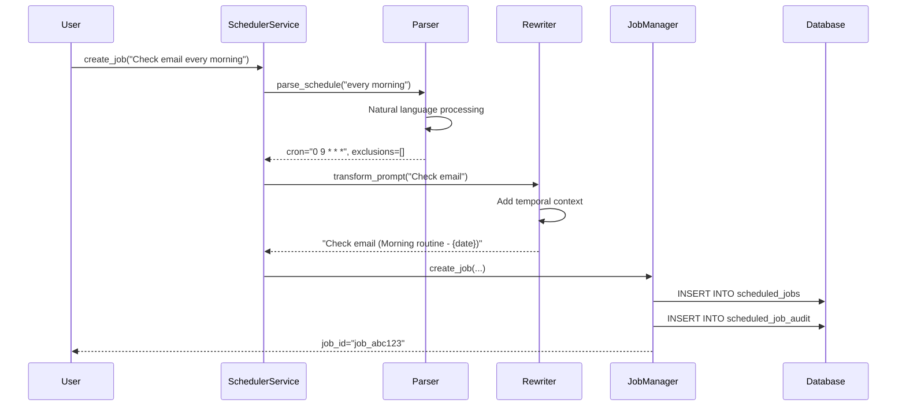
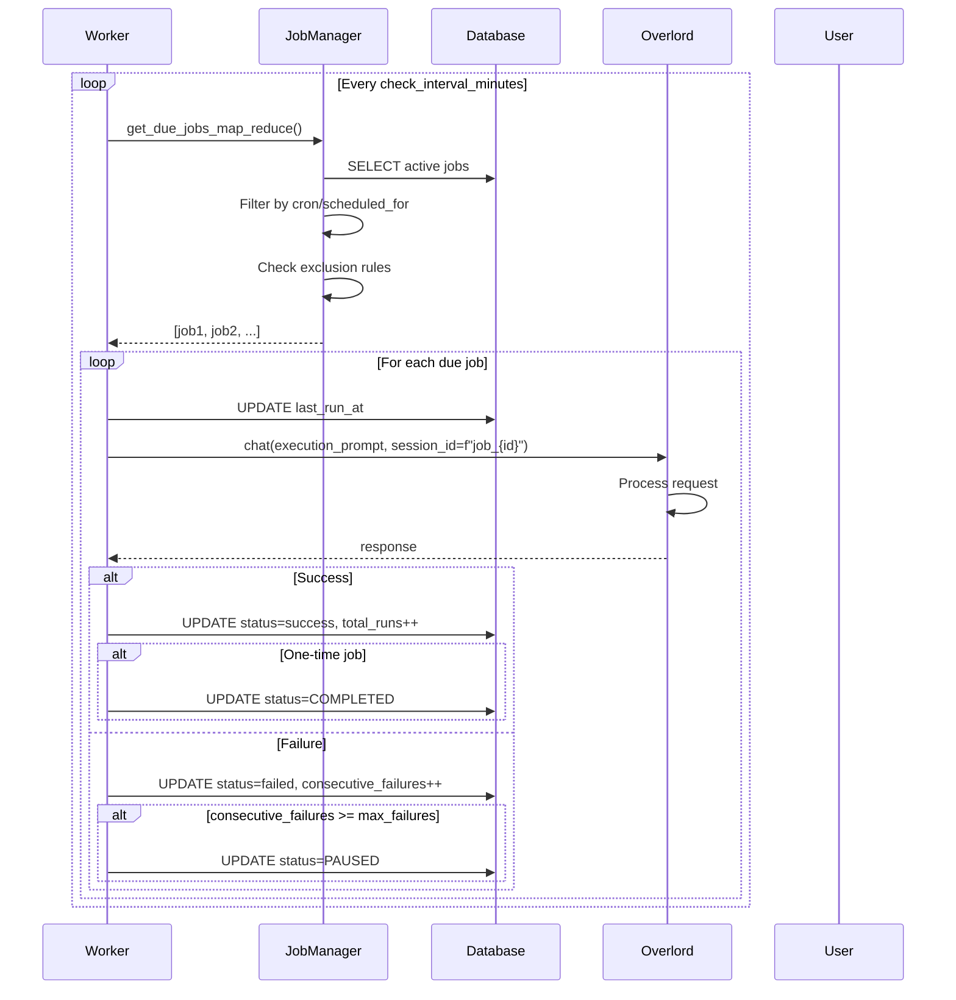

# MUXI Scheduler Architecture Documentation

## Overview

The MUXI Scheduler is a sophisticated task scheduling system that enables AI formations to execute tasks proactively at specified intervals or specific times. It supports both recurring jobs (cron-based) and one-time jobs (specific datetime execution), with natural language processing capabilities for schedule definition and intelligent exclusion rules.

## Core Architecture

### System Components

```
┌────────────────────────────────────────────────────────┐
│                    User Interface                      │
│                  (Natural Language Input)              │
└─────────────────────────┬──────────────────────────────┘
                          │
┌─────────────────────────▼──────────────────────────────┐
│                  SchedulerService                      │
│              (Main Orchestration Layer)                │
│  ┌──────────┐ ┌────────────┐ ┌─────────────────────┐   │
│  │ Worker   │ │   Cache    │ │  Circuit Breaker    │   │
│  │ Thread   │ │  Manager   │ │   (LLM Protection)  │   │
│  └──────────┘ └────────────┘ └─────────────────────┘   │
└─────────┬──────────┬─────────┬────────────┬────────────┘
          │          │         │            │
    ┌─────▼────┐ ┌───▼───┐ ┌───▼────┐ ┌─────▼─────┐
    │JobManager│ │Parser │ │Rewriter│ │  Batch    │
    │          │ │       │ │        │ │ Processor │
    └─────┬────┘ └───────┘ └────────┘ └───────────┘
          │
    ┌─────▼─────────────────────────────┐
    │         Database Layer            │
    │  ┌────────────┐ ┌──────────────┐  │
    │  │scheduled_  │ │scheduled_job_│  │
    │  │   jobs     │ │    audit     │  │
    │  └────────────┘ └──────────────┘  │
    └───────────────────────────────────┘
          │
    ┌─────▼─────────────────────────────┐
    │      Overlord Execution           │
    │   (chat() with session_id)        │
    └───────────────────────────────────┘
```

### Key Design Patterns

#### 1. Map/Reduce Pattern for Job Selection
The scheduler uses a map/reduce pattern WITHOUT calculating `next_run_at`:
- **MAP**: Fetch all active jobs from the database in batches
- **REDUCE**: Filter jobs based on current time and exclusion rules
- This approach avoids timezone complexity and DST issues

#### 2. Session-Based Execution
Each job execution uses a unique session ID: `f"job_{job_id}"`
- Enables tracking of job conversations
- Maintains context across executions
- Isolates job executions from each other

#### 3. Formation Integration
The scheduler leverages existing MUXI infrastructure:
- Uses Overlord's `chat()` method for execution
- Integrates with RequestTracker for async operations
- Utilizes existing webhook infrastructure

## Database Schema

### scheduled_jobs Table

| Column | Type | Description |
|--------|------|-------------|
| `id` | String(255) | Primary key, format: `job_{nanoid}` |
| `user_id` | Integer | Internal user ID (FK to users.id) |
| `external_user_id` | String(255) | Original user identifier |
| `title` | String(500) | Human-readable job title |
| `original_prompt` | Text | User's natural language request |
| `execution_prompt` | Text | Transformed prompt for execution |
| `is_recurring` | Boolean | True for recurring, False for one-time |
| `cron_expression` | String(255) | Cron pattern (NULL for one-time) |
| `scheduled_for` | DateTime | Specific datetime for one-time jobs |
| `exclusion_rules` | JSON | Array of exclusion patterns |
| `status` | String(20) | ACTIVE, PAUSED, COMPLETED |
| `last_run_at` | DateTime | Last execution timestamp |
| `last_run_status` | String(20) | success or failed |
| `total_runs` | Integer | Total execution count |
| `consecutive_failures` | Integer | Failure tracking for auto-pause |
| `job_metadata` | JSON | Extensible metadata field |

### scheduled_job_audit Table

| Column | Type | Description |
|--------|------|-------------|
| `id` | Integer | Auto-increment primary key |
| `job_id` | String(255) | FK to scheduled_jobs.id |
| `user_id` | Integer | FK to users.id |
| `action` | String(50) | created, updated, paused, resumed, deleted, replaced |
| `timestamp` | DateTime | When action occurred |
| `changes` | Text | JSON string of what changed |
| `reason` | Text | Optional reason for action |

## Core Workflows

### Job Creation Flow



### Job Execution Flow



## Key Components

### 1. SchedulerService

The main orchestration component that:
- Manages the background worker thread using `@multitasking.task`
- Coordinates job checking cycles (default: every 1 minute)
- Enforces concurrency limits (default: 10 concurrent jobs)
- Handles auto-pause after consecutive failures (default: 3 failures)

```python
# Key configuration
check_interval_minutes = 1  # How often to check for due jobs
max_concurrent_jobs = 10    # Maximum parallel executions
max_failures_before_pause = 3  # Auto-pause threshold
```

### 2. JobManager

Database operations layer that:
- Handles CRUD operations for scheduled jobs
- Manages audit trail for all job actions
- Enforces formation isolation (multi-tenant support)
- Provides batch processing methods for performance

Key methods:
- `create_job()`: Create new scheduled job with validation
- `get_active_jobs()`: Fetch jobs for processing
- `mark_job_execution_*()`: Track execution results
- `complete_onetime_job()`: Mark one-time jobs as completed

### 3. ScheduleParser

Natural language processing component that:
- Converts human language to cron expressions
- Generates dynamic exclusion rules via LLM
- Handles timezone-aware scheduling
- Supports multilingual input through LLM

Examples:
- "every day at 9am" → `"0 9 * * *"`
- "every Monday at 2pm" → `"0 14 * * 1"`
- "every hour except weekends" → cron + exclusion rules

### 4. PromptRewriter

Transforms user prompts for execution by:
- Adding temporal context (current date/time)
- Enhancing prompts for better LLM understanding
- Maintaining consistency across executions

### 5. BatchProcessor

Performance optimization component that:
- Processes jobs in configurable batches
- Implements concurrent processing with limits
- Provides metrics and monitoring

### 6. LLMCircuitBreaker

Fault tolerance component that:
- Protects against LLM service failures
- Implements exponential backoff
- Provides fallback mechanisms

## Job Types

### Recurring Jobs

Jobs that execute on a regular schedule using cron expressions:

```python
# Example: Daily report at 9am
{
    "is_recurring": True,
    "cron_expression": "0 9 * * *",
    "scheduled_for": None,
    "title": "Daily Status Report",
    "execution_prompt": "Generate daily status report"
}
```

### One-Time Jobs

Jobs that execute once at a specific datetime:

```python
# Example: Reminder for meeting tomorrow at 2pm
{
    "is_recurring": False,
    "cron_expression": None,
    "scheduled_for": datetime(2025, 1, 20, 14, 0, 0),
    "title": "Meeting Reminder",
    "execution_prompt": "Remind about project sync meeting"
}
```

## Exclusion Rules

Dynamic exclusion rules prevent job execution during specific periods:

### Cron-Based Exclusions
```json
{
    "type": "cron",
    "pattern": "0 0 * * 0,6",
    "description": "Skip weekends"
}
```

### Complex Date Exclusions
```json
{
    "type": "complex_date",
    "pattern": "last_friday_of_month",
    "description": "Skip last Friday of each month"
}
```

Supported patterns:
- `first_[weekday]_of_month`
- `last_[weekday]_of_month`
- `nth_weekday:N:weekday`
- `nth_day:N`
- `last_day_minus:N`

## Security & Isolation

### Multi-Tenant Support
- Jobs are isolated by `formation_id`
- User mapping through `users` table
- Formation-scoped queries prevent cross-tenant access

### Input Validation
- Comprehensive validation via `SchedulerInputValidator`
- Resource limits enforcement via `LimitsEnforcer`
- SQL injection prevention through SQLAlchemy ORM

### Audit Trail
- All job lifecycle events tracked in `scheduled_job_audit`
- Actions: created, updated, paused, resumed, deleted, replaced
- Complete change history with timestamps and reasons

## Performance Optimizations

### Caching Strategy
- LLM results cached for repeated schedules
- Configurable TTL (default: 300 seconds)
- Maximum cache size limit (default: 1000 entries)

### Batch Processing
- Jobs fetched in configurable batches
- Concurrent execution with limits
- Performance metrics tracking

### Database Indexes
- Composite indexes for efficient queries:
  - `idx_scheduled_jobs_user_status`: (user_id, status)
  - `idx_scheduled_jobs_active_cron`: (status, cron_expression)
  - `idx_scheduled_jobs_onetime_due`: (is_recurring, scheduled_for, status)

## Monitoring & Observability

### Events Emitted
- `SCHEDULER_SERVICE_STARTED`: Service initialization
- `SCHEDULER_CYCLE_COMPLETED`: Each check cycle completion
- `SCHEDULED_JOB_STARTED`: Job execution begins
- `SCHEDULED_JOB_COMPLETED`: Successful execution
- `SCHEDULED_JOB_FAILED`: Execution failure
- `SCHEDULED_JOB_EXCLUDED`: Excluded by rules
- `SCHEDULED_JOB_AUTO_PAUSED`: Auto-pause triggered
- `ONETIME_JOB_COMPLETED`: One-time job finished

### Performance Metrics
```python
{
    "cycles_completed": 1234,
    "jobs_processed": 5678,
    "llm_calls_saved": 890,  # Via caching
    "batch_processing_time": 0.45
}
```

## Configuration

Default configuration can be overridden in formation YAML:

```yaml
scheduler:
  check_interval_minutes: 1
  max_concurrent_jobs: 10
  max_failures_before_pause: 3
  timezone: "America/New_York"
  cache_ttl: 300
  max_cache_size: 1000
  llm_failure_threshold: 5
  llm_circuit_timeout: 60.0
  batch_size: 50
  max_concurrent_batch_processing: 5
```

## Error Handling

### Failure Recovery
1. Individual job failures tracked via `consecutive_failures`
2. Auto-pause triggered after threshold (default: 3)
3. Manual resume required after auto-pause
4. Audit trail maintains failure history

### Circuit Breaker Pattern
- LLM failures trigger circuit breaker
- Exponential backoff prevents cascading failures
- Automatic recovery after timeout

## Integration Points

### Overlord Integration
```python
# Job execution through overlord
response = await overlord.chat(
    message=execution_prompt,
    user_id=job["user_id"],
    session_id=f"job_{job_id}"  # Unique session per job
)
```

### Webhook Support
- Jobs can trigger webhooks on completion
- Leverages existing RequestTracker infrastructure
- Async execution with result delivery

### Memory Context
- Each job maintains conversation history
- Session-based isolation prevents context bleeding
- Buffer memory with configurable retention

## Testing Considerations

The scheduler is designed for testability:
- Map/reduce pattern enables unit testing of components
- Session IDs allow tracking in test environments
- Audit trail provides complete execution history
- Mock time injection for deterministic testing

## Recent Improvements (September 2025)

### Enhanced Integration
- **Overlord Integration**: Scheduler now integrated directly into overlord.py (lines 6395-6455)
- **Natural Language Detection**: Enhanced analyzer prompt for better pattern recognition
- **Webhook Support**: Full async execution with webhook URL passing from formation config

### Technical Fixes
- **JSON Parsing**: Fixed handling of markdown-wrapped LLM responses
- **Observability Events**: Corrected all non-existent event types (e.g., DATETIME_PARSING_FAILED → INTERNAL_ERROR)
- **One-off Scheduling**: Fixed handling of scheduled_for vs cron_expression fields

### Test Coverage
- **Area 12 Complete**: 8/11 tests implemented with 75% pass rate
- **Infrastructure Validation**: 100% success for scheduling infrastructure
- **Performance Metrics**: Job creation ~10-15s, webhook delivery ~2-5s

## Summary

The MUXI Scheduler provides a robust, scalable solution for proactive task execution in AI formations. Its key strengths include:

1. **Natural Language Interface**: Users describe schedules in plain language ("At 3pm", "In 5 minutes", "Every Monday")
2. **Flexible Scheduling**: Support for both recurring and one-time jobs
3. **Intelligent Exclusions**: Dynamic rules prevent unwanted executions
4. **Production Ready**: Auto-pause, audit trail, monitoring, and fault tolerance
5. **Formation Integration**: Leverages existing MUXI infrastructure with overlord.chat()
6. **Multi-Tenant**: Complete isolation between formations
7. **Performance Optimized**: Caching, batching, and circuit breakers
8. **Fully Tested**: Comprehensive e2e test coverage with real services

The scheduler transforms MUXI formations from reactive to proactive systems, enabling automated workflows and scheduled intelligence.
