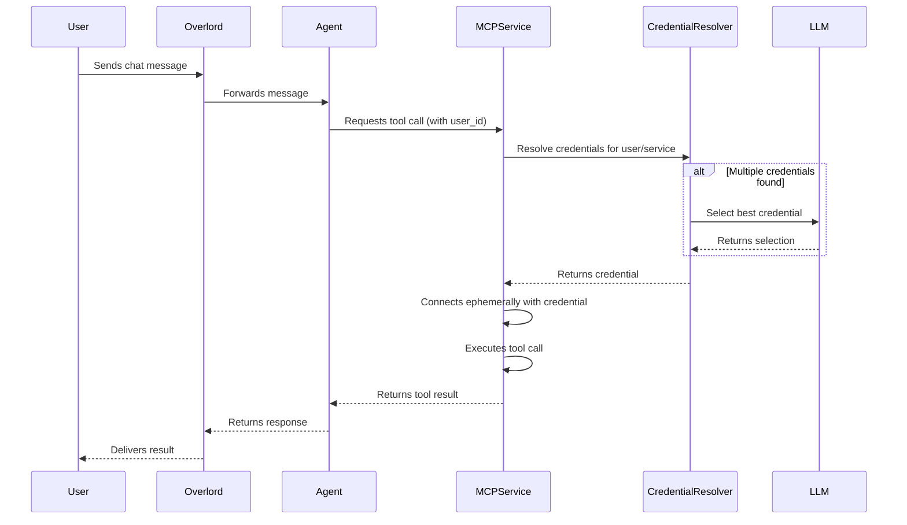
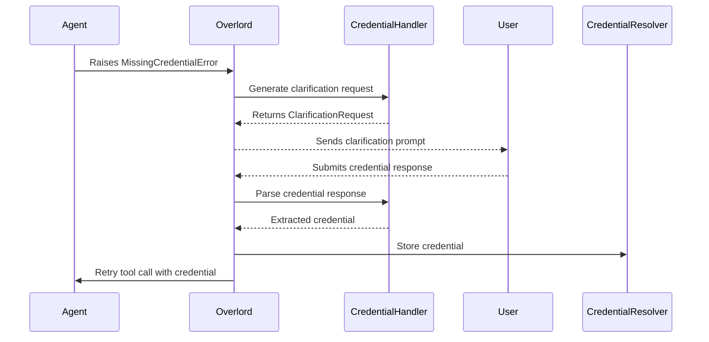

# User-Specific Credentials Chat Flow

This document explains how user-specific credentials work in the MUXI Runtime, including credential storage, resolution, selection, and the complete chat flow with clarification handling.

## Overview

The MUXI Runtime supports user-specific credentials for external services (like GitHub, Linear, etc.) with intelligent selection and clarification flows. This system allows:

- **Multi-user support**: Each user has isolated credentials
- **Multiple credentials per service**: Users can have multiple accounts for the same service
- **Intelligent selection**: LLM-based credential selection with partial name matching
- **Session caching**: Selected credentials are remembered within a conversation
- **Clarification flow**: Ambiguous requests trigger user clarification

## Sequence Diagram(s)

### Credential-Aware Tool Invocation Flow



### Clarification Request for Missing Credentials



## Architecture Components

### 1. Credential Storage (PostgreSQL)

```sql
-- Users table
users:
  - id: Integer (primary key)
  - external_user_id: Text (e.g., "user1", "alice@example.com")
  - formation_id: String (formation isolation)
  - public_id: String(21) (nano ID for external exposure)

-- Credentials table
credentials:
  - id: Integer (primary key)
  - user_id: Integer (foreign key to users.id)
  - credential_id: String (unique ID)
  - name: String (e.g., "lily automaze", "ranaroussi")
  - service: String (lowercase, e.g., "github", "linear")
  - credentials: JSON (encrypted credential data)
```

### 2. Key Classes and Services

- **CredentialResolver** (`credential_resolver.py`): Database operations and caching
- **MCPService** (`services/mcp/service.py`): Credential selection logic
- **Overlord** (`overlord.py`): Clarification flow orchestration
- **Agent** (`agent.py`): Tool invocation and error handling

## Complete Chat Flow Diagram

```
┌─────────────────────────────────────────────────────────────────────────────┐
│                           USER SENDS MESSAGE                                │
│                        "list my repositories"                               │
└─────────────────────────┬───────────────────────────────────────────────────┘
                          │
                          ▼
┌─────────────────────────────────────────────────────────────────────────────┐
│                    OVERLORD.chat(user_id="user1")                           │
│              overlord/overlord.py:~1200                                     │
│  • Checks for pending clarifications                                        │
│  • Routes to appropriate agent                                              │
│  • Passes user_id through the call chain                                    │
└─────────────────────────┬───────────────────────────────────────────────────┘
                          │
                          ▼
┌─────────────────────────────────────────────────────────────────────────────┐
│                   AGENT.process_message()                                   │
│               agents/agent.py:~400                                          │
│  • Optional: Enhances message if mcp.enhance_user_prompts=true              │
│  • Sends enhanced message to LLM                                            │
│  • LLM decides to call GitHub tools                                         │
└─────────────────────────┬───────────────────────────────────────────────────┘
                          │
                          ▼
┌─────────────────────────────────────────────────────────────────────────────┐
│                    AGENT.invoke_tool()                                      │
│               agents/agent.py:~1875                                         │
│  • Calls MCP service to execute tool                                        │
│  • Passes user_id and credential_resolver                                   │
└─────────────────────────┬───────────────────────────────────────────────────┘
                          │
                          ▼
┌─────────────────────────────────────────────────────────────────────────────┐
│                  MCP_SERVICE.invoke_tool()                                  │
│               services/mcp/service.py:~400                                  │
│  • Checks if server needs user credentials                                  │
│  • Calls credential_resolver.resolve(user_id, service)                      │
└─────────────────────────┬───────────────────────────────────────────────────┘
                          │
                          ▼
┌─────────────────────────────────────────────────────────────────────────────┐
│              CREDENTIAL_RESOLVER.resolve()                                  │
│           memory/credential_resolver.py:~140                                │
│  • Checks cache first                                                       │
│  • Queries database: finds 2 credentials                                    │
│    - "lily automaze"                                                        │
│    - "ranaroussi"                                                           │
│  • Returns list of credentials (multiple found)                             │
└─────────────────────────┬───────────────────────────────────────────────────┘
                          │
                          ▼
┌─────────────────────────────────────────────────────────────────────────────┐
│          MCP_SERVICE._handle_multiple_credentials()                         │
│               services/mcp/service.py:~1500                                 │
│  • Checks session cache for previous selection                              │
│  • No cached selection found                                                │
│  • Analyzes user message for explicit credential mentions                   │
└─────────────────────────┬───────────────────────────────────────────────────┘
                          │
                          ▼
┌─────────────────────────────────────────────────────────────────────────────┐
│           MCP_SERVICE._select_best_credential_with_llm()                    │
│               services/mcp/service.py:~1631                                 │
│  • Calls LLM with credential selection prompt                               │
│  • LLM analyzes "list my repositories" (ambiguous)                          │
│  • LLM returns selection: 0 (needs clarification)                           │
│  • RAISES CredentialSelectionNeededError                                    │
└─────────────────────────┬───────────────────────────────────────────────────┘
                          │ Exception bubbles up
                          ▼
┌─────────────────────────────────────────────────────────────────────────────┐
│                    AGENT.invoke_tool()                                      │
│               agents/agent.py:~1972                                         │
│  • Catches CredentialSelectionNeededError                                   │
│  • Converts to AmbiguousCredentialError                                     │
│  • RE-RAISES with credential details                                        │
└─────────────────────────┬───────────────────────────────────────────────────┘
                          │ Exception bubbles up
                          ▼
┌─────────────────────────────────────────────────────────────────────────────┐
│                    OVERLORD.chat()                                          │
│              overlord/overlord.py:~3800                                     │
│  • Catches AmbiguousCredentialError                                         │
│  • Stores clarification in _pending_clarifications                          │
│  • Generates clarification message                                          │
└─────────────────────────┬───────────────────────────────────────────────────┘
                          │
                          ▼
┌─────────────────────────────────────────────────────────────────────────────┐
│                        USER SEES RESPONSE                                   │
│   "I found multiple GitHub accounts for you. Which would you like to use?"  │
│                    "1. lily automaze"                                       │
│                    "2. ranaroussi"                                          │
└─────────────────────────┬───────────────────────────────────────────────────┘
                          │
                          ▼
┌─────────────────────────────────────────────────────────────────────────────┐
│                      USER RESPONDS: "1"                                     │
└─────────────────────────┬───────────────────────────────────────────────────┘
                          │
                          ▼
┌─────────────────────────────────────────────────────────────────────────────┐
│                    OVERLORD.chat()                                          │
│              overlord/overlord.py:~1200                                     │
│  • Detects pending clarification exists                                     │
│  • Parses user response "1" → selects "lily automaze"                       │
│  • Caches selection in MCP service                                          │
│  • Retries original request with selected credential                        │
└─────────────────────────┬───────────────────────────────────────────────────┘
                          │
                          ▼
┌─────────────────────────────────────────────────────────────────────────────┐
│                  SUCCESSFUL API CALL                                        │
│          GitHub API called with "lily automaze" credentials                 │
│                 Returns repository list                                     │
└─────────────────────────────────────────────────────────────────────────────┘
```

## Credential Selection Logic

### 1. Message Enhancement (Optional)
When `mcp.enhance_user_prompts` is enabled:
```python
# Original: "list my repos"
# Enhanced: "list my GitHub repositories"
```

### 2. LLM Credential Selection
The system uses an LLM to intelligently select credentials based on:

1. **Explicit mentions**: "list repos in my lily account" → selects lily
2. **Partial name matching**: "lily" matches "lily automaze"
3. **Context clues**: Previous conversation history
4. **Ambiguous requests**: "list my repos" → triggers clarification

### 3. Session Caching
- Selected credentials are cached per user per service per session
- Follow-up requests use cached selection automatically
- Explicit mentions override cache: "now use ranaroussi account"

## Credential Flow Examples

### Example 1: Single Credential (No Clarification)
```
User: "list my GitHub repos" (user has only 1 GitHub credential)
System: [Uses the single credential directly]
Response: "Here are your repositories..."
```

### Example 2: Multiple Credentials with Clarification
```
User: "list my repos" (user has 2 GitHub credentials)
System: "Which GitHub account would you like to use?
         1. lily automaze
         2. ranaroussi"
User: "1"
System: [Uses lily automaze credential]
Response: "Here are the repositories in lily automaze..."
```

### Example 3: Explicit Credential Selection
```
User: "list repos in my ranaroussi account"
System: [Directly uses ranaroussi credential, no clarification]
Response: "Here are the repositories in ranaroussi..."
```

### Example 4: Session Caching
```
User: "list my repos"
System: "Which account?" [User selects lily]
User: "how many stars do I have?"
System: [Uses cached lily credential without asking]
Response: "In lily automaze, you have..."
```

## Database Operations

### Storing Credentials
```python
await credential_resolver.store_credential(
    user_id="user1",
    service="github",
    credentials={"token": "ghp_xxx"},
    credential_name="lily automaze"
)
```

### Resolving Credentials
```python
# Single credential returns dict
creds = await credential_resolver.resolve("user1", "github")
# {"token": "ghp_xxx"}

# Multiple credentials returns list
creds = await credential_resolver.resolve("user1", "github")
# [
#   {"name": "lily automaze", "credentials": {"token": "ghp_xxx"}},
#   {"name": "ranaroussi", "credentials": {"token": "ghp_yyy"}}
# ]
```

## Error Handling

### MissingCredentialError
- Raised when user has no credentials for a service
- Triggers clarification asking user to provide credentials

### CredentialSelectionNeededError
- Internal error from MCP service
- Converted to AmbiguousCredentialError by Agent

### AmbiguousCredentialError
- Raised when multiple credentials exist and selection is ambiguous
- Contains available credentials and LLM ordering
- Triggers numbered clarification dialog

## Configuration

### Formation Configuration
```yaml
# Enable message enhancement for better tool selection
mcp:
  enhance_user_prompts: true
  max_tool_calls: 10

# MCP server with user credentials
mcp/github.yaml:
  id: "github-mcp"
  use_user_credentials: true  # Enable user-specific credentials
```

### Security Considerations
1. **Isolation**: Credentials are isolated by user AND formation
2. **Encryption**: Credentials are encrypted in the database
3. **No Cross-User Access**: Users cannot access other users' credentials
4. **Session Scope**: Credential cache is per-session, not persistent

## Future Enhancements (Default Credentials)

The system is designed to support default credentials in the future:

### Setting Defaults
```
User: "Set ranaroussi as my default GitHub account"
System: "I've set ranaroussi as your default GitHub account."
```

### Using Defaults
```
User: "list my repos" (has default set)
System: [Uses default credential without clarification]
```

### Database Schema for Defaults
```sql
ALTER TABLE credentials ADD COLUMN is_default BOOLEAN DEFAULT FALSE;

CREATE UNIQUE INDEX idx_credentials_default
ON credentials (user_id, service)
WHERE is_default = TRUE;
```

## Testing

The credential system has comprehensive test coverage:

- **test_4d1**: Single credential usage
- **test_4d2**: Missing credential handling
- **test_4d3**: Multiple credential clarification
- **test_4d3_explicit**: Direct credential selection
- **test_4d3_clarification**: Ambiguous request flow
- **test_4d3_cache**: Session caching verification
- **test_4d3_cache_switch**: Cache override testing
- **test_4d4**: Multi-user isolation
- **test_4e1/4e2**: Security isolation testing

## Troubleshooting

### Common Issues

1. **Credentials not found**: Check database and formation_id
2. **Wrong credential selected**: Verify credential names are distinct
3. **Clarification not triggered**: Check message enhancement settings
4. **Cache not working**: Ensure session_id is consistent

### Debug Points
- Enable debug logging in credential_resolver.py
- Check `_pending_clarifications` in Overlord
- Verify MCP server `use_user_credentials` flag
- Monitor LLM credential selection responses

---

*This document describes the user credential system as implemented in MUXI Runtime v0.0.1*
