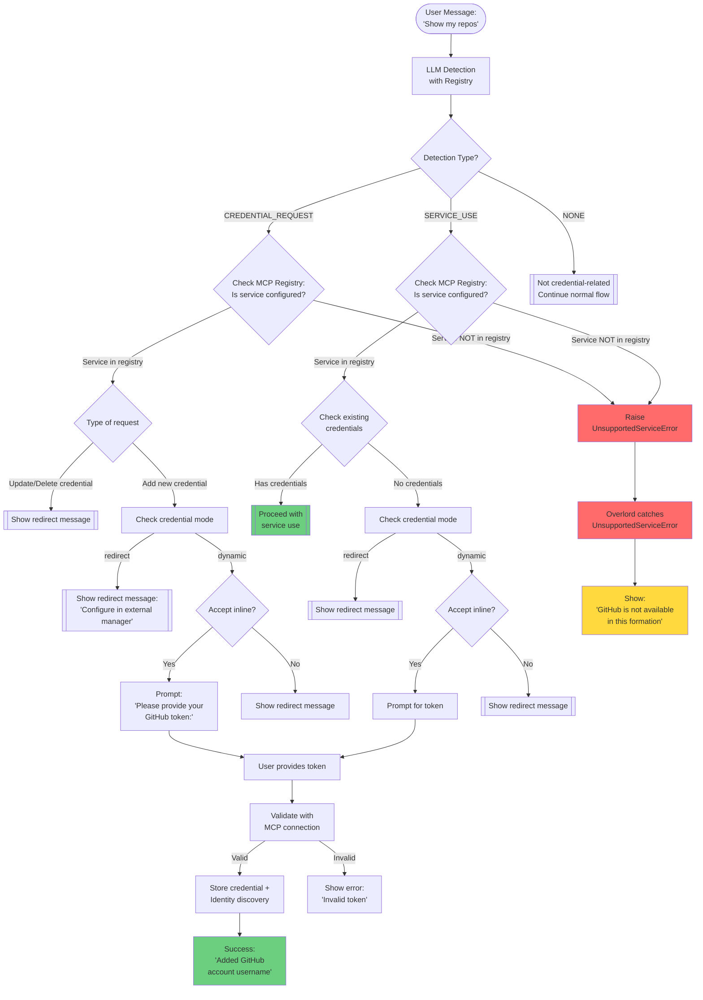

# User Credentials Flow

This document explains the credential handling system in the MUXI Runtime, including credential detection, routing based on modes (redirect/dynamic), storage, and the complete flow with MCP server registry.

## Overview

The MUXI Runtime provides a sophisticated credential handling system that:

- **Intercepts credential requests early**: Before clarification, preventing confusion
- **Supports two modes**: `redirect` (external management) and `dynamic` (inline collection)
- **Uses MCP server registry**: Tracks which services use credentials and accept inline entry
- **LLM-powered detection**: Intelligently identifies SERVICE_USE vs CREDENTIAL_REQUEST
- **Handles missing services**: Raises UnsupportedServiceError for unconfigured services
- **Encrypted storage**: Per-user encryption with key derivation

## Credential Handling Modes

### Redirect Mode (Default)
- Shows configured `redirect_message` when credentials are needed
- User manages credentials externally (e.g., web portal, CLI tool)
- No credential values pass through the chat interface

### Dynamic Mode
- Prompts users for credentials inline during chat
- Only works if service has `accept_inline: true`
- Validates credentials via MCP connection before storage
- Performs identity discovery for meaningful naming

## Complete Flow Diagram



## Architecture Components

### 1. MCP Server Registry (formation.py)

During formation initialization, the system builds a registry of MCP servers that use user credentials:

```python
# In formation._register_mcp_servers()
self._mcp_servers_with_user_credentials = {
    "github-mcp": {
        "service": "github",        # Normalized service name
        "server_id": "github-mcp",  # Full MCP server ID
        "accept_inline": True,       # From auth.accept_inline
        "auth_type": "bearer",       # Auth type
        "uses_user_credentials": True,
        "description": "GitHub MCP Server"
    }
}
```

### 2. Credential Detection (overlord.py)

LLM-based detection identifies credential needs:

```python
async def _detect_credential_need(message: str, user_id: str) -> Dict:
    # Returns detection result with type:
    # - SERVICE_USE: User wants to use a service
    # - CREDENTIAL_REQUEST: User wants to add/update credentials
    # - NONE: Not credential-related
```

### 3. Credential Storage

```
src/muxi/formation/credentials/
├── __init__.py           # Module exports
├── resolver.py           # CredentialResolver (database operations)
├── encrypted.py          # EncryptedCredentialResolver (encryption layer)
└── exceptions.py         # MissingCredentialError, AmbiguousCredentialError
```

### 4. Database Schema

```sql
-- Users table
users:
  - id: Integer (primary key)
  - external_user_id: Text (e.g., "user1", "alice@example.com")
  - formation_id: String (formation isolation)
  - public_id: String(21) (nano ID for external exposure)

-- Credentials table
credentials:
  - id: Integer (primary key)
  - user_id: Integer (foreign key to users.id)
  - credential_id: String (unique ID)
  - name: String (e.g., "ranaroussi")
  - service: String (normalized, e.g., "github")
  - credentials: JSON (encrypted with per-user key)
```

## Configuration

### Formation YAML

```yaml
# Credential handling configuration
user_credentials:
  mode: "redirect"  # or "dynamic"
  redirect_message: "Please configure your API credentials in the external credential manager."
  # encryption_key: "optional-custom-key"  # Defaults to formation_id

# MCP server configuration
mcp_servers:
  - id: "github-mcp"
    endpoint: "https://api.github.com/mcp"
    auth:
      type: "bearer"
      accept_inline: true  # Allow dynamic credential collection
      token: "${{ user.credentials.github }}"
```

## Detection Examples

### SERVICE_USE Detection
```
User: "Show my repos"
User: "List my GitHub PRs"
User: "Check my issues"
→ Detection: SERVICE_USE (user wants to use a service)
```

### CREDENTIAL_REQUEST Detection
```
User: "Add new GitHub account"
User: "I need to configure my API key"
User: "Set up different credentials"
→ Detection: CREDENTIAL_REQUEST (user wants to add/update credentials)
```

### NONE Detection
```
User: "What's the weather?"
User: "Write a Python function"
User: "Explain quantum computing"
→ Detection: NONE (not credential-related)
```

## Flow Examples

### Example 1: Redirect Mode - New Account Request
```
Formation config: mode: "redirect"

User: "I need to add a new GitHub account with different credentials"
System: "Please configure your API credentials in the external credential manager."
```

### Example 2: Dynamic Mode - New Account Request
```
Formation config: mode: "dynamic", GitHub has accept_inline: true

User: "I need to add a new GitHub account"
System: "Please provide your GitHub personal access token:"
User: "ghp_xxxxxxxxxxxx"
System: "Successfully added GitHub account 'ranaroussi'"
```

### Example 3: Service Use Without Credentials
```
User: "Show my repos"
System: [Detects SERVICE_USE, checks GitHub configured, no credentials]

Redirect mode:
System: "Please configure your API credentials in the external credential manager."

Dynamic mode with accept_inline:
System: "You need GitHub credentials to do that. Please provide your GitHub personal access token:"
```

### Example 4: Unconfigured Service
```
User: "Show my Slack messages"
System: [Detects SERVICE_USE, Slack not in MCP registry]
System: "Slack service is not available in this formation."
```

## Security Features

### Per-User Encryption
- Each user's credentials encrypted with unique key
- Key derivation: PBKDF2(formation_id + user_id)
- Fernet encryption for credential storage
- Zero-configuration: works out of the box

### Isolation
- **Formation-level**: Credentials isolated by formation_id
- **User-level**: No cross-user credential access
- **Service-level**: Credentials scoped to specific services

### Validation
- Credentials validated via MCP connection before storage
- Invalid credentials rejected immediately
- No storage of unverified credentials

## Identity Discovery

When storing credentials in dynamic mode, the system:

1. Validates the credential via MCP connection
2. Discovers the identity (e.g., GitHub username)
3. Stores with meaningful name instead of generic "github"

```python
# Instead of storing as "github"
credential_name = await discover_identity(service, credential)
# Stores as "ranaroussi" or "lily-automaze"
```

## Error Handling

### UnsupportedServiceError
- Raised when user requests a service not in the formation
- Caught by overlord and converted to friendly message
- Example: "GitHub is not available in this formation"

### MissingCredentialError
- Raised when credentials needed but not found
- Triggers redirect message or dynamic prompt
- Includes service name and user ID

### AmbiguousCredentialError
- Raised when multiple credentials exist
- In redirect mode: Shows redirect message
- In dynamic mode: Shows existing accounts

## Implementation Details

### Request Interception Point

The credential detection happens in the request lifecycle at:
```
Format Message → Credential Detection → Has Pending Clarification → ...
```

This ensures credential requests are handled before entering the clarification system.

### Registry Usage

The MCP server registry (`_mcp_servers_with_user_credentials`) enables:
- Dynamic discovery of credential-using services
- No hardcoding of service names
- Runtime configuration from formation YAML
- Per-service inline acceptance settings

## Testing

### Test Coverage
- **test_8e1a**: Redirect mode credential handling
- **test_8e2**: Dynamic mode credential collection
- **test_4d** series: Multi-credential selection and caching
- **Integration tests**: Encryption and storage verification

### Key Test Scenarios
1. Credential request detection (both modes)
2. Service use without credentials
3. Unconfigured service handling
4. Identity discovery validation
5. Encryption/decryption cycle
6. Multi-user isolation

## Migration from Old System

The new system replaces the previous clarification-based approach:

### Old Flow (Pre-#53)
- Credential requests went through clarification
- Pattern matching for detection
- Credentials handled as clarification responses

### New Flow (Issue #53)
- Credential requests intercepted before clarification
- LLM-based detection with registry
- Direct handling based on mode

## Future Enhancements

### Planned Features
1. **OAuth flow support**: Beyond simple tokens
2. **Credential rotation**: Automatic refresh for expiring tokens
3. **Default credentials**: User-preferred credentials per service
4. **Credential sharing**: Team-level shared credentials
5. **Audit logging**: Track credential usage

### API Extensions
```python
# Future: Set default credential
await resolver.set_default(user_id, service, credential_name)

# Future: Share credential with team
await resolver.share_credential(credential_id, team_id)

# Future: Rotate credential
await resolver.rotate_credential(user_id, service)
```

---

*This document describes the credential handling system as implemented in MUXI Runtime v0.0.1 (Issue #53)*