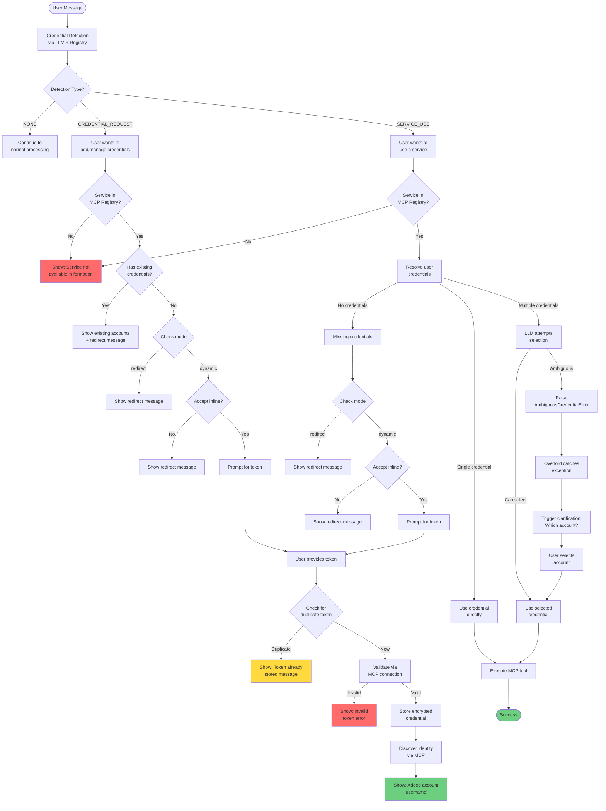

# User Credentials System Documentation

## Overview

The MUXI Runtime provides a comprehensive credential handling system that manages user authentication for external services (GitHub, Slack, etc.) with enterprise-grade security and developer-friendly usability. The system supports multiple credentials per service per user, encrypted storage, and flexible credential management modes.

## Key Features

- **Multi-account support**: Users can have multiple credentials for the same service
- **Encrypted storage**: Per-user encryption with PBKDF2 key derivation
- **Duplicate detection**: Prevents storing the same token multiple times
- **Two operational modes**: Redirect (external) and Dynamic (inline)
- **Identity discovery**: Meaningful account naming instead of generic service names
- **LLM-powered detection**: Intelligent identification of credential needs
- **MCP server registry**: Dynamic service discovery from formation configuration

## Architecture Overview

```
User Request → Credential Detection → Mode-based Routing → Storage/Validation
                      ↓                        ↓                    ↓
                 LLM Analysis            Redirect/Dynamic      Encrypted DB
                      ↓                        ↓                    ↓
                MCP Registry           External/Inline      Identity Discovery
```

## Core Components

### 1. Credential Module Structure
```
src/muxi/formation/credentials/
├── __init__.py           # Module exports
├── resolver.py           # Base CredentialResolver class
├── encrypted.py          # EncryptedCredentialResolver with encryption
├── handler.py            # CredentialHandler for request processing
└── exceptions.py         # Credential-specific exceptions
```

### 2. Database Schema
```sql
-- Users table
users:
  - id: Integer (primary key)
  - external_user_id: Text (e.g., "user1", "alice@example.com")
  - formation_id: String (formation isolation)
  - public_id: String(21) (nano ID for external exposure)

-- Credentials table
credentials:
  - id: Integer (primary key)
  - user_id: Integer (foreign key to users.id)
  - credential_id: String (unique ID)
  - name: String (e.g., "ranaroussi", "lilyautomaze")
  - service: String (normalized, e.g., "github")
  - credentials: JSON (encrypted with per-user key)
  - created_at: Timestamp
  - updated_at: Timestamp
```

### 3. MCP Server Registry

Built during formation initialization to track credential-using services:

```python
# In formation._register_mcp_servers()
self._mcp_servers_with_user_credentials = {
    "github-mcp": {
        "service": "github",        # Normalized service name
        "server_id": "github-mcp",  # Full MCP server ID
        "accept_inline": True,       # From auth.accept_inline
        "auth_type": "bearer",       # Auth type
        "uses_user_credentials": True,
        "description": "GitHub MCP Server"
    }
}
```

## Complete Flow Diagram



## Credential Handling Modes

### Redirect Mode (Default)
- Shows configured `redirect_message` when credentials are needed
- User manages credentials externally (e.g., web portal, CLI tool)
- No credential values pass through the chat interface
- Suitable for enterprise environments with compliance requirements

### Dynamic Mode
- Prompts users for credentials inline during chat
- Only works if service has `accept_inline: true`
- Validates credentials via MCP connection before storage
- Performs identity discovery for meaningful naming
- Suitable for developer environments and personal use

## Configuration

### Formation YAML

```yaml
# Credential handling configuration
user_credentials:
  mode: "dynamic"  # or "redirect"
  encryption_key: null  # Optional, defaults to formation_id
  redirect_message: |
    Please configure your API credentials in the external credential manager.

# MCP server configuration
mcp_servers:
  - id: "github-mcp"
    endpoint: "https://api.github.com/mcp"
    auth:
      type: "bearer"
      accept_inline: true  # Allow dynamic credential collection
      token: "${{ user.credentials.github }}"
```

## Exception Flow

### Exception Hierarchy

```
MissingCredentialError → Triggers credential addition flow
    ↓
CredentialSelectionNeededError → Raised by MCP when selection ambiguous
    ↓
AmbiguousCredentialError → Converted by Agent, caught by Overlord
    ↓
UnsupportedServiceError → Service not configured in formation
```

### Exception Details

#### MissingCredentialError
- **Raised by**: MCPService when no credentials found
- **Handled by**: CredentialHandler to prompt for new credentials
- **Contains**: service name, user_id

#### AmbiguousCredentialError
- **Raised by**: Agent (converted from CredentialSelectionNeededError)
- **Handled by**: Overlord to trigger clarification
- **Contains**: service, user_id, available_credentials list

#### UnsupportedServiceError
- **Raised by**: CredentialHandler when service not in MCP registry
- **Handled by**: Overlord to show friendly error message
- **Contains**: service name, available services list

## Key Features Implementation

### 1. Duplicate Token Detection

Before storing a new credential, the system checks for duplicates:

```python
async def check_duplicate(self, user_id: str, service: str, credentials: Any) -> bool:
    """Check if credential already exists by comparing decrypted values."""
    # Fetch all existing credentials for user/service
    existing_credentials = await self._fetch_credentials(user_id, service)
    
    # Canonicalize the incoming credential for comparison
    canonical_new = self._canonicalize_credential(credentials)
    
    # Decrypt and compare each one
    for existing in existing_credentials:
        decrypted = self._decrypt_credentials(user_id, existing.credentials)
        # Use canonical comparison to handle key ordering differences
        canonical_existing = self._canonicalize_credential(decrypted)
        if canonical_existing == canonical_new:
            return True  # Duplicate found
    
    return False  # No duplicate

def _canonicalize_credential(self, credential: Any) -> str:
    """
    Canonicalize credentials for consistent comparison.
    Handles dictionary key ordering, whitespace differences, and type variations.
    Returns a normalized JSON string representation.
    """
```

**Benefits**:
- Prevents unnecessary API calls for validation
- Avoids storing duplicate tokens
- Provides clear feedback to users

### 2. Per-User Encryption

Each user's credentials are encrypted with a unique key:

```python
def derive_user_key(self, user_id: str) -> Fernet:
    """Derive per-user encryption key using PBKDF2."""
    base_key = self.custom_key or self.formation_id
    combined = f"{base_key}:{user_id}".encode('utf-8')
    
    kdf = PBKDF2HMAC(
        algorithm=hashes.SHA256(),
        length=32,
        salt=b'muxi-user-credentials-v1',
        iterations=100000,
    )
    
    key = base64.urlsafe_b64encode(kdf.derive(combined))
    return Fernet(key)
```

**Security Benefits**:
- User isolation: Each user has unique encryption
- Zero-configuration: Works out of the box using formation_id
- Forward compatibility: Can upgrade to custom keys later

### 3. Identity Discovery

When storing credentials, the system discovers the actual account identity:

```python
async def update_credential_name_with_discovery(
    self, user_id: str, service: str, mcp_service: Any
) -> Optional[str]:
    """Discover and update credential name using MCP identity tools."""
    # Use MCP's get_me or equivalent to discover identity
    identity = await mcp_service.discover_identity(service)
    
    if identity and identity != service:
        # Update credential name from "github" to "ranaroussi"
        await self._update_credential_name(user_id, service, identity)
        return identity
```

**User Benefits**:
- Meaningful account names instead of generic service names
- Easy identification when multiple accounts exist
- Better UX for account selection

### 4. LLM-Based Detection

The system uses LLM to intelligently detect credential needs:

```python
async def _detect_credential_need(self, message: str, user_id: str) -> Optional[Dict]:
    """Detect if message relates to a service that needs credentials."""
    # Get available credential-using services from registry
    available_services = self._mcp_servers_with_user_credentials
    
    prompt = f"""Analyze if this message relates to any service that requires credentials.
    
    Available services: {list(available_services.keys())}
    User message: {message}
    
    Respond with:
    - CREDENTIAL_REQUEST:<service> if adding/configuring credentials
    - SERVICE_USE:<service> if using a service
    - NONE if neither
    """
    
    response = await self.llm.chat(prompt)
    return self._parse_detection_response(response)
```

**Advantages**:
- Works in any language (multilingual support)
- Context-aware detection
- No hardcoded patterns

## Flow Examples

### Example 1: Adding New Account (Dynamic Mode)

```
User: "I need to add a new GitHub account"
System: [Detects CREDENTIAL_REQUEST for GitHub]
System: "Please provide your GitHub personal access token:"
User: "ghp_xxxxxxxxxxxx"
System: [Validates token, discovers identity]
System: "Successfully added GitHub account 'ranaroussi'"
```

### Example 2: Duplicate Token Detection

```
User: "Add my GitHub token ghp_abc123"
System: [Checks for duplicate BEFORE validation]
System: "That GitHub token is already stored in your account. You're all set!"
```

### Example 3: Multiple Accounts Selection

```
User: "Show my GitHub repositories"
System: [Finds 2 credentials: ranaroussi, lilyautomaze]
System: "You have two GitHub accounts: 'ranaroussi' and 'lilyautomaze'. Which would you like to use?"
User: "Use ranaroussi"
System: [Uses selected credential to fetch repositories]
```

### Example 4: Missing Service (Not Configured)

```
User: "Connect to my Slack workspace"
System: [Detects SERVICE_USE, Slack not in MCP registry]
System: "Slack service is not available in this formation."
```

## Security Considerations

### Encryption at Rest
- All credentials encrypted before database storage
- Per-user keys prevent cross-user access
- Formation-level isolation for multi-tenant deployments

### No Credential Leakage
- Credentials never appear in logs
- LLM context sanitized before processing
- Error messages don't expose credential values

### Validation Before Storage
- Credentials validated via actual service connection
- Invalid credentials rejected immediately
- No storage of unverified credentials

### Audit Trail
- All credential operations logged (without values)
- User actions tracked for compliance
- Credential usage monitored

## Testing

### Test Coverage

| Test File | Purpose | Coverage |
|-----------|---------|----------|
| test_8e1a_apikey_redirect | Redirect mode for API keys | ✅ |
| test_8e1b_bearer_redirect | Redirect mode for bearer tokens | ✅ |
| test_8e1c_oauth_redirect | Redirect mode for OAuth | ✅ |
| test_8e2_dynamic | Dynamic credential collection | ✅ |
| test_8e7_existing_creds_new_account | Multiple account handling | ✅ |
| test_8e10_user_cancellation | Cancellation flow | ✅ |
| test_8e11_duplicate_token_v2 | Duplicate detection | ✅ |
| test_4d4_multiuser_isolation | User isolation | ✅ |

### Key Test Scenarios

1. **Credential Addition**: Both redirect and dynamic modes
2. **Duplicate Detection**: Prevents duplicate token storage
3. **Multiple Accounts**: Selection and management
4. **User Isolation**: No cross-user credential access
5. **Encryption**: Verify encryption/decryption cycle
6. **Service Discovery**: MCP registry integration
7. **Error Handling**: Graceful failures and messages

## Common Issues and Solutions

### Issue: SQLAlchemy "Multiple rows were found when one or none was required"
**Cause**: Using `.scalar_one_or_none()` when multiple credentials exist
**Solution**: Changed to `.scalars().all()` to handle multiple credentials properly

### Issue: Duplicate tokens not detected
**Cause**: Comparing encrypted values instead of decrypted
**Solution**: Decrypt stored credentials before comparison

### Issue: Generic credential names
**Cause**: Not performing identity discovery
**Solution**: Use MCP service to discover actual account identity

### Issue: Credentials in logs
**Cause**: Missing log sanitization
**Solution**: Add credential pattern detection to log filters

## API Reference

### CredentialResolver Methods

```python
async def resolve(user_id: str, service: str) -> Optional[Union[Dict, List[Dict]]]:
    """Resolve credentials for a user and service."""

async def store_credential(
    user_id: str, 
    service: str, 
    credentials: Any,
    credential_name: Optional[str] = None
) -> str:
    """Store encrypted credential, returns status."""

async def check_duplicate(
    user_id: str, 
    service: str, 
    credentials: Any
) -> bool:
    """Check if credential already exists."""

async def update_credential_name_with_discovery(
    user_id: str,
    service: str,
    mcp_service: Any
) -> Optional[str]:
    """Discover and update credential identity."""

async def list_credentials(user_id: str) -> Dict[str, List[Dict[str, Any]]]:
    """
    List all credentials for a user.
    Returns dictionary mapping service names to lists of credential objects.
    Each credential includes: id, credential_id, name, credentials, created_at, updated_at.
    Supports multiple credentials per service.
    """

async def remove_credential(user_id: str, service: str, credential_name: str) -> bool:
    """Remove a specific credential by user, service, and name."""
```

### CredentialHandler Methods

```python
async def detect_credential_need(
    message: str, 
    user_id: str
) -> Optional[Dict]:
    """Detect if message needs credential handling."""

async def handle_credential_request(
    message: str,
    user_id: str,
    session_id: str,
    request_id: str
) -> Optional[MuxiResponse]:
    """Handle credential request based on mode."""
```

## Migration Notes

### From Old System (Pre-Epic)
- Pattern-based detection → LLM-based detection
- Hardcoded service names → MCP registry
- Single credential support → Multiple credentials
- Plaintext storage → Encrypted storage
- Clarification-based flow → Direct credential handling

### Database Migration
- Existing credentials table compatible
- Add encryption to existing records
- Populate credential names via discovery
- No schema changes required

## Future Enhancements

### Planned Features
1. **OAuth 2.0 Flow**: Full OAuth support with refresh tokens
2. **Credential Rotation**: Automatic token refresh
3. **Team Credentials**: Shared credentials for teams
4. **Default Selection**: User-preferred credentials per service
5. **Expiration Handling**: Proactive credential renewal
6. **Audit Dashboard**: Credential usage analytics

### API Extensions (Future)
```python
# Set default credential for service
await resolver.set_default(user_id, service, credential_name)

# Share credential with team
await resolver.share_credential(credential_id, team_id)

# Rotate expiring credential
await resolver.rotate_credential(user_id, service)

# Get credential usage statistics
await resolver.get_usage_stats(user_id, service)
```

## Conclusion

The MUXI Runtime credential handling system provides a robust, secure, and user-friendly solution for managing authentication across multiple services. With support for multiple accounts, encrypted storage, duplicate detection, and flexible operational modes, it meets both enterprise security requirements and developer productivity needs.

The system's architecture ensures:
- **Security**: Encrypted storage with user isolation
- **Usability**: Intelligent detection and meaningful naming
- **Flexibility**: Redirect and dynamic modes for different environments
- **Scalability**: Multi-user, multi-service, multi-credential support
- **Maintainability**: Clean separation of concerns and comprehensive testing

---

*Last Updated: August 30, 2025*
*MUXI Runtime Version: 0.0.1*
*Epic: user-credentials-handling (#29)*