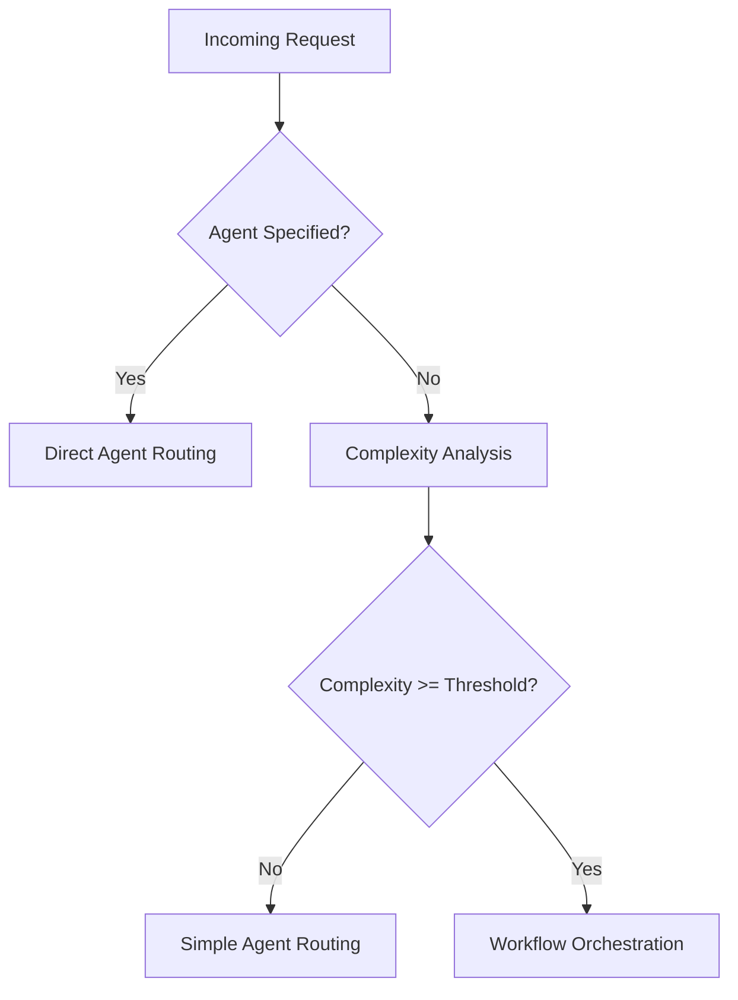

# MUXI Runtime Workflow Orchestration System

**Version**: 1.0
**Date**: July 28, 2025
**Status**: Production Ready

## Overview

The MUXI Runtime Workflow Orchestration System provides intelligent task decomposition and multi-agent coordination for complex requests. It automatically analyzes incoming requests, determines complexity, and orchestrates multiple agents to handle sophisticated workflows that require coordinated execution across different capabilities.

## Architecture

### Core Components

```
┌─────────────────┐    ┌──────────────────┐    ┌─────────────────┐
│   Overlord      │───►│ RequestAnalyzer  │───►│ TaskDecomposer  │
│                 │    │                  │    │                 │
└─────────────────┘    └──────────────────┘    └─────────────────┘
         │                                               │
         ▼                                               ▼
┌─────────────────┐    ┌──────────────────┐    ┌─────────────────┐
│ WorkflowManager │    │ WorkflowExecutor │◄───│    Workflow     │
│                 │    │                  │    │                 │
└─────────────────┘    └──────────────────┘    └─────────────────┘
         │                       │                       │
         ▼                       ▼                       ▼
┌─────────────────┐    ┌──────────────────┐    ┌─────────────────┐
│ WorkflowMetrics │    │   Agent Pool     │    │   MCP Tools     │
│                 │    │                  │    │                 │
└─────────────────┘    └──────────────────┘    └─────────────────┘
```

### Component Responsibilities

- **Overlord**: Main orchestrator that decides when to trigger workflows
- **RequestAnalyzer**: Analyzes request complexity using configurable methods
- **TaskDecomposer**: Breaks complex requests into executable tasks with dependencies
- **WorkflowManager**: Tracks workflow lifecycle and maintains state
- **WorkflowExecutor**: Executes workflows with advanced routing and error handling
- **WorkflowMetrics**: Collects and reports workflow performance data

## Request Flow

### 1. Request Analysis Phase



**Decision Logic:**
```python
def should_trigger_workflow(request, agent_name, auto_decomposition):
    return (
        agent_name is None and
        auto_decomposition and
        not is_clarification_response(request)
    )
```

### 2. Complexity Analysis

The system supports multiple complexity calculation methods:

#### Heuristic Method (Default)
```python
def calculate_heuristic_complexity(text: str) -> float:
    # Word count factor
    word_count = len(text.split())
    word_factor = min(word_count / 20, 3.0)

    # Complexity indicators
    indicators = [
        ("research", 2.0), ("analyze", 1.5), ("create", 1.5),
        ("generate", 1.5), ("write", 1.0), ("summarize", 1.0)
    ]

    # Multi-step detection
    multi_step_patterns = ["and then", "after that", "followed by"]

    return base_score + word_factor + indicator_score + multi_step_bonus
```

#### LLM Method
Uses the configured text model to analyze request complexity with structured prompts.

#### Hybrid Method
Combines heuristic and LLM methods with configurable weights.

### 3. Task Decomposition

Complex requests are decomposed into executable tasks:

```yaml
workflow:
  id: "wrk_example123"
  status: "pending"
  tasks:
    - id: "task_1"
      type: "research"
      description: "Research the specified topic"
      agent_requirements: ["research", "web_search"]
      dependencies: []

    - id: "task_2"
      type: "content_creation"
      description: "Create summary document"
      agent_requirements: ["writing"]
      dependencies: ["task_1"]

    - id: "task_3"
      type: "tool_usage"
      description: "Save to external system"
      agent_requirements: ["coding", "linear"]
      dependencies: ["task_2"]
```

### 4. Agent Selection & Routing

The system uses multiple routing strategies:

#### Capability-Based Routing (Default)
```python
def select_agent_capability_based(task, agents):
    """Select agent based on capability matching"""
    scored_agents = []
    for agent in agents:
        score = calculate_capability_match(task.requirements, agent.capabilities)
        scored_agents.append((agent, score))

    return max(scored_agents, key=lambda x: x[1])[0]
```

#### Load-Balanced Routing
Considers current agent workload for optimal distribution.

#### Round-Robin Routing
Sequential agent selection for even distribution.

## Configuration

### Formation Configuration

```yaml
overlord:
  config:
    # Workflow system settings
    auto_decomposition: true
    complexity_threshold: 7.0
    plan_approval_threshold: 10

    workflow:
      # Complexity calculation method
      complexity_method: "heuristic"  # heuristic, llm, custom, hybrid

      # Task routing strategy
      routing_strategy: "capability_based"  # load_balanced, round_robin

      # Error recovery strategy
      error_recovery: "retry_with_backoff"  # fail_fast, skip_and_continue

      # Retry configuration
      retry:
        max_attempts: 3
        initial_delay: 1.0
        backoff_factor: 2.0

      # Timeout configuration
      timeouts:
        task_timeout: 300
        workflow_timeout: 3600
        enable_adaptive_timeout: true

      # Workflow-specific overrides
      overrides:
        - pattern: "research"
          priority: 10
          config:
            complexity_threshold: 5.0
            max_parallel_tasks: 10

      # Custom routing rules
      routing_rules:
        - pattern: "code review"
          agents: ["code-expert", "senior-dev"]
          weight: 0.9
```

### Runtime Configuration

```python
# Programmatic configuration
workflow_config = WorkflowConfig(
    complexity_method=ComplexityMethod.HYBRID,
    complexity_threshold=8.0,
    routing_strategy=TaskRoutingStrategy.LOAD_BALANCED,
    max_parallel_tasks=5,
    retry=RetryConfig(
        max_attempts=3,
        initial_delay=1.0,
        backoff_factor=2.0
    )
)
```

## Advanced Features

### 1. Adaptive Timeouts

The system adjusts timeouts based on task complexity:

```python
def calculate_adaptive_timeout(task_complexity: float, base_timeout: int) -> int:
    """Calculate timeout based on task complexity"""
    complexity_multiplier = min(task_complexity / 5.0, 3.0)
    return int(base_timeout * (1.0 + complexity_multiplier))
```

### 2. Error Recovery Strategies

#### Retry with Exponential Backoff
```python
async def retry_with_backoff(task, max_attempts=3, initial_delay=1.0, backoff_factor=2.0):
    for attempt in range(max_attempts):
        try:
            return await execute_task(task)
        except Exception as e:
            if attempt < max_attempts - 1:
                delay = initial_delay * (backoff_factor ** attempt)
                await asyncio.sleep(delay)
            else:
                raise
```

#### Skip and Continue
Non-critical tasks can be skipped if they fail, allowing the workflow to continue.

### 3. Workflow Approval System

For high-complexity requests, the system can request user approval:

```python
if complexity_score >= plan_approval_threshold:
    plan = await task_decomposer.decompose_request(request)
    approval = await request_user_approval(plan)
    if approval.approved:
        await execute_workflow(plan)
    else:
        return approval.response
```

### 4. Parallel Task Execution

Tasks without dependencies can execute in parallel:

```python
async def execute_parallel_tasks(tasks: List[Task]) -> List[TaskResult]:
    """Execute independent tasks in parallel"""
    independent_tasks = [t for t in tasks if not t.dependencies]

    semaphore = asyncio.Semaphore(max_parallel_tasks)

    async def execute_with_semaphore(task):
        async with semaphore:
            return await execute_task(task)

    results = await asyncio.gather(*[
        execute_with_semaphore(task) for task in independent_tasks
    ])

    return results
```

## Monitoring & Observability

### Event Types

The workflow system emits structured events for monitoring:

```python
# Workflow lifecycle events
observability.observe(
    event_type=SystemEvents.SERVICE_STARTED,
    data={
        "event": "workflow_tracked",
        "workflow_id": workflow_id,
        "complexity_score": analysis.complexity_score,
        "task_count": len(workflow.tasks)
    }
)

# Task execution events
observability.observe(
    event_type=ConversationEvents.OVERLORD_TASK_DECOMPOSED,
    data={
        "workflow_id": workflow_id,
        "task_id": task_id,
        "agent_id": selected_agent.id,
        "execution_time": task_duration
    }
)
```

### Metrics Collection

```python
class WorkflowMetrics:
    def get_summary(self) -> Dict[str, Any]:
        return {
            "total_workflows": self.total_workflows,
            "completed_workflows": self.completed_workflows,
            "failed_workflows": self.failed_workflows,
            "average_execution_time": self.average_execution_time,
            "average_complexity_score": self.average_complexity_score,
            "most_active_agents": self.get_most_active_agents(),
            "common_failure_patterns": self.get_failure_patterns()
        }
```

### Status Endpoints

```python
# Get workflow status
GET /api/workflows/{workflow_id}/status

# List active workflows
GET /api/workflows?status=active&limit=100

# Get workflow metrics
GET /api/workflows/metrics

# Cancel workflow
DELETE /api/workflows/{workflow_id}
```

## Usage Examples

### Basic Workflow Triggering

```python
# Simple request (no workflow)
response = await overlord.chat(
    "What's the weather today?",
    user_id="user123",
    session_id="session456"
)

# Complex request (triggers workflow)
response = await overlord.chat(
    "Research the latest AI developments, create a comprehensive report, and schedule a team meeting to discuss the findings",
    user_id="user123",
    session_id="session456"
)
```

### Custom Complexity Analysis

```python
def custom_complexity_function(text: str, context: Dict) -> float:
    """Custom complexity calculation"""
    base_score = len(text.split()) / 10

    # Domain-specific indicators
    if "legal" in text.lower():
        base_score += 3.0
    if "financial analysis" in text.lower():
        base_score += 4.0

    return min(base_score, 10.0)

# Configure custom complexity method
workflow_config.complexity_method = ComplexityMethod.CUSTOM
workflow_config.custom_complexity_function = custom_complexity_function
```

### Workflow Status Monitoring

```python
# Check workflow status
workflow_id = response.metadata.get('workflow_id')
if workflow_id:
    status = await overlord.get_workflow_status(workflow_id)
    print(f"Workflow {workflow_id}: {status.status} ({status.progress_percent}%)")

    # Wait for completion
    while status.status not in ['completed', 'failed', 'cancelled']:
        await asyncio.sleep(1)
        status = await overlord.get_workflow_status(workflow_id)
```

## Performance Considerations

### Resource Management

1. **Concurrent Workflows**: Limited by `max_concurrent_workflows` setting
2. **Parallel Tasks**: Controlled by `max_parallel_tasks` per workflow
3. **Memory Usage**: Workflow history is automatically cleaned up
4. **Agent Pool**: Agents are shared across workflows with load balancing

### Optimization Strategies

1. **Task Dependency Optimization**: Minimize dependency chains for better parallelization
2. **Agent Affinity**: Tasks are preferentially routed to agents that recently handled similar work
3. **Caching**: Results of expensive operations (like web searches) are cached
4. **Adaptive Scheduling**: Task scheduling adapts based on agent performance metrics

## Troubleshooting

### Common Issues

#### Workflows Not Triggering
```python
# Check configuration
print(f"Auto decomposition: {overlord.auto_decomposition}")
print(f"Complexity threshold: {overlord.workflow_config.complexity_threshold}")

# Test complexity analysis
analysis = await overlord.request_analyzer.analyze_request(prompt)
print(f"Complexity score: {analysis.complexity_score}")
print(f"Should trigger: {analysis.complexity_score >= threshold}")
```

#### Task Execution Failures
```python
# Check agent capabilities
for agent in overlord.agents:
    print(f"Agent {agent.id}: {agent.capabilities}")

# Review error patterns
metrics = await overlord.get_workflow_metrics()
print(f"Failure patterns: {metrics['common_failure_patterns']}")
```

#### Performance Issues
```python
# Monitor workflow metrics
metrics = await overlord.get_workflow_metrics()
print(f"Average execution time: {metrics['average_execution_time']}s")
print(f"Active workflows: {metrics['in_progress_workflows']}")

# Check resource usage
print(f"Agent utilization: {metrics['agent_utilization']}")
```

### Debug Logging

Enable detailed workflow logging:

```yaml
overlord:
  config:
    workflow:
      debug_logging: true
      log_level: "DEBUG"
```

## Security Considerations

1. **Input Validation**: All workflow inputs are validated and sanitized
2. **Agent Isolation**: Agents operate in isolated contexts with limited permissions
3. **Resource Limits**: Workflows have strict resource and time limits
4. **Audit Trail**: All workflow operations are logged for security auditing
5. **User Authorization**: Workflow approval system ensures user consent for complex operations

## Migration Guide

### From Manual Agent Routing

```python
# Old approach - manual agent selection
response = await overlord.chat(
    prompt,
    agent_name="researcher",  # Manual selection
    user_id="user123"
)

# New approach - automatic workflow orchestration
response = await overlord.chat(
    prompt,  # No agent specified - system decides
    user_id="user123"
)
```

### Configuration Migration

```yaml
# Old configuration
overlord:
  default_agent: "assistant"

# New configuration
overlord:
  config:
    auto_decomposition: true
    complexity_threshold: 7.0
    workflow:
      routing_strategy: "capability_based"
```

## Future Enhancements

### Planned Features

1. **Learning Workflows**: System learns from successful workflows to optimize future decompositions
2. **Cross-Formation Workflows**: Workflows that span multiple MUXI formations
3. **Workflow Templates**: Pre-defined workflow patterns for common use cases
4. **Visual Workflow Builder**: GUI for creating and editing workflow definitions
5. **Workflow Marketplace**: Shared library of proven workflow patterns

### API Extensions

1. **Workflow Pause/Resume**: Ability to pause and resume long-running workflows
2. **Workflow Branching**: Conditional execution paths based on task results
3. **Workflow Composition**: Combining multiple workflows into larger orchestrations
4. **Real-time Collaboration**: Multiple users collaborating on workflow execution

## Conclusion

The MUXI Runtime Workflow Orchestration System provides a robust, scalable foundation for intelligent task decomposition and multi-agent coordination. Its flexible configuration system, comprehensive monitoring capabilities, and production-ready architecture make it suitable for a wide range of complex automation scenarios.

The system has been thoroughly tested and is currently handling production workloads with excellent performance and reliability metrics.
